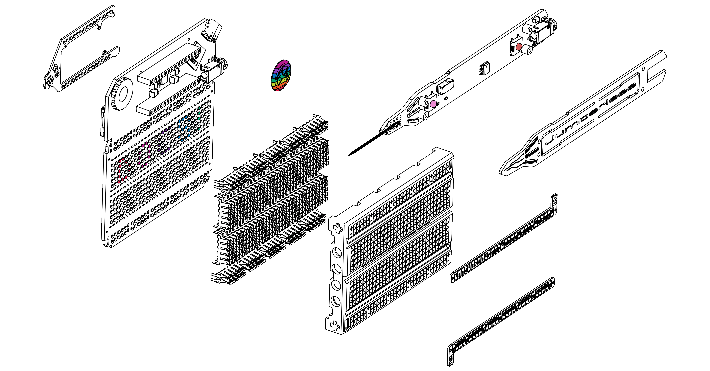
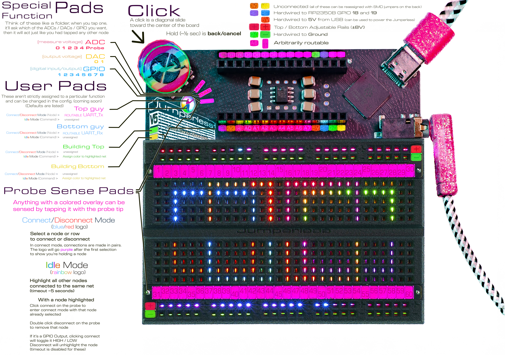
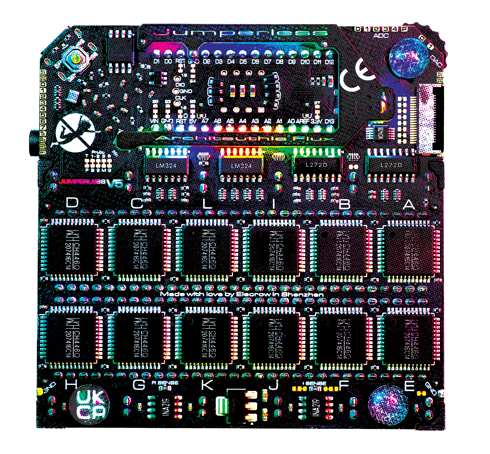

<video controls width="1080">
  <source src="./00_Home.assets/Jumperless V5.mp4" type="video/mp4">
</video>

---

## What is it? 这是什么？

Jumperless V5 lets you prototype like a nerdy wizard who can see electricity and conjure jumpers with a magic wand. It’s an Integrated Development Environment (IDE) for hardware, with an analog-by-nature RP2350B dev board, a drawer full of wires, and a workbench full of test equipment (including a power supply, a multimeter, an oscilloscope, a function generator, and a logic analyzer) all crammed inside a breadboard.

Jumperless V5 让你像一个能看到电流、能用魔法棒召唤跳线的极客巫师一样进行开发。它是一个硬件集成开发环境（IDE），内置了 RP2350B 开发板、导线以及一个有各种测试设备（包括电源、万用表、示波器、函数发生器和逻辑分析仪）的工作台，所有这些都被集成在一个面包板里。

You can connect any point to any other using software-defined jumpers, so the four individually programmable ±8 V power supplies; ten GPIO; and seven management channels for voltage, current, and resistance can all be connected anywhere on the breadboard or the Arduino Nano header. RGB LEDs under each hole turn the breadboard itself into a display that provides real-time information about whatever’s happening in your circuit.

你可以通过软件定义的导线将任意点连接到其他任意点。因此，4 路可独立编程的 ±8 V 电源、10 个 GPIO 口以及 7 条用于监测电压、电流和电阻的管理通道，全都可以接到面包板或 Arduino Nano 系统板引脚的任意位置。每个孔下的 RGB LED 将面包板本身变成一个显示屏，实时显示电路中的情况。

It's not just about being too lazy to plug in some jumpers. With software controlled wiring, the circuit *itself* is now [***scriptable***](08_MicroPython.md), which opens up a world of infinite crazy new things you could never do on a regular breadboard. Have a script try out every combination of parts until it does what you want (*à la* [evolvable hardware](https://evolvablehardware.org/)), automatically switch around audio effects on the fly, characterize some unknown chip with the part numbers sanded off, or don't bother with any of that and just [play Doom on it](https://www.youtube.com/watch?v=xWYWruUO0F4).

这不仅仅是因为懒得插一些导线。通过软件控制布线，电路变成 [***可编程的***](08_MicroPython.md)，这为你打开了一扇通往无限新奇事物的大门，这些是你在普通面包板上从未做过的。通过编写一个脚本尝试每一种元件组合，直到它达到你想要的效果（类似于 [可进化的硬件](https://evolvablehardware.org/)），自动实时切换音频效果，对一个擦掉编号的未知芯片进行特性分析，或者干脆不做这些，只是 [在它上面玩《毁灭战士》](https://www.youtube.com/watch?v=xWYWruUO0F4)。

But more likely, you'll be using it to get circuits from your brain into hardware with so little friction it feels like you're just thinking them into existence. So yeah, wizard shit.

但更有可能的是，你会用它来将在你大脑中的电路实现到实际硬件连接中，阻力如此之小就像是你直接将它们想象到现实中一样。所以是的，这就是巫师般的操作。

These are the docs where you will learn how to wield your new powers.

在这些文档中，你将学会如何驾驭你的新力量。

If you don't already have one, [Get a Jumperless V5 on Crowd Supply](https://www.crowdsupply.com/architeuthis-flux/jumperless-v5).

如果你还没有，[就在 Crowd Supply 上购买一个 Jumperless V5吧](https://www.crowdsupply.com/architeuthis-flux/jumperless-v5)。

---

## Getting Started 开始

---

## Documentation Sections 文档章节

- **[Basic Controls](01_Basic_Controls.md)** - Learn how to use the probe, click wheel, and slot system

  **[基本操作](01_Basic_Controls.md)** - 学习如何使用探针、拨轮和插槽系统

- **[The App](02_The_App.md)** - For talking to your Jumperless, importing from Wokwi, and flashing Arduino sketches

  **[应用程序](02_The_App.md)** - 用于与 Jumperless 通信、从 Wokwi 导入电路图，以及烧录 Arduino 程序

- **[OLED](03_OLED_Support.md)** - Add a better display

  **[OLED显示屏](03_OLED_Support.md)** - 添加一个更好的显示屏

- **[Arduino](04_Arduino_Stuff.md)** - UART passthrough and automatic flashing

  **[Arduino](04_Arduino_Stuff.md)** - UART 透传与自动烧录功能

- **[Configuration](05_Config_File.md)** - Persistent settings

  **[配置](05_Config_File.md)** - 持久化设置（保存后掉电不丢失的设置）

- **[Debugging](06_Debug_Views.md)** - Crossbar, bridge, and net list views

  **[调试](06_Debug_Views.md)** - 查看交叉开关矩阵、桥接和网表视图

- **[File Manager](07_File_Manager.md)** - Filesystem access, YAML slot file editing, and text editor

  **[文件管理器](07_File_Manager.md)** - 访问文件系统、编辑 YAML 插槽文件以及使用文本编辑器

- **[MicroPython](08_MicroPython.md)** - Use the onboard MicroPython interpreter

  **[MicroPython](08_MicroPython.md)** - 使用板载的 MicroPython 解释器

- **[Odds and Ends](10_Odds_and_Ends.md)** - Stuff I couldn't think of a good category for

  **[其他杂项](10_Odds_and_Ends.md)** - 难以归类到其他章节的内容

- **[3D Printable Stand](12_3D_Printable_Stand.md)** - Print your own stand

  **[3D 可打印支架](12_3D_Printable_Stand.md)** - 打印你自己的支架

- **[Writing Native Apps](13_Writing_Apps.md)** - Dig into the actual firmware and write your own apps

  **[编写原生应用](13_Writing_Apps.md)** - 深入底层固件并编写你自己的应用程序

- **[Glossary](13_Glossary_of_Terms.md)** - Key terms including slots, nodes, bridges, and the W command

  **[术语表](13_Glossary_of_Terms.md)** - 关键术语解释，包括插槽、节点、桥接和 W 指令

---

## Find Me On The Internet 在网上找到我

Join the [Discord](https://discord.gg/bvacV7r3FP) for pretty much instant answers to your questions

加入 [Discord](https://discord.gg/bvacV7r3FP)，你的问题几乎可以即时得到解答。

  
  
    
    
  
  

