# Basic Controls 基本控制


---

## The Probe 探头

First, keep the switch on the probe set to `Select`.

首先，将探头上的开关保持在 `Select`（选择）位置。

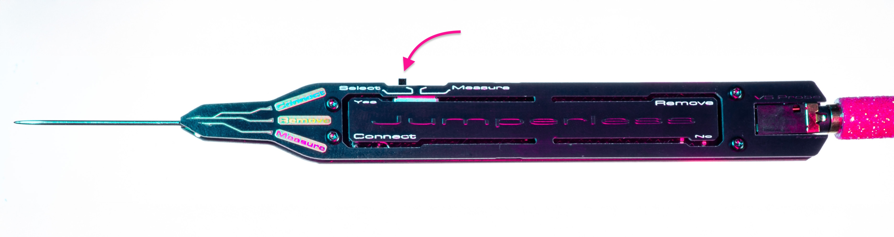

**Why Select mode?** `Measure` mode allows the probe tip to be ±9V tolerant and routable like any other node, but as of yet, the code to actually do anything with it is unwritten so it just connects to DAC 0 and outputs 3.3V just like it was in `Select` mode. But the DAC is much worse at matching the RP2350B's idea of what 3.3V is *exactly*, so probing will be flaky and may be off from the rows you're tapping in `Measure`.

**为什么使用 Select 模式？** `Measure`（测量）模式允许探头尖端耐受 ±9V 电压并像其他节点一样进行路由，但目前尚未编写实际利用它的代码，所以它只是连接到 DAC 0 并输出 3.3V，与 `Select` 模式没有区别。但 DAC 在精准输出 RP2350B 所认为的 3.3V 方面表现较差，因此在 `Measure` 模式下探测会变得不稳定，甚至会与您所点击的行产生偏差。

---

## Connecting Rows 连接行

Click the `Connect` button on the probe.

点击探头上的 `Connect`（连接）按钮。

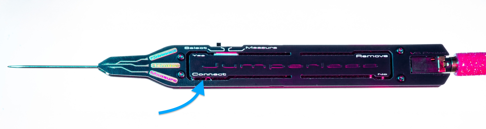

The logo should turn blue and the LEDs on the probe should also change.

Logo 应变为蓝色，探头上的 LED 也会发生变化。

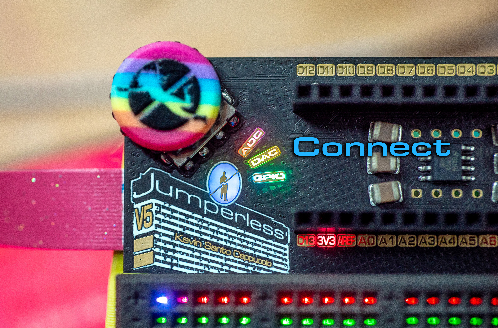

Now any pair of nodes you tap should get connected as you make them. In connect mode, you're creating `bridges` (see the [glossary](./13_Glossary_of_Terms.md)), so connections are made in pairs. When you've tapped the first `node` in a pair, the `logo` and `Connect` text on the probe will brighten to show that you're "`holding`" a connection, and the next thing you tap will connect to that first `node`.

现在，你点击的任意一对节点将在你操作时连接起来。在连接模式下，你正在创建 `bridges`（桥接，参见[术语表](./13_Glossary_of_Terms.md)），因此连接是成对进行的。当你点击一对中的第一个 `node`（节点）时，`logo` 和探头上的 `Connect` 文字会变亮，表示你正在 "`holding`"（保持）一个连接，你点击的下一个目标将连接到这第一个 `node`。

If you make a mistake while `holding` a connection, click the `Connect` button and it will clear it and take you back to the first `node`. If you click the `Connect` button while you're not `holding` a `node`, it will leave `probe mode` and bring you back into `idle mode` (rainbowy `logo`, all 3 `probe LED`s on).

如果在 `holding` 连接时出错，可以再次按下 `Connect` 按钮清除当前保持状态并回到初始节点 `node`。如果你在没有 `holding` `node` 时点击 `Connect` 按钮，它将退出 `probe mode`（探头模式）并带你回到 `idle mode`（空闲模式，彩虹色 `logo`，3 个 `probe LED` 全亮）。

To get out of `Connect` mode, press the button again.

要退出 `Connect` 连接模式，请再次按下按钮。

### Encoder Connections 编码器连接

You can also make connections using just the clickwheel, without needing to touch the probe to the breadboard:

你也可以仅使用滚轮进行连接，而无需将探头接触面包板：

**To activate:**

**激活方式：**

- Navigate to: `Click` > `Connect` > `Add` (or `Remove`)

  导航至：`Click` > `Connect` > `Add`（或 `Remove`）

- OR just turn the clickwheel while already in probe mode

  或者在探头模式下直接转动滚轮

**How it works:** 

1. Turn the clickwheel to scroll through all available nodes:

   转动滚轮滚动浏览所有可用节点：

   - Breadboard rows (1-60)

     面包板行 (1-60)

   - Nano header pins (D0-A7)

     Nano 排针 (D0-A7)

   - Rails (Top, Bottom, GND)

     电源轨 (Top, Bottom, GND)

   - DAC (0, 1)

     DAC (0, 1)

   - ADC (0-4, Probe)

     ADC (0-4, Probe)

   - GPIO (1-8)

     GPIO (1-8)

   - UART (TX, RX)

     UART (TX, RX)

   - Current sense (I+, I-)

     电流检测 (I+, I-)

2. Click the encoder button to select the highlighted node

   点击编码器按钮选择高亮的节点

3. Hold the encoder button to exit

   长按编码器按钮退出

The cursor will automatically hide after 5 seconds of inactivity. This is especially useful when you need precise control or want to access special functions without tapping pads.

光标会在 5 秒无操作后自动隐藏。这在需要精确控制或想要访问特殊功能而不触碰焊盘时特别有用。

---

## Removing Rows 移除行

Click the `Remove` button

点击 `Remove`（移除）按钮

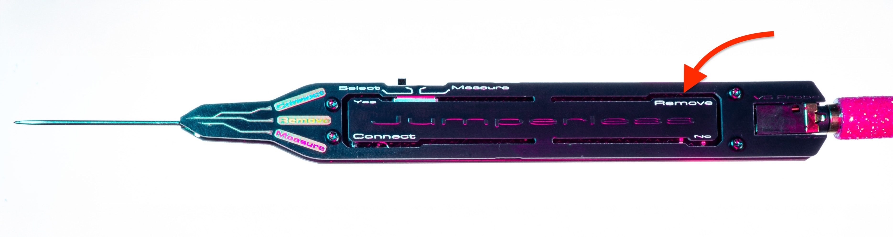

and the logo should turn reddish

Logo 应变为淡红色

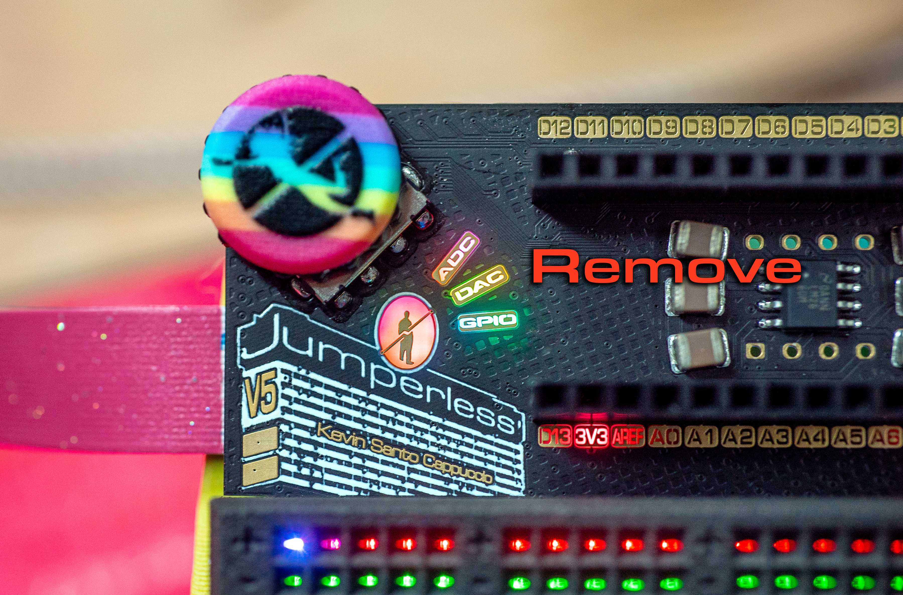

Now you can swipe along the `pad`s or tap them one at a time. Remember it only disconnects that `node` and anything connected to it directly, not *everything* on the `net`. So tapping say, `row 25` that's connected to `GND` won't clear everything connected to `GND`, but tapping the `-` on the rails (for `GND`) would.

现在你可以沿着 `pad`（焊盘）滑动或逐个点击它们。请记住，它只断开该 `node` 以及直接连接到它的东西，而不是 `net`（网络）上的*所有*东西。例如，点击连接到 `GND` 的 `row 25` 不会清除连接到 `GND` 的所有东西，但点击电源轨上的 `-`（代表 `GND`）则会。

The special functions work the same way, tap the pad, pick one, and it will remove it. Click the button again to get out.

特殊功能的工作方式相同，点击焊盘，选择一个，它将将其移除。再次点击按钮退出。

---

## Probe Notes 探头注意事项

**Remember the probe is read by a resistive voltage divider**, so putting your fingers on the pads (or the back sides of the 4 risers that connect those `probe sense` boards to the main board), or anything causing the probe tip not to be at a steady 3.3V will give you weird readings.

**请记住，探头是通过电阻分压器读取的**，所以把手指放在焊盘上（或连接那些 `probe sense` 板到主板的 4 个立柱的背面），或任何导致探头尖端电压不稳定在 3.3V 的因素，都会给你带来奇怪的读数。

If you can't seem to stop playing with the switch on the probe, run the app `probe calib` and tap around on the board while turning the clickweel until the place you tapped is always spot on (do this with the switch in both modes), and hold the clickwheel button to save. This adjusts the nominal 3.3V `measure` mode puts out should be fairly accurate enough for probing.

如果你忍不住要玩探头上的开关，请运行 `probe calib` 应用程序，并在转动滚轮的同时在板上四处点击，直到你点击的位置总是精准对齐（在两种模式下都要做），然后长按滚轮按钮保存。这会调整 `measure` 模式输出 3.3V，使其对于探测来说足够准确。

---

## The Click Wheel 点击滚轮

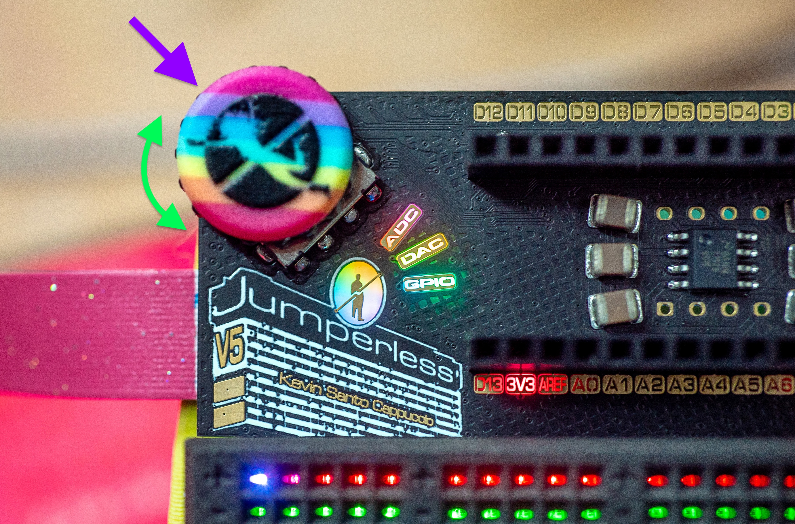

There are two kinds of presses, `click` (short press) and `hold` (long press). In general, a `click` (short) is a `yes`, and a `hold` (long) is a `no`/`back`/`exit`/`whatever`.

有两种按压方式：`click`（短按）和 `hold`（长按）。一般来说，`click`（短按）是 `yes`（确认），`hold`（长按）是 `no`/`back`/`exit`/`whatever`（取消/返回/退出/随便什么）。

When I say `click`, it's more of a diagonal slide toward the center of the board ([these encoders](https://item.szlcsc.com/43288199.html?fromZone=s_s__%2522C41430892%2522&spm=sc.gbn.xh1.zy.n___sc.hm.hd.ss&lcsc_vid=Q1VdXlFeFVRcVQdfTlAMXwcHFQIMAlIDQFlXA1FUFFYxVlNQQlFeVVNXTlJaVjtW) were meant to poke out just a little bit from the side of a tablet or whatever).

当我说 `click` 时，它更像是向板子中心对角滑动（[这些编码器](https://item.szlcsc.com/43288199.html?fromZone=s_s__%2522C41430892%2522&spm=sc.gbn.xh1.zy.n___sc.hm.hd.ss&lcsc_vid=Q1VdXlFeFVRcVQdfTlAMXwcHFQIMAlIDQFlXA1FUFFYxVlNQQlFeVVNXTlJaVjtW) 会在从平板电脑或其他设备的侧面稍微突出一点点。）

To get to the menu, `click` the button and scroll through the menus, `click` will bring you into that menu, `hold` will take you back one level. If you have trouble reading stuff on the breadboard LEDs, everything is copied to the Serial terminal and the OLED (talked about in [OLED Section](https://jumperless-docs.readthedocs.io/en/latest/04-oled/)), and adjusting the brightness may help; in the menus, it's `Display Options` > `Bright` > `Menu` and then scroll around until you find a level you like, then `click` to confirm.

要进入菜单，`click` 按钮并滚动菜单，`click` 进入该菜单，`hold` 将返回上一级。如果你难以阅读面包板 LED 上的内容，所有内容都会复制到串口终端和 OLED（在 [OLED 章节](https://jumperless-docs.readthedocs.io/en/latest/04-oled/) 中讨论），调整亮度可能会有帮助；在菜单中，路径是 `Display Options` > `Bright` > `Menu`，滚动直到找到你喜欢的亮度，然后 `click` 确认。

---

## Special Functions 特殊功能

To connect to `special functions`, tap the corresponding `pad` near the logo, it will show you a menu on the breadboard and terminal to choose them.

如果你要使用 `special functions`（特殊功能），点击 Logo 附近的相应焊盘 `pad`，它将在面包板和终端上显示一个菜单供选择。

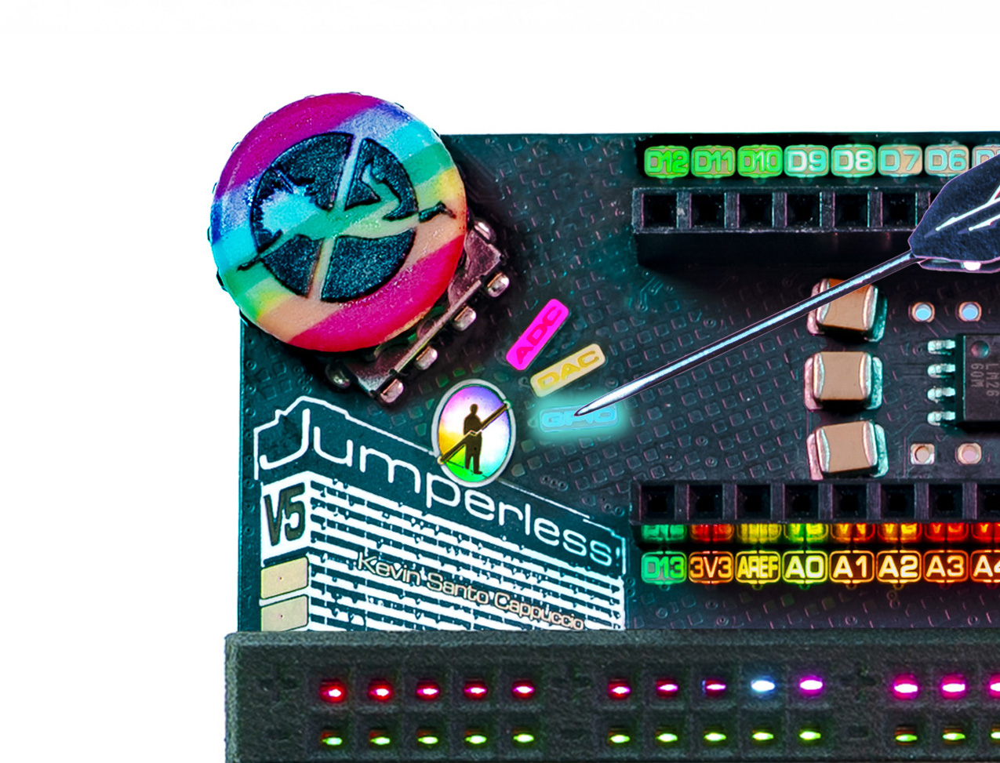

You can think of `special functions` just like any other `node`, the only difference is they're in a sort of "folder" so I didn't need to put a dedicated pad for each of them.

你可以把 `special functions` 想象成任何其他 `node`，唯一的区别是它们在一个类似“文件夹”的结构中，所以我不需要为它们每一个都设置专用焊盘。

```
DAC Pad
 └─ 0 1 [Tap pads below selection]¹
  └─ -8V  !:.:!  +8V [Tap bottom pads or use clickwheel to select a voltage] > [click probe Connect button to confirm]²
   └─ [Tap a row to connect it to] (or if you were already "holding" a node, it'll connect there)³
```

```
DAC 焊盘
 └─ 0 1 [点击下方选择的焊盘]¹
  └─ -8V  !:.:!  +8V [点击底部焊盘或使用滚轮选择电压] > [点击探头 Connect 按钮确认]²
   └─ [点击一行以连接] (或者如果你已经 "holding"（保持）着一个节点，它会连接到那里)³
```

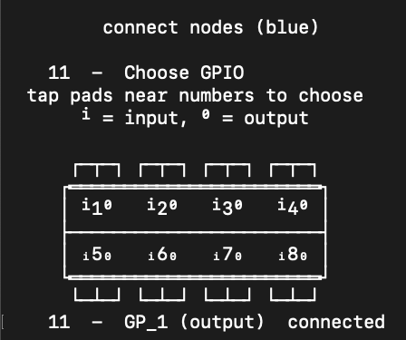

(This is an ASCII version of what will show on the breadboard LEDs) ¹

(这是面包板 LED 上显示的 ASCII 版本) ¹

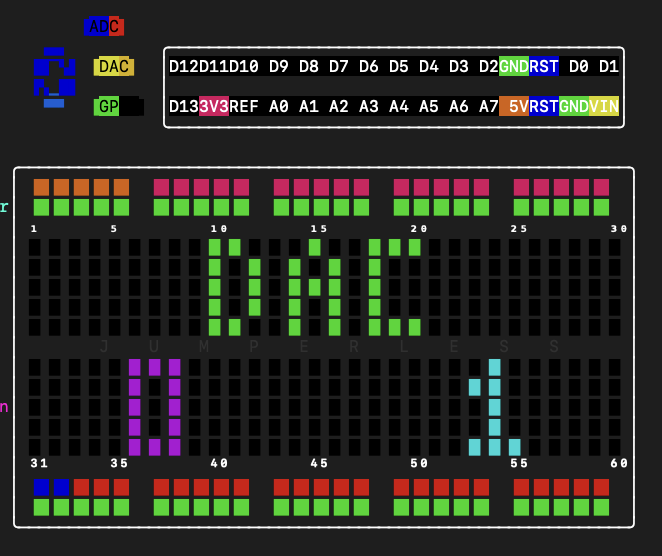

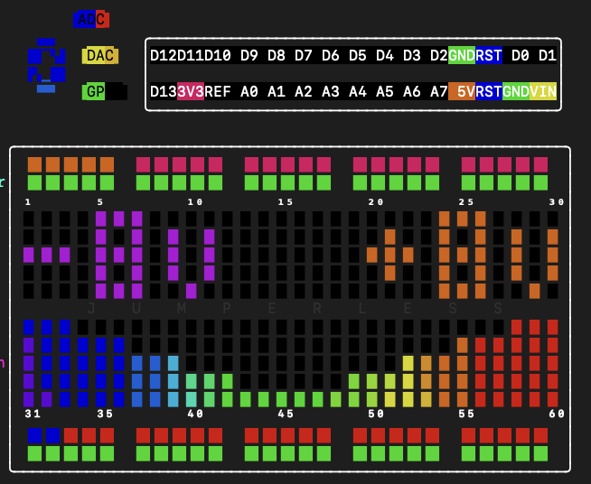

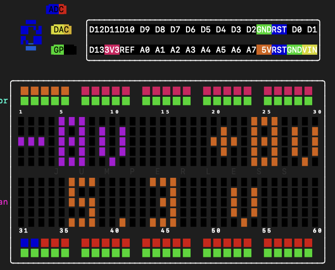

```
GPIO Pad
 └─ ⁱ1⁰ ⁱ2⁰ ⁱ3⁰ ⁱ4⁰ 
    ₁5₀ ₁6₀ ₁7₀ ₁8₀ [Tap pads to choose which `GPIO` (left side for input, right side for output)]
     └─ [Tap a row to connect it to] (or if you were already "holding" a node, it'll connect there)
```

```
GPIO 焊盘
 └─ ⁱ1⁰ ⁱ2⁰ ⁱ3⁰ ⁱ4⁰ 
    ₁5₀ ₁6₀ ₁7₀ ₁8₀ [点击焊盘选择哪个 `GPIO` (左侧为输入, 右侧为输出)]
     └─ [点击一行以连接] (或者如果你已经 "holding"（保持）着一个节点，它会连接到那里)
```

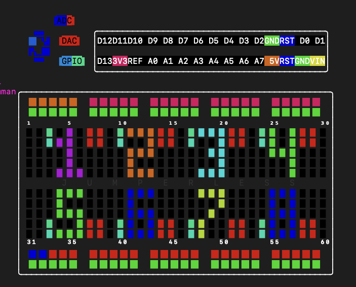

The 4 `user pads` will be remappable in the future, but for now, `top_guy` is `routable UART Tx` and `bottom_guy` is `routable UART Rx`, and `buiding` pads are `Current sense` + and -.

4 个 `user pads`（用户焊盘）将来可以重新映射，但目前，`top_guy`（上方的小人）是 `routable UART Tx`（可路由的UART发送端），`bottom_guy`（下方的小人）是 `routable UART Rx`（可路由的UART接收端），`buiding`（建筑物）焊盘是 `Current sense`（电流检测）+ 和 -。

The **building pads** have multiple functions:

**建筑物焊盘**有多种功能：

- In `idle mode`: Override colors for net highlighting (see [Idle Mode Interactions](#Idle Mode Net Highlighting 空闲模式网络高亮))

  在 `idle mode`（空闲模式）：覆盖网络高亮的颜色（见 [空闲模式网络高亮](#Idle Mode Net Highlighting 空闲模式网络高亮)）

- In `connect`/`remove` mode: Access **Current Sense (I+/I-)** with marching ants visualization!

  在 `connect`/`remove` 模式：访问 **Current Sense (I+/I-)** 并带有蚂蚁行进动画效果！

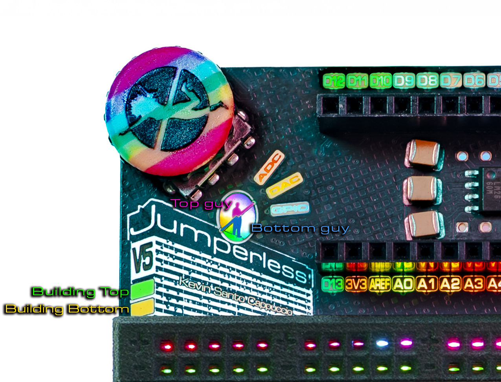

### Current Sensing with Marching Ants 带行军蚂蚁效果的电流检测

When you tap either building pad in connect or remove mode, you'll get access to the current sense inputs (I+ and I-). When both I+ and I- are connected to different nets in your circuit:

当你在连接或移除模式下点击任一建筑物焊盘时，你可以访问电流检测输入（I+ 和 I-）。当 I+ 和 I- 连接到电路中的不同网络时：

1. A virtual wire appears between the two nets containing the `I Sense` nodes

   包含 `I Sense` 节点的两个网络之间会出现一条虚拟导线。

2. Animated "marching ants" flow along this wire showing current direction

   动画化的“行军蚂蚁”沿着这条导线流动，显示电流方向。

The animation automatically picks the where to put the virtual "wire". It will search other nodes on the same nets that `I sense +` and `I sense -` are on it prefers places where they're on the same level so it can actually draw a connecting wire and not just be vertical lines.

动画会自动选择虚拟“导线”的位置。它会在 `I sense +` 和 `I sense -` 所在的网络上搜索其他节点，倾向于选择那些处于同一水平位置的地方，这样它可以绘制一条连接线，而不仅仅是垂直线。

<video controls width="360">
	<source src="./01_Basic_Controls.assets/514636095-7fa478f0-bbdf-4d48-b6a3-dcb1a36f23d0.mp4"  type="video/mp4">
</video>
!!! warning `I Sense +` and `I Sense -` go on different nets but they're shorted internally They're two ends of a 2Ω shunt resistor, so remember that these will be shorted together. You measure current in series so this is expected, but it's super easy to forget. Take this warning as the equivalent of your multimeter yelling at you when you have the probes in the current holes and have it set to voltage.

!!! 警告 `I Sense +` 和 `I Sense -` 位于不同的网络上，但它们在内部是短接的。 它们是 2Ω 分流电阻的两端，所以请记住这些将短接在一起。你是串联测量电流的，所以这是预期的，但这非常容易忘记。把这个警告当成是你的万用表在你把探头插在电流孔却设置为电压档时会响。

---

## Idle Mode Net Highlighting 空闲模式网络高亮

The main thing is that there's a lot more interaction that can be done outside of any particular mode (like not probing and the logo is rainbowy, I'm gonna call this idle mode here until I think of a good name).

主要是可以在任何特定模式之外进行更多的交互（比如不在探测且 Logo 是彩虹色时，我在想出一个好名字之前暂时称之为 idle mode（空闲模式））。

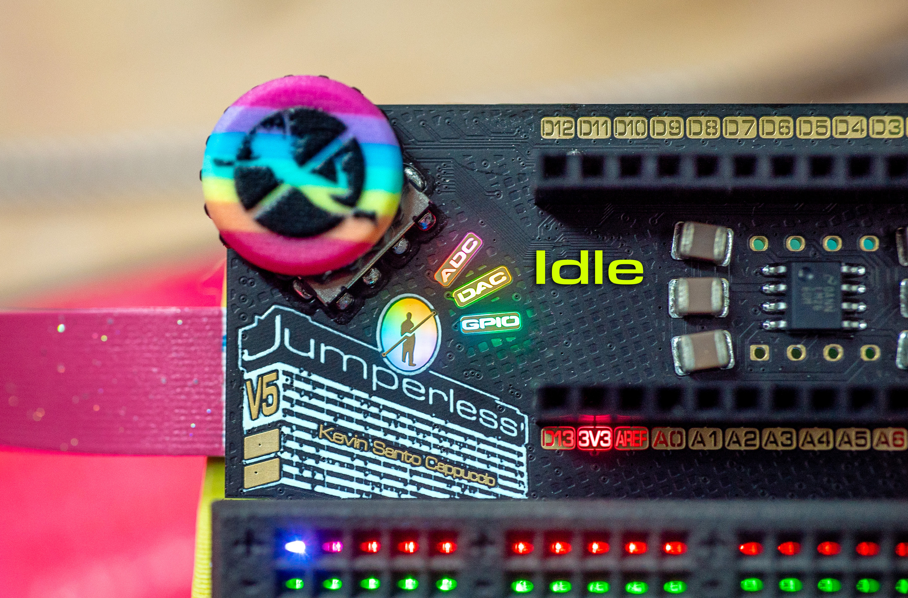

Here's what's new (all of this is in idle mode):

以下是新功能（所有这些都在空闲模式下）：

### **Basic Interactions** 基本交互

- **Tapping nets highlights them** as before, but there's a slightly different animation on the `row` you have selected from the whole `net`

  **点击网络会高亮显示它们**，和以前一样，但你从整个 `net` 中选中的 `row` 会有稍微不同的动画。

- **The click wheel scrolls through highlighting `rows`** as if you tapped each one

  **滚轮滚动可以切换高亮 `rows`**，就像你点击了每一行一样。

### **Row Selection Actions** 行选择操作

With a `row` selected, here's what you can do:

选中一个 `row` 后，你可以进行以下操作：

#### **Rail Voltage Adjustment** 电源轨电压调整

**Rail / DAC voltages change with `slots`** - each slot can have its own power supply configuration!

**电源轨 / DAC 电压随 `slots`（插槽）变化** - 每个插槽可以有自己的电源配置！

If the highlighted `row` is a `rail` (top or bottom) or `DAC`, `click` the clickwheel and then scroll the wheel (or use the probe on the bottom row) to adjust the voltage.

如果高亮的 `row` 是 `rail`（顶部或底部）或 `DAC`，`click` 滚轮然后滚动滚轮（或使用底排的探头）来调整电压。

`Click` the wheel to confirm, `hold` to cancel the adjustment.

`Click` 滚轮确认，`hold` 取消调整。

**Tip:** You can also tap the `DAC` or `rail` pads to highlight them, then click the encoder to adjust the output directly without connecting anything. `click` the clickwheel button to confirm.

**提示：** 你也可以点击 `DAC` 或 `rail` 焊盘来高亮它们，然后点击编码器直接调整输出，无需连接任何东西。`click` 滚轮按钮确认。

#### **Connect Button **连接按钮

- `connect` button will bring you into probing mode with the highlighted row already selected and then spit you back out to `idle` mode once you've made a connection to another row, or click `connect` again to exit

  `connect` 按钮将带你进入探测模式，且已选中高亮的行，一旦你连接到另一行，它就会把你带回 `idle` 模式，或者再次点击 `connect` 退出。

#### **Remove Button** 移除按钮

- `remove` will briefly turn the `row` reddish `warn` (I need to settle on a good time for this, if it feels too short or long lmk), another `remove` press will remove that `row` (just like in `probe` mode, it removes the `bridge` it's in, so just things that have a direct connection to that `row`, not the whole `net`), if you let it time out without pressing anything, the row will be unhighlighted.

  `remove` 会使 `row` 短暂变为淡红色 `warn`（警告）（我需要确定一个合适的时间，如果感觉太短或太长请告诉我），再次按下 `remove` 将移除该 `row`（就像在 `probe` 模式下一样，它移除所在的 `bridge`，所以只是直接连接到该 `row` 的东西，而不是整个 `net`），如果你超时未按任何键，该行将取消高亮。

TL;DR, double click `remove` to remove, single click to unhighlight.

简而言之，双击 `remove` 移除，单击取消高亮。

#### **Color Picker** 颜色选择器

- tapping the `building top` pad with something highlighted will open the `color picker`, (note: the color now follows the `row` instead of the net, so it can keep the colors even if you remove nets below it and they shift, this was soooo difficult until I realized I should do it by `node`).

  在有东西高亮时点击 `building top`（建筑物顶部）焊盘将打开 `color picker`（颜色选择器），（注意：颜色现在跟随 `row` 而不是网络，所以即使你移除了它下面的网络且它们发生了移动，它也能保持颜色，这太难了，直到我意识到应该按 `node` 来做）。

- Also the color assignments are saved to a file for each slot, so they should work after a reboot and when changing `slots`.

  此外，颜色分配会保存到每个插槽的文件中，因此在重启和更改 `slots` 后它们应该仍然有效。

- In the `color picker`, short clicking the probe buttons will zoom in and out, long press will confirm. The click wheel is similar, except you toggle `zoom` and `scroll` modes with short presses and long press to confirm.

  在 `color picker` 中，短按探头按钮进行放大和缩小，长按确认。滚轮类似，只是短按在 `zoom`（缩放）和 `scroll`（滚动）模式之间切换，长按确认。

- Here's a demo on YouTube.

  这里有一个 YouTube 演示视频：
  
  <video controls width="1080">
    <source src="./01_Basic_Controls.assets/JumperlOS Color Picker.mp4" type="video/mp4">
  </video>

### **Measurement Display** 测量显示

If the highlighted row is a `measurement` (`gpio input` or `adc`) it will print the state to serial and the oled.

如果高亮的行是 `measurement`（测量）（`gpio input` 或 `adc`），它将把状态打印到串口和 OLED。

### **Output Toggle** 输出切换

If the highlighted row is an `output` (`gpio output`, I'll eventually do `dacs` too) clicking the `connect` button will toggle it `high` / `low`. The `remove` button will *just* unhighlight the net (there were some choices here, like make each button assigned to high / low or allow removing them, but this felt like the best way after trying them all). I will eventually add a setting for the toggle repeat rate (set to 500ms now) and a way to set it freewheeling as a clock.

如果高亮的行是 `output`（输出）（`gpio output`，我最终也会做 `dacs`），点击 `connect` 按钮将切换它为 `high`（高电平）/ `low`（低电平）。`remove` 按钮将*仅仅*取消高亮网络（这里有一些选择，比如让每个按钮分配给高/低，或允许移除它们，但在尝试所有方法后，感觉这是最好的方式）。我最终会添加一个切换重复率的设置（现在设置为 500ms）以及一种将其设置为自由运行时钟的方法。