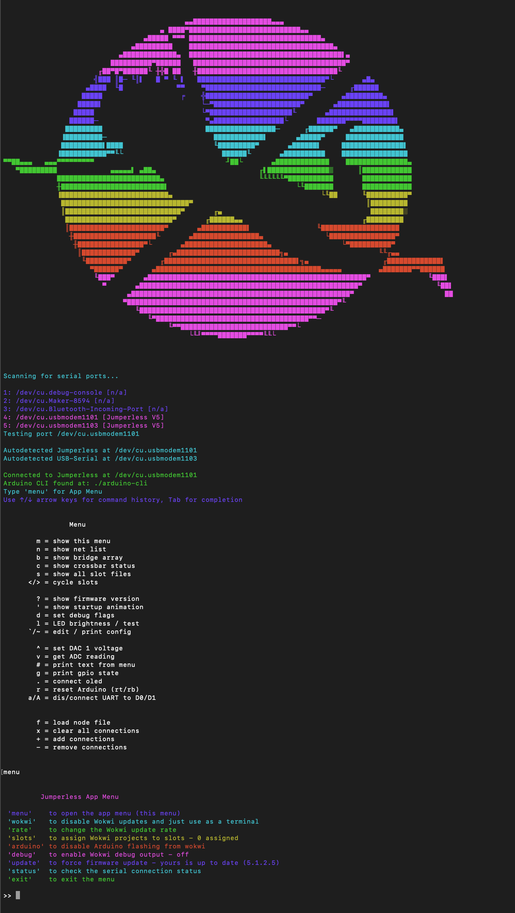
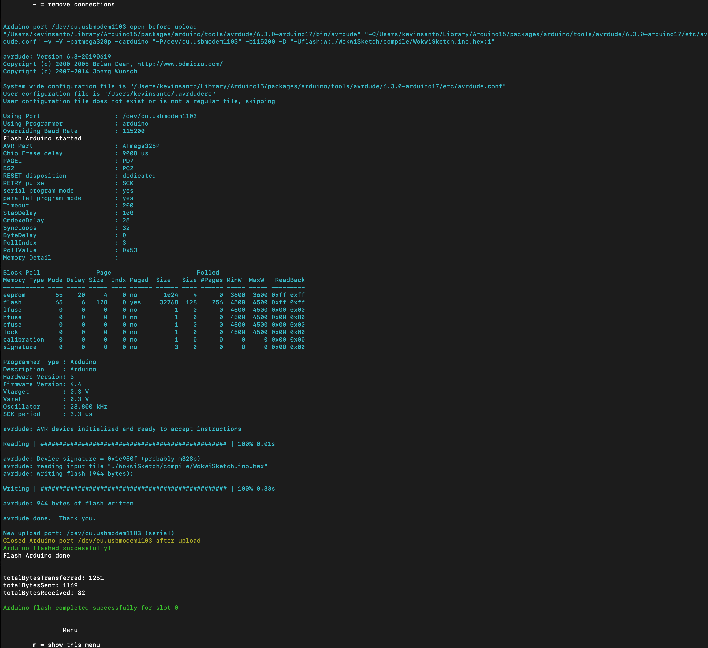
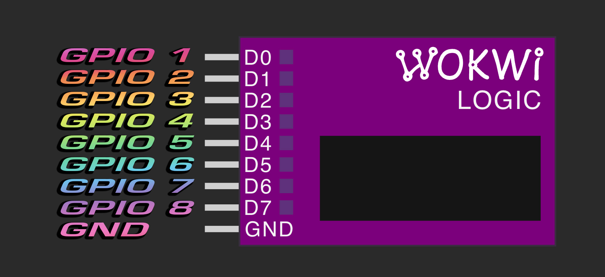
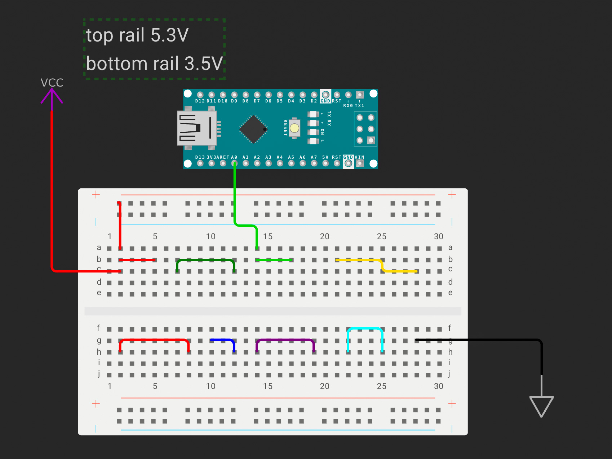
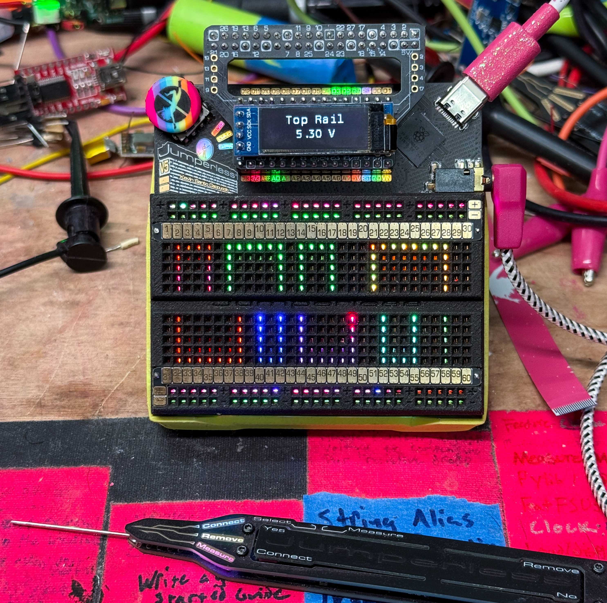

# The App 应用程序

## Installation guide 安装指南

### The Jumperless App is now on PyPi! Jumperless App 现已发布在 PyPi 上！

The easiest way to get started is with pip:

最简单的入门方法是使用 pip：

```bash
pip install jumperless
```

Then run it with:

然后运行它：

```bash
jumperless
```

**Note:** If the app version shows less than the latest release, `pip` defaults to a local version if it's available. In that case, run:

**注意：** 如果 App 显示的版本低于最新发布的版本，且本地已有旧版本，`pip` 可能会默认使用本地版本。在这种情况下，请运行以下命令：

```bash
pip install --no-cache-dir --upgrade jumperless
```

to make sure it grabs the latest version.

以确保获取最新版本。

The app repo is at [https://github.com/Architeuthis-Flux/Jumperless-App](https://github.com/Architeuthis-Flux/Jumperless-App).

App 的代码仓库位于：https://github.com/Architeuthis-Flux/Jumperless-App。

### Alternative: Download Pre-built Binaries 替代方案：下载预构建的二进制文件

#### Find the latest release 查找最新版本

[https://github.com/Architeuthis-Flux/JumperlessV5/releases/latest](https://github.com/Architeuthis-Flux/JumperlessV5/releases/latest)

The link above will magically lead you to the latest version, and will look something like `https://github.com/Architeuthis-Flux/JumperlessV5/releases/tag/5.2.0.0`

上面的链接会神奇地把你带到最新版本页面，链接看起来大概像这样：`https://github.com/Architeuthis-Flux/JumperlessV5/releases/tag/5.2.0.0`

**At the bottom under Assets, download the Jumperless App for your OS.**

在底部的 Assets（资产）下方，下载适合你操作系统的 Jumperless App。

### Windows

  - `Jumperless.exe`
  - `Jumperless-Windows-x64.zip`

### macOS

  - `Jumperless_Installer.dmg`
  - `Jumperless_macOS.zip`

### Linux

  - x86 `Jumperless-linux-x86_64.tar.gz` (if you're not sure which flavor of Linux, use this one)

    (如果你不确定你的 Linux 是什么架构，选这个)

  - arm64 `Jumperless-linux-arm64.tar.gz`

### Python

    1. download `JumperlessWokwiBridge.py` and `requirements.txt`.
    2. open your favorite terminal, navigate to the folder where you downloaded the two files above.
    3. `pip install -r requirements.txt` # run this command to install the needed Python libraries.
    4. `python3 JumperlessWokwiBridge.py` # open the app, will update firmware if there's a newer version.


    1. 下载 `JumperlessWokwiBridge.py` 和 `requirements.txt`。
    2. 打开你喜欢的终端，导航到下载上述两个文件的文件夹。
    3. `pip install -r requirements.txt` # 运行此命令以安装所需的 Python 库。
    4. `python3 JumperlessWokwiBridge.py` # 打开应用程序，如果有新版本固件，它将进行更新。

---

Now that I've lifted my self-imposed ban on VT100 commands (for compatibility and me-spending-too-much-time-on-them reasons, but, YOLO), we've got colors now! 

既然我已经解除了对自己施加的 VT100 命令禁令（出于兼容性原因，以及我把太多时间花在这上面的原因，但是，人生苦短/YOLO），我们要有颜色了！



But that's like the *least* cool thing the new app can do, here's a list of what's new:

但这只是新 App 最微不足道的功能，以下是新功能的列表：

---

## What It Does 它能做什么


- **Firmware updating** should be pretty reliable when there's a new version (falls back to instructions for how to do it manually)

  **固件更新**：当有新版本时，更新过程应该非常可靠（如果失败，会回退到手动操作说明）。

- **Command history and tab completion**, up arrows will go through past commands and are persistent after closing

  **命令历史记录和 Tab 补全**：按向上箭头可以浏览过去的命令，并且在关闭后仍然保留。

- **Properly detects** which port is the main Jumperless Serial and which is routable UART

  **正确检测**：能正确识别哪个端口是主 Jumperless 串口，哪个是可路由的 UART。

- **Arduino flashing from [Wokwi](https://wokwi.com/)** works once again and is a lot more solid
  
  **从 [Wokwi](https://wokwi.com/) 烧录 Arduino**：再次可以使用了，而且更加稳定。
  
  - It installs [arduino-cli](https://github.com/arduino/arduino-cli) on first startup and uses it pull in libraries, compile, and flash an arduino Nano in the header
  
    它会在首次启动时安装 [arduino-cli](https://github.com/arduino/arduino-cli)，并使用它来拉取库、编译，并烧录到插头上的 Arduino Nano。
  
  - If the routable UART lines aren't connected when the app detects a change in the sketch file, it will connect them to flash the new code and then return them to how they were
  
    如果 App 检测到 sketch 文件有更改，而可路由 UART 线路未连接，它将自动连接它们以烧录新代码，然后将它们恢复原状。
  
  - [avrdude](https://github.com/avrdudes/avrdude) output is shown in real time (you'd be amazed how difficult this was)
  
    [avrdude](https://github.com/avrdudes/avrdude) 的输出会实时显示（你无法想象这有多难实现）。
  
- **Direct Wokwi circuit import** - Copy diagram.json from Wokwi and import it with the `W` command (see below)

  **直接导入 Wokwi 电路** - 从 Wokwi 复制 diagram.json 并使用 `W` 命令导入（见下文）。

- **No longer a janky pile of garbage**

  **不再是一堆烂代码 (No longer a janky pile of garbage)**
  
---

## Local Arduino Sketch Support 本地 Arduino Sketch 支持

**You can set a `slot` to point to a local Arduino sketch.ino file and it will flash if it detects a change** 

你可以设置一个 `slot` 指向本地的 Arduino sketch.ino 文件，如果检测到更改，它将自动烧录。

- If you don't like using Arduino IDE or Wokwi and prefer using `vim` or `emacs` or whatever, now you can let the app handle the flashing stuff and just edit an .ino file.

  如果你不喜欢使用 Arduino IDE 或 Wokwi，而更喜欢使用 `vim` 或 `emacs` 之类的工具，现在你可以让 App 处理烧录工作，你只需要编辑 .ino 文件即可。

- In the app, type `menu` then `slots` and instead of entering a link to a Wokwi project, just give it a path to a file (this will be saved so you can unassign it and pick it later by name)

  在 App 中，输入 `menu` 然后输入 `slots`，不需要输入 Wokwi 项目的链接，只需给它一个文件路径（这会被保存下来，所以你可以取消分配，以后再按名称选择它）。

- (This one is so fucking sick) 

  (这个功能简直太酷了/fucking sick)



---

## Launch Scripts 启动脚本

- Launch scripts included to easily run it from your favorite terminal emulator and not just the system default (terminal.app on macOS, Powershell on Windows, idk on Linux), just go to the directory in a terminal and run the script in [tabby](https://tabby.sh/) or whatever

  包含启动脚本，可以轻松地从你喜欢的终端模拟器运行它，而不仅仅是系统默认的终端（macOS 上的 terminal.app，Windows 上的 Powershell，Linux 上的随便什么），只需在终端中进入该目录并在 [tabby](https://tabby.sh/) 或其他终端中运行脚本即可。

- The launcher *should* kill other instances (and close their windows) that happen to be open because it's such a common issue for me at least

  启动器 *应该* 会杀掉其他恰好打开的实例（并关闭它们的窗口），因为这对我来说是一个非常常见的问题。

- Linux people are no longer red-headed stepchildren, there are proper tar.gz packages now for you nerds

  Linux 用户不再是“二等公民”，现在专门为你们这群极客准备了 tar.gz 包。

---

## Importing Circuits from Wokwi 从 Wokwi 导入电路

You can design circuits in the [Wokwi online simulator](https://wokwi.com) and import them directly to your Jumperless with the `W` command, or use the Jumperless App and it'll pull it from your project automatically and live update.

你可以在 [Wokwi 在线模拟器](https://wokwi.com) 中设计电路，并使用 `W` 命令将其直接导入到你的 Jumperless，或者使用 Jumperless App，它会自动从你的项目中拉取并实时更新。

### Direct Link Import 直接链接导入

You can now just dump a Wokwi link into the app at any time and it'll work:

你现在可以随时将 Wokwi 链接丢进 App 中，它就能工作：

```
		Menu
~~~~~
	x = clear all connections
	+ = add connections
	- = remove connections

https://wokwi.com/projects/424432011346848769


Enter a name for this new project: cool project zone
✓ Saved 'cool project zone' to project library

✓ 'cool project zone' assigned to active slot 0
  URL: https://wokwi.com/projects/424432011346848769
  The project will start updating automatically
```

### How to manually Import from Wokwi 如何从 Wokwi 手动导入

1. **Design your circuit** on [wokwi.com](https://wokwi.com)

   在 [wokwi.com](https://wokwi.com) 上 **设计你的电路**

2. **Click on the `diagram.json` tab** in the Wokwi editor

   在 Wokwi 编辑器中 **点击 `diagram.json` 标签页**

3. **Copy all the JSON content** (Ctrl+A, Ctrl+C or Cmd+A, Cmd+C)

   **复制所有 JSON 内容** (Ctrl+A, Ctrl+C 或 Cmd+A, Cmd+C)

4. **In Jumperless, type `W`** and press Enter

   **在 Jumperless 中，输入 `W`** 并按 Enter

5. **Paste the JSON** (Ctrl+V or right-click → Paste)

   **粘贴 JSON** (Ctrl+V 或 右键 → 粘贴)

6. The parser automatically detects when the JSON is complete and imports it!

   解析器会自动检测 JSON 何时完成并导入！

### Supported Wokwi Components 支持的 Wokwi 组件

- **Half breadboard** - Wokwi's breadboard maps directly to Jumperless rows

  **半尺寸面包板 (Half breadboard)** - Wokwi 的面包板直接映射到 Jumperless 的行。

- **Arduino Nano** - All pins (D0-D13, A0-A7) (GND, 5V, 3.3V, and RST pins are hardwired and don't do anything)

  **Arduino Nano** - 所有引脚 (D0-D13, A0-A7) (GND, 5V, 3.3V, 和 RST 引脚是硬连线的，不做任何操作)。

- **Logic Analyzer** - Channels map to GPIO: D0-7 → GPIO 1-8

  **逻辑分析仪 (Logic Analyzer)** - 通道映射到 GPIO：D0-7 → GPIO 1-8。

- **Wire colors** - Wokwi wire colors preserved

  **导线颜色** - 保留 Wokwi 的导线颜色。

- **Rail voltages** - Detected from text labels in Wokwi

  **导轨电压** - 从 Wokwi 中的文本标签检测。

- **VCC and GND Nodes** - VCC maps to the `TOP_RAIL`

  **VCC 和 GND 节点** - VCC 映射到 `TOP_RAIL` (顶部导轨)。



**Note:** The app still works with the OG Jumperless and those original mappings remain the same.

**注意：** 该 App 仍然适用于初代 Jumperless，那些原始映射保持不变。

### Wire Color Mapping 导线颜色映射

**Wire colors will match the ones you set in Wokwi!** The new Wokwi parser sends the entire `diagram.json` from Wokwi and parses it on the Jumperless, which means color information gets preserved.

**导线颜色将与你在 Wokwi 中设置的一致！** 新的 Wokwi 解析器会发送来自 Wokwi 的整个 `diagram.json` 并在 Jumperless 上进行解析，这意味着颜色信息得以保留。





All Wokwi wire colors are preserved and displayed on the breadboard LEDs:

所有 Wokwi 导线颜色都被保留并显示在面包板 LED 上：

`red`, `orange`, `yellow`, `green`, `blue`, `violet`, `purple`, `magenta`, `cyan`, `white`, `gray`, `black`, `brown`, `limegreen`, `gold`

`red` (红), `orange` (橙), `yellow` (黄), `green` (绿), `blue` (蓝), `violet` (紫罗兰), `purple` (紫), `magenta` (洋红), `cyan` (青), `white` (白), `gray` (灰), `black` (黑), `brown` (棕), `limegreen` (酸橙绿), `gold` (金)

**Note:** Black wires let the Jumperless auto-assign a color.

**注意：** 黑色导线会让 Jumperless 自动分配颜色。

If you leave all the wires green (the default in Wokwi) or make a wire black, it'll just auto assign colors.

如果你让所有导线保持绿色（Wokwi 中的默认设置）或将导线设为黑色，它就会自动分配颜色。

**About color assignment:** There is some weirdness because colors in Wokwi are applied to `bridges` (a pair of `nodes`) while color in the Jumperless gets assigned to `nets` (a collection of connected `nodes`). So if you have a bunch of things electrically connected together with different wire colors, it'll just pick one. It tries to pick unique colors first (no other nets with that same color), but if it can't, it'll shift the hue a bit so it's still that color but you can hopefully tell them apart.

**关于颜色分配：** 这里有点奇怪，因为 Wokwi 中的颜色是应用于 `bridges`（一对 `nodes`/节点）的，而 Jumperless 中的颜色是分配给 `nets`（一组连接在一起的 `nodes`）的。所以，如果你有一堆东西电气连接在一起但用了不同的导线颜色，它只会选择其中一种。它会尝试优先选择唯一的颜色（没有其他网络使用相同的颜色），如果做不到，它会稍微改变色调，这样它仍然是那种颜色，但希望你能区分它们。

### Rail Voltage Detection 导轨电压检测

Add a text label in your Wokwi diagram to specify rail voltages:

在你的 Wokwi 图表中添加文本标签以指定导轨电压：

```
top rail 5.5V
bottom rail 3.5V
```

The Jumperless parser will automatically detect these values and set the rails accordingly

Jumperless 解析器将自动检测这些值并相应地设置导轨。

### Command Variants 命令变体

```
W              # Paste JSON, save to active slot
W 5            # Paste JSON, save to slot 5
W /file.json   # Load from file, save to active slot
```

```
W              # 粘贴 JSON，保存到当前活动插槽
W 5            # 粘贴 JSON，保存到插槽 5
W /file.json   # 从文件加载，保存到当前活动插槽
```

### After Import 导入后

Use `<` to cycle through slots to activate your imported circuit, or it will be active immediately if imported to the current slot.

使用 `<` 循环切换插槽以激活你导入的电路，如果导入的是当前插槽，它将立即生效。

---

## Terminal Compatibility 终端兼容性

Or you can use any terminal emulator you like, [iTerm2](https://iterm2.com/), [xTerm](https://invisible-island.net/xterm/), [Tabby](https://github.com/Eugeny/tabby), [Arduino IDE](https://www.arduino.cc/en/software/)'s Serial Monitor, whatever. The TUI is all handled from the Jumperless itself so it just needs something to print text. 

或者你可以使用任何你喜欢的终端模拟器，[iTerm2](https://iterm2.com/), [xTerm](https://invisible-island.net/xterm/), [Tabby](https://github.com/Eugeny/tabby), [Arduino IDE](https://www.arduino.cc/en/software/) 的串口监视器，随便什么。TUI（文本用户界面）完全由 Jumperless 本身处理，所以它只需要一个能打印文本的地方。