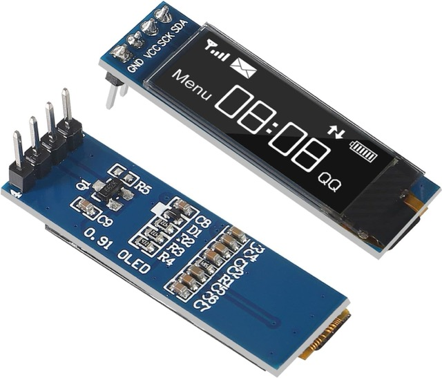
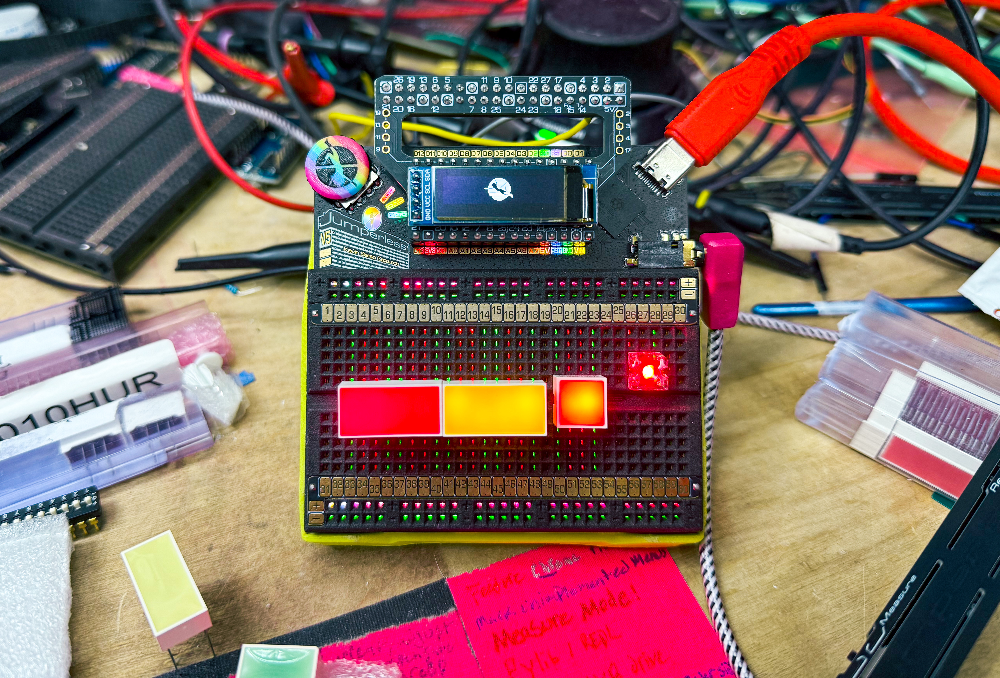
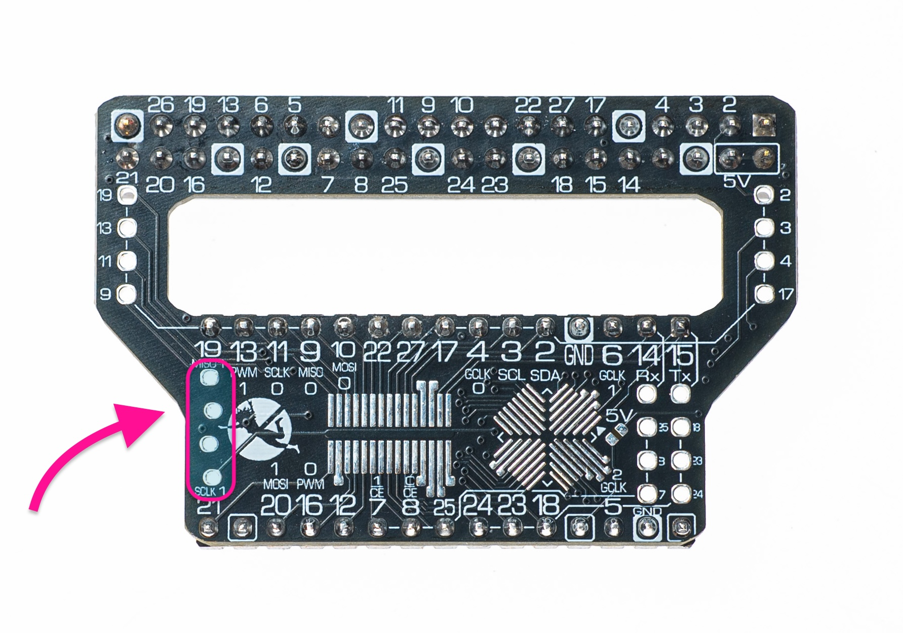

# OLED Support OLED 支持

First, get yourself one of these bad boys (literally any of these are fine.)

首先，搞一个这玩意儿（真的，下面这些随便哪个都行）。


https://www.amazon.com/MakerFocus-Display-SSD1306-3-3V-5V-Arduino/dp/B079BN2J8V



Ignore the really cool LEDs.

忽略那些很酷的 LED 灯。

## Installation 安装

They should friction fit into the SBC/SMD/OLED board included with your Jumperless V5.

它们应该可以刚好卡进（摩擦配合）随 Jumperless V5 附带的 SBC/SMD/OLED 板上。



---

## Functionality 功能

This should copy basically any text printed on the breadboard, some people have trouble reading text on the breadboard LEDs, which is why I added all this. (if I missed something, let me know, it's a fairly new thing so I've probably forgot to add code for it to print in a bunch of places.)

这基本上会复制打印在面包板上的任何文本，有些人觉得面包板上的 LED 文本不太好读，所以我加了这个功能。（如果我漏了什么，请告诉我，这是一个相当新的功能，我可能忘了在很多地方添加打印代码。）

---

## Connection 连接

To connect the data lines to the Jumperless' GPIO 7 and 8, just use the menu option `.` (that's a period). It will try to find the OLED on the I2C bus, after a few failed attempts, it'll automatically disconnect to free up GPIO 7 and 8. 

要将数据线连接到 Jumperless 的 GPIO 7 和 8，只需使用菜单选项 `.`（就是一个句号）。它会尝试在 I2C 总线上寻找 OLED，在几次尝试失败后，它会自动断开连接以释放 GPIO 7 和 8。

---

## Auto-Connect on Boot 开机自动连接

If you want to use this all the time, there's a config option to connect the OLED on startup. You can just paste this into the main menu:

如果你想一直使用它，有一个配置选项可以在启动时连接 OLED。你可以直接把这行代码粘贴到主菜单中：

```
`[top_oled] connect_on_boot = true;
```

---

## Lock Connection 锁定连接

Locking the connection to the OLED ensures that it stays connected even when you enter a complete `node` list. So if you're using Wokwi or manually adding connections in a file, you don't need to add `GPIO_7 - D2` and `GPIO_8 - D3` to keep the I2C connected to the OLED.

锁定与 OLED 的连接可以确保即使你输入了完整的 `node` 列表，它也能保持连接。因此，如果你正在使用 Wokwi 或在文件中手动添加连接，你不需要添加 `GPIO_7 - D2` 和 `GPIO_8 - D3` 来保持 I2C 与 OLED 的连接。

```
`[top_oled] lock_connection = true;
```

---

## Custom Startup Message 自定义启动消息

You can customize what appears on the OLED when your Jumperless boots up. There are two options: text messages or custom bitmap images.

你可以自定义 Jumperless 启动时在 OLED 上显示的内容。有两个选项：文本消息或自定义位图图像。

### Text Message 文本消息

Set a custom text message to display on the OLED at startup (max 32 characters):

设置启动时在 OLED 上显示的自定义文本消息（最多 32 个字符）：

```
`[top_oled] startup_message = Your Message Here;
```

This message will appear after the Jumperless logo on boot.

此消息将在启动时的 Jumperless Logo 之后显示。

### Bitmap Image 位图图像

Display a custom bitmap image at startup by just giving it a path on the filesystem.

通过提供文件系统上的路径，在启动时显示自定义位图图像。

```
`[top_oled] startup_message = /images/mylogo.bin;
```

**Requirements:**

**要求：**

- Image must be a bitmap file (`.bin` format) with 4-byte header

  图像必须是位图文件（`.bin` 格式），带有 4 字节的头信息

- Recommended size: 128×32 pixels (standard OLED size)

  推荐尺寸：128×32 像素（标准 OLED 尺寸）

- Use the built-in [Bitmap Editor](#Bitmap Editor 位图编辑器) to create or edit images

  使用内置的 [位图编辑器 (Bitmap Editor)](#Bitmap Editor 位图编辑器) 创建或编辑图像

- Store images in the `/images/` directory on the Jumperless filesystem

  将图像存储在 Jumperless 文件系统的 `/images/` 目录下

---

## Display Dimensions 显示器尺寸

If you have a different sized OLED (like 128x64), you can set the dimensions:

如果你有不同尺寸的 OLED（比如 128x64），你可以设置尺寸：

```jython
`[top_oled] width = 128;
`[top_oled] height = 64;
```

---

## Advanced GPIO Configuration 高级 GPIO 配置

You can change both the GPIO used for the display or the rows it connects to with the config options:

你可以通过配置选项更改用于显示器的 GPIO 或其连接的行：

```jython
`[top_oled] sda_pin = 26;
`[top_oled] scl_pin = 27;
`[top_oled] gpio_sda = GP_7;
`[top_oled] gpio_scl = GP_8;
`[top_oled] sda_row = D2;
`[top_oled] scl_row = D3;
```

# Bitmap Editor 位图编辑器

The built-in bitmap editor lets you create and edit OLED images directly on your Jumperless using your terminal and the clickwheel.

内置的位图编辑器允许你直接在 Jumperless 上使用终端和拨轮创建和编辑 OLED 图像。

<video controls width="720">
  <source src="./03_OLED_Support.assets/515974259-9c716bdf-33bc-4af8-b618-852852049017.mp4" type="video/mp4">
</video>

## Accessing the Bitmap Editor 访问位图编辑器

### From File Manager 从文件管理器

1. Open the file manager from the main menu

   从主菜单打开文件管理器

2. Navigate to a `.bin` bitmap file

   导航到一个 `.bin` 位图文件

3. Select the file to open it in the editor

   选择该文件以在编辑器中打开

### Creating a New Image 创建新图像

You can create a new bitmap file from the file manager:

你可以从文件管理器创建一个新的位图文件：

1. Navigate to where you want to create the file (e.g., `/images/`)

   导航到你想创建文件的位置（例如 `/images/`）

2. Pess `n` for "new file"

   按 `n` 键新建文件 ("new file")

3. Name it with a `.bin` extension (e.g., `mylogo.bin`)

   命名文件并加上 `.bin` 扩展名（例如 `mylogo.bin`）

4. The editor will automatically create a blank 128×32 bitmap (or whatever your OLED dimensions are set to in config)

   编辑器将自动创建一个空白的 128×32 位图（或者根据你配置中设置的 OLED 尺寸）

---

## Editor Interface 编辑器界面

The bitmap editor displays your image in the terminal and on the OLED (if connected). You'll see:

位图编辑器会在终端和 OLED（如果已连接）上显示你的图像。你会看到：

- **Main canvas**: Your bitmap rendered using block characters

  **主画布**：使用块字符渲染的位图

- **Status bar**: Filename, dimensions, cursor position, and save status

  **状态栏**：文件名、尺寸、光标位置和保存状态

- **Menu bar**: Quick access to View, Encoder, Draw modes, Save, and Quit

  **菜单栏**：快速访问视图 (View)、编码器 (Encoder)、绘制模式 (Draw modes)、保存 (Save) 和退出 (Quit)

- **Help panel**: Keyboard shortcuts and hardware control reference

  **帮助面板**：键盘快捷键和硬件控制参考

### View Modes 视图模式

Press `m` to cycle through three display modes:

按 `m` 键在三种显示模式之间循环切换：

1. **Full Block Mode** (1:1 pixel mapping)

   **全块模式 (Full Block Mode)** (1:1 像素映射)

   - Each character = 1 pixel

     每个字符 = 1 个像素

2. **Half Block Mode** (2:1 vertical compression)

   **半块模式 (Half Block Mode)** (2:1 垂直压缩)

   - Each character = 2 pixels vertically

     每个字符 = 垂直方向 2 个像素

   - Fits 128×32 images on smaller terminals

     适合在较小的终端上显示 128×32 的图像

3. **Quarter Block Mode** (2×2 compression)

   **四分之一块模式 (Quarter Block Mode)** (2×2 压缩)

   - Each character = 2×2 pixels (4 pixels total)

     每个字符 = 2×2 像素（共 4 个像素）

   - Fits larger images on screen

     适合在屏幕上显示更大的图像

---

## Navigation 导航

### Moving the Cursor 移动光标

**Keyboard:**

**键盘：**

- Arrow keys or `W/A/S/D` keys

  方向键或 `W/A/S/D` 键

- Vim keys: `j` (down), `k` (up), `l` (right)

  Vim 键位：`j` (下), `k` (上), `l` (右)

**Hardware:**

**硬件：**

- **Clickwheel encoder**: Rotate to move cursor

  **拨轮编码器**：旋转以移动光标

- **Probe switch**:

  **探针开关**：

  - `Select` position → Horizontal movement

    `Select` 位置 → 水平移动

  - `Measure` position → Vertical movement

    `Measure` 位置 → 垂直移动

  - Press `/` to toggle encoder direction (H/V) independently

    按 `/` 键可独立切换编码器方向（水平 H / 垂直 V）

---

## Editing Pixels 编辑像素

### Editing Methods 编辑方法

The editor has three draw modes (cycle with `.` key) to pick what happens when you press `enter`/`space`/`encoder click`:

编辑器有三种绘制模式（使用 `.` 键循环切换），决定了你按下 `enter`/`space`/`encoder click`（编码器点击）时会发生什么：

1. **Toggle Mode** (default): Flips pixel state (ON ↔ OFF)

   **切换模式**（默认）：翻转像素状态（亮 ↔ 灭）

2. **Set Mode**: Always turns pixels ON (draw)

   **设置模式**：始终将像素点亮（绘制）

3. **Clear Mode**: Always turns pixels OFF (erase)

   **清除模式**：始终将像素熄灭（擦除）

Or just use these keys to do it directly and not worry about the mode:

或者直接使用这些键直接操作，无需担心模式：

- `z` = Set pixel (turn ON)

  `z` = 设置像素（点亮）

- `x` = Clear pixel (turn OFF)

  `x` = 清除像素（熄灭）

- `c` = Toggle pixel

  `c` = 切换像素（翻转）

---

## Menu Bar Navigation 菜单栏导航

When the cursor reaches the bottom edge and you press down, you enter the menu bar:

当光标到达底部边缘并继续按下方向键时，你将进入菜单栏：

**Navigation:**

**导航：**

- Left/Right arrows: Move between menu items

  左/右箭头：在菜单项之间移动

- Enter/Space: Activate selected item

  Enter/Space：激活选中的项目

- Up: Exit menu bar

  上箭头：退出菜单栏

**Menu Items:**

**菜单项：**

- **View**: Cycle display modes (Full/Half/Quarter)

  **View**：循环切换显示模式（Full/Half/Quarter）

- **Enc**: Toggle encoder direction (H/V)

  **Enc**：切换编码器方向（H/V）

- **Draw**: Cycle draw modes (Toggle/Set/Clear)

  **Draw**：循环切换绘制模式（Toggle/Set/Clear）

- **«Save»**: Save file and return to editing

  **«Save»**：保存文件并返回编辑

- **«Quit»**: Exit editor (prompts if modified)

  **«Quit»**：退出编辑器（如果已修改会提示）

---

## Saving and Quitting 保存和退出

- **Ctrl+S**: Quick save

  **Ctrl+S**：快速保存

- **Ctrl+Q**: Quit (prompts to save if modified)

  **Ctrl+Q**：退出（如果已修改会提示保存）

- **h or ?**: Show help screen

  **h 或 ?**：显示帮助屏幕

The editor automatically adds the 4-byte header (width and height) when saving, making the file compatible as a startup image.

编辑器在保存时会自动添加 4 字节的头信息（宽度和高度），使文件兼容作为启动图像。

---

## Example Workflow: Creating a Startup Logo 示例流程：创建一个启动 Logo

1. Open file manager, navigate to `/images/`

   打开文件管理器，导航到 `/images/`

2. Create new file: `mylogo.bin`

   创建新文件：`mylogo.bin`

3. Editor opens with blank 128×32 canvas

   编辑器打开，显示空白的 128×32 画布

4. Switch to Half Block mode (`m`) for better overview

   切换到半块模式 (`m`) 以获得更好的概览

5. Use clickwheel to navigate, Connect button to draw

   使用拨轮导航，使用 Connect 按钮进行绘制

6. Save with Ctrl+S

   使用 Ctrl+S 保存

7. Set as startup image:

   设置为启动图像：

   - By editing the config file: ``[top_oled] startup_image = /images/mylogo.bin`

     通过编辑配置文件：``[top_oled] startup_image = /images/mylogo.bin`

   - Or use the click menus `OLED` > `Startup message` > `image` > (scroll through all the images and `click` to select)

     或者使用点击菜单 `OLED` > `Startup message` > `image` > (滚动浏览所有图像并点击选择)

8. Reboot or enter/exit the click menu to see your custom logo

   重启或进入/退出点击菜单以查看你的自定义 Logo

---

## Editor Screenshots 编辑器截图

Full size view (1:1 pixel mapping):

全尺寸视图 (1:1 像素映射):

```
                                                                                                                       ███████  
                                                                                              ██████      ███████    ██      ██ 
                                                                     ██████    █████        ███    ██   ██      ██  █         █ 
                                            ██████       ██████  ████     ██  ██   ██      ██       █  █         ███          ██
       █████         ███          ████  ████     ██  ████     █ █          ██ █     █     █          ██           ██           █
      ██   █ ████   █  ██  ███   ██  ███          ███          █            ██      ██   █           ██           █     ██     █
    ██      ██  ██ █    ███  ██  █    █           ███          █            ██      ██  ██          ██     ██     █    ████    █
   ██       █    ██     ██    █  █    █            █           █   █████     █      ██  █         ████    ████    █    ████   ██
   ██       █    ██      █    █  █    █    ████    █          ██    █████    █      ██  █     █████ ██    ████   ██    ████████ 
   ██       █    ██      █    █ ██    █   █████    █     ███████    █████    █      ██  █    ████    █    █████████     █████   
    ██      █    ██      █     ██     █   ██████   █    █████  █    █   ██   █     ███  █    ██      █     ████ ████      ███   
    ██      █    ███     █     ██     █   ██  ██   █    ███    ██   █    █   █     ██   █    ███████ ██     ███    █        ██  
     ██     █    ███     █      █     █   █    █   █    ██     ██    █   █   █     ██   ██   ██    ████       ███  ██        █  
     ██     █    ███     █            █   █    █   █    ██████ ██    █   █   █     ██   ██          █ ██        ██  ███      ██ 
     ██     █    ████    █            █   █    █   █    ██   ████    █  ██   █     ██   ██          █  ███       █   ████     ██
      █     █    ████    █            █    █  ██   █          █ █    ████   ███    █    ██         ██    ████    ██   ████     █
      █     ██    ███    █            █    ████    █          █ ██   ███    ███    █     █     █████      ████    █ ███████    █
      ██     █    ███    █        █   █    ███     █         ██ ██         ████    █     █    ████         ███    ███  ████    █
       █     █    ███    ██   █   █   ██          ██      ████  ██        ███ █    █     █    ███████  ███████    ██    ██     █
       █     █    ███    ██   █  ██   ██          ██     ███     █        ██  █    █  ████    ████  ████   ██     █            █
 ████  █     █     █     ██   ██ ██    █         ████    ██      █   ██    ██ █    ████  ██    ██    ██           █           ██
██  ██ █     ██          ██   █████    █    ██████ ██    ███████ █   ███    ███    ██     █          ██           █           █ 
█    ███     ██         ███    ████    █    █████  ██     ██   ███    ██     ██           █          ██          ███         ██ 
█     █      ██         ███    █ ██    █     ██    ██           ██    ███     █           █         ████         ████       ██  
█           ████        █ █    █  █    █     █     ██           ██    ███     ██         ███      ███████       ██ ██████████   
█           █ ██       ██ █    █  █    █     █      ██         ████   ████   ████      ██████████████ ███████████   █████████   
█          ██  ██      ██ █    █  ██  ███   ██      ███     ███████████ ██████████████████ ████████    █████████     ███████    
██         ██  ███    ██  ██  ██  ████████████       ███████████  █████  █████  █████████   ██████       ██████                 
 ██       ██    ████████  ██████  █████ █████        █████████     ███    ███    ██████                                         
 ███     ███     ██████    ████    ███   ███          █████                                                                     
  █████████       ████      ██                                                                                                  
   ███████                                                                                                                      
 /images/bubbleJump.bin   |   128x32   |   (64,16)   |   Saved                                                         
 View:Full   |   Enc:V   |   Draw:CLR   |   «Save»   |   «Quit»                                                        

⟨Clickwheel > ↺ / ↻: move H/V | Click: toggle pixel ⟩ ⟨ Probe Buttons >  Connect:set | Remove:clear  | Switch > Select:H | Measure:V ⟩
⟨Terminal >     [z]:set [x]:clear [c]:toggle pixel   | [m]:Cycle View | [/]: Enc H/V |  ctrl+S:Save  |    ctrl+Q:Quit    | [?]:Help  ⟩
```


Half Block view (2:1 vertical compression - each character is 2 pixels tall):

半块视图 (2:1 垂直压缩 - 每个字符代表 2 个像素高):

```
                                                                                              ▄▄▄▄▄▄      ▄▄▄▄▄▄▄    ▄▄▀▀▀▀▀▀█▄ 
                                            ▄▄▄▄▄▄       ▄▄▄▄▄▄  ▄▄▄▄▀▀▀▀▀█▄  ▄█▀▀▀█▄      ▄█▀▀    ▀█  ▄▀▀      ▀█▄▄▀         █▄
      ▄█▀▀▀█ ▄▄▄▄   ▄▀▀█▄  ▄▄▄   ▄█▀▀█▄▄▀▀▀▀     ▀█▄▄▀▀▀▀     ▀▄▀          ▀█▄▀     █▄   ▄▀          ██           █▀    ▄▄     █
   ▄█▀      █▀  ▀█▄▀    ██▀  ▀█  █    █           ▀█▀          █   ▄▄▄▄▄    ▀█      ██  █▀        ▄▄██    ▄██▄    █    ████   ▄█
   ██       █    ██      █    █ ▄█    █   ▄████    █     ▄▄▄▄▄██    █████    █      ██  █    ▄███▀▀ ▀█    ████▄▄▄██    ▀█████▀▀ 
    ██      █    ██▄     █     ██     █   ██▀▀██   █    ███▀▀  █▄   █   ▀█   █     ██▀  █    ██▄▄▄▄▄ █▄    ▀███ ▀▀▀█      ▀▀█▄  
     ██     █    ███     █      ▀     █   █    █   █    ██▄▄▄▄ ██    █   █   █     ██   ██   ▀▀    ▀█▀█▄      ▀▀█▄ ▀█▄▄      █▄ 
     ▀█     █    ████    █            █   ▀▄  ▄█   █    ▀▀   ▀█▀█    █▄▄█▀  ▄█▄    █▀   ██         ▄█  ▀▀█▄▄▄    █▄  ▀███▄    ▀█
      █▄    ▀█    ███    █        ▄   █    ███▀    █         ▄█ ▄█   ▀▀▀   ▄███    █     █    ▄███▀▀      ▀███    █▄█▀▀████    █
       █     █    ███    ██   █  ▄█   ██          ██     ▄██▀▀  ▀█        ██▀ █    █  ▄▄▄█    ████▀▀█▄▄█▀▀▀██▀    █▀    ▀▀     █
▄█▀▀█▄ █     █▄    ▀     ██   ██▄██    █    ▄▄▄▄▄█▀██    ██▄▄▄▄▄ █   ██▄   ▀█▄█    ██▀▀  ▀█    ▀▀    ██           █           █▀
█    ▀█▀     ██         ███    █▀██    █    ▀██▀▀  ██     ▀▀   ▀██    ██▄    ▀█           █         ▄██▄         ███▄       ▄█▀ 
█           █▀██       ▄█ █    █  █    █     █     ▀█▄         ▄██▄   ███▄   ▄██▄      ▄▄███▄▄▄▄▄▄███▀███▄▄▄▄▄▄▄█▀ ▀█████████   
█▄         ██  ██▄    ▄█▀ █▄  ▄█  ██▄▄███▄▄▄██      ▀██▄▄▄▄▄████▀▀█████ ▀█████▀▀█████████▀ ▀██████▀    ▀▀██████▀     ▀▀▀▀▀▀▀    
 ██▄     ▄██    ▀██████▀  ▀████▀  ▀███▀ ▀███▀        ▀█████▀▀▀     ▀▀▀    ▀▀▀    ▀▀▀▀▀▀                                         
  ▀███████▀       ▀▀▀▀      ▀▀                                                                                                  
 /images/bubbleJump.bin   |   128x32   |   (64,16)   |   Saved                                                         
 View:Half   |   Enc:V   |   Draw:CLR   |   «Save»   |   «Quit»                                                        

⟨Clickwheel > ↺ / ↻: move H/V | Click: toggle pixel ⟩ ⟨ Probe Buttons >  Connect:set | Remove:clear  | Switch > Select:H | Measure:V ⟩
⟨Terminal >     [z]:set [x]:clear [c]:toggle pixel   | [m]:Cycle View | [/]: Enc H/V |  ctrl+S:Save  |    ctrl+Q:Quit    | [?]:Help  ⟩
```


Quarter Block view (2×2 compression - each character is 4 pixels):

四分之一块视图 (2×2 压缩 - 每个字符代表 4 个像素):

```
                                               ▄▄▄   ▄▄▄▖ ▗▞▀▀▜▖
                      ▄▄▄   ▗▄▄▖▗▄▞▀▀▙ ▟▀▜▖  ▗▛▘ ▝▌▗▀   ▜▄▘    ▙
   ▟▀▜▗▄▖ ▞▜▖▗▄ ▗▛▜▄▀▀  ▝▙▞▀▘  ▚▘    ▝▙▘  ▙ ▗▘    ▐▌     ▛  ▄  ▐
 ▗▛   ▛ ▜▞  █▘▝▌▐  ▌     ▜▘    ▐ ▗▄▄  ▜   █ ▛    ▄█  ▟▙  ▌ ▐█▌ ▟
 ▐▌   ▌ ▐▌  ▐  ▌▟  ▌ ▟█▌ ▐  ▗▄▄█  ██▌ ▐   █ ▌ ▗█▛▘▜  ██▄▟▌ ▝██▛▘
  █   ▌ ▐▙  ▐  ▐▌  ▌ █▀█ ▐  █▛▘▐▖ ▌ ▜ ▐  ▐▛ ▌ ▐▙▄▄▐▖ ▝█▌▀▜   ▀▙ 
  ▐▌  ▌ ▐█  ▐   ▘  ▌ ▌ ▐ ▐  █▄▄▐▌ ▐ ▐ ▐  ▐▌ █ ▝▘ ▝▛▙   ▀▙▝▙▖  ▐▖
  ▝▌  ▌ ▐█▌ ▐      ▌ ▚ ▟ ▐  ▀ ▝▛▌ ▐▄▛ ▟▖ ▐▘ █    ▗▌▝▜▄▖ ▐▖▝█▙  ▜
   ▙  ▜  █▌ ▐    ▖ ▌ ▐█▘ ▐    ▗▌▟ ▝▀ ▗█▌ ▐  ▐  ▟█▀   ▜█  ▙▛▜█▌ ▐
   ▐  ▐  █▌ ▐▌ ▌▗▌ █     █  ▗█▀ ▜    █▘▌ ▐ ▄▟  ██▀▙▟▀▜▛  ▛  ▀  ▐
▟▀▙▐  ▐▖ ▝  ▐▌ █▟▌ ▐  ▄▄▟▜▌ ▐▙▄▄▐ ▐▙ ▝▙▌ ▐▛▘▝▌ ▝▘ ▐▌     ▌     ▛
▌ ▝▛  ▐▌    █▌ ▐▜▌ ▐  ▜▛▘▐▌  ▀ ▝█  █▖ ▝▌     ▌    ▟▙    ▐█▖   ▟▘
▌     ▛█   ▗▌▌ ▐ ▌ ▐  ▐  ▝▙    ▗█▖ █▙ ▗█▖  ▗▟█▄▄▄█▛█▙▄▄▄▛▝████▌ 
▙    ▐▌▐▙  ▟▘▙ ▟ █▄█▙▄█   ▜▙▄▄██▀██▌▜██▀████▛▝███▘ ▝▜██▛  ▝▀▀▀  
▐▙  ▗█  ▜██▛ ▜█▛ ▜█▘▜█▘   ▝██▛▀  ▝▀  ▀▘ ▝▀▀▘                    
 ▜███▘   ▀▀   ▀                                                 
 /images/bubbleJump.bin   |   128x32   |   (64,16)   |   Saved                                                         
 View:Qtr   |   Enc:V   |   Draw:CLR   |   «Save»   |   «Quit»                                                         

⟨Clickwheel > ↺ / ↻: move H/V | Click: toggle pixel ⟩ ⟨ Probe Buttons >  Connect:set | Remove:clear  | Switch > Select:H | Measure:V ⟩
⟨Terminal >     [z]:set [x]:clear [c]:toggle pixel   | [m]:Cycle View | [/]: Enc H/V |  ctrl+S:Save  |    ctrl+Q:Quit    | [?]:Help  ⟩
```


The output of `?`

`?` 键输出的内容：

````
=== Bitmap Editor Help ===

Navigation:
  Encoder wheel       - Move cursor (H or V mode)
  Arrow keys / WASD   - Move cursor
  j/k/l (vim)         - Move cursor
  Down at bottom edge - Enter menu bar

Editing:
  Encoder click       - Apply current draw mode at cursor
  Enter / Space       - Apply current draw mode at cursor
  Connect button HOLD - Set pixels while held (draw lines)
  Remove button HOLD  - Clear pixels while held (erase lines)

Direct Pixel Actions (keyboard):
  z                   - Set pixel at cursor (draw)
  x                   - Clear pixel at cursor (erase)
  c                   - Toggle pixel at cursor

Draw Mode Control:
  .                   - Cycle draw modes (Toggle/Set/Clear)

Hardware Controls:
  Probe switch SELECT - Encoder horizontal movement
  Probe switch MEASURE- Encoder vertical movement

Display:
  m                   - Cycle view mode (Full/Half/Quarter)
  /                   - Toggle encoder H/V movement

Menu Bar (Down at bottom edge):
  Left/Right arrows   - Navigate menu items
  Enter / Space       - Activate menu item (cycle/Save/Quit)
  Up / Escape         - Exit menu bar

Menu Bar Items:
  View      - Cycle display mode (Full/Half/Quarter)
  Enc       - Toggle encoder direction (H/V)
  Draw      - Cycle draw mode (Toggle/Set/Clear)
  «Save»    - [Button] Save file and exit menu
  «Quit»    - [Button] Quit editor (prompts if modified)

File:
  Ctrl+S              - Save file
  Ctrl+Q / ESC        - Quit (prompts if modified)
  h / ?               - Show this help

Cursor Colors:
  Green background - Pixel is OFF
  Red background   - Pixel is ON
````

---

## Bitmap File Format 位图文件格式

The editor works with `.bin` files in two formats:

编辑器支持两种格式的 `.bin` 文件：

**With Header (Recommended):**

**带头信息（推荐）：**

- 4 bytes: Width (16-bit little-endian)

  4 字节：宽度（16 位小端序）

- 2 bytes: Height (16-bit little-endian)  

  2 字节：高度（16 位小端序）

- Remaining: Bitmap data (MSB-first, row-major)

  剩余部分：位图数据（最高有效位优先 MSB-first，行优先 row-major）

- Example: 128×32 = 4 header + 512 data = 516 bytes total

  示例：128×32 = 4 字节头 + 512 字节数据 = 总共 516 字节

**Raw Format:**

原始格式 (Raw)：

- Just bitmap data, dimensions inferred from file size

  仅位图数据，从文件大小推断尺寸

- 512 bytes → 128×32, 1024 bytes → 128×64, etc.

  512 字节 → 128×32，1024 字节 → 128×64，以此类推

The editor automatically adds headers when saving, making files ready to use as startup images.

编辑器在保存时会自动添加头信息，使文件准备好用作启动图像。

---

## Converting External Images 转换外部图像

Want to use your own images? The Jumperless repository includes Python scripts to convert PNG/JPG images to OLED bitmaps:

想使用你自己的图像？Jumperless 仓库包含将 PNG/JPG 图像转换为 OLED 位图的 Python 脚本：

**Location:** `JumperlOS/scripts/image_to_oled_bitmap.py`

**位置：** `JumperlOS/scripts/image_to_oled_bitmap.py`

**Usage:**

**用法：**

```bash
python image_to_oled_bitmap.py input.png output.bin --width 128 --height 32
```

The script will:

该脚本将：

1. Resize your image to fit the OLED dimensions

   调整图像大小以适应 OLED 尺寸

2. Convert to 1-bit (black/white) format

   转换为 1 位（黑/白）格式

3. Save with proper header format

   以正确的头格式保存

4. Output is ready to use as a startup image or edit in the bitmap editor

   输出文件即可用作启动图像或在位图编辑器中编辑

Then you can mount your Jumperless's filesystem as a mass storage device with `U` and drop sit into the `/images/` folder.

然后你可以按 `U` 键将 Jumperless 的文件系统挂载为大容量存储设备，并将文件拖入 `/images/` 文件夹。