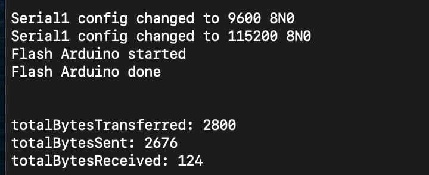
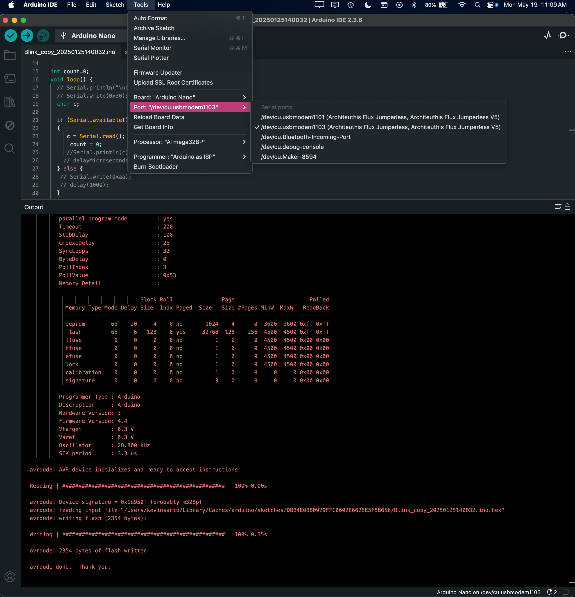

# Arduino Stuff Arduino 相关功能

## UART Passthrough UART 透传

With an Arduino Nano in the header and the UART lines connected, anything on those lines should be passed through to the second serial port that shows up when you plug in your Jumperless. 

当 Arduino Nano 插在排母上并连接了 UART 线路时，这些线路上的任何内容都会被透传到插入 Jumperless 后出现的第二个串口。

(You can also set the config option ``[serial_1] print_passthrough = true;` and have it print on both. Don't worry about the baud rate, the Jumperless senses what the host computer is set to and changes the speed accordingly.

（你也可以设置配置选项 `[serial_1] print_passthrough = true;` 让它在两个串口上同时打印。不用担心波特率，Jumperless 会自动检测主机电脑的设置并相应地更改速度。）



---

## Quick Connection Shortcuts 快速连接快捷键

The shortcuts to connect `D0` and `D1` to the Jumperless's UART `Tx` and `Rx` is `A` to connect, and `a` to disconnect.

将 `D0` 和 `D1` 连接到 Jumperless 的 UART `Tx` 和 `Rx` 的快捷键是：按 `A` 连接，按 `a` 断开。

---

## Automatic Flashing 自动烧录

It will even sense when Arduino IDE is trying to upload code and twiddle the reset lines to allow you to flash code with just a single USB cable going to your Jumperless.

它甚至能感知 Arduino IDE 何时尝试上传代码，并自动控制复位线路，让你只需通过一根连接 Jumperless 的 USB 线缆即可烧录代码。



**Tip:** You can also use [Wokwi](https://wokwi.com/) with the Jumperless Bridge app for flashing - no need to even have the Arduino IDE open!

**提示：** 你还可以配合 [Wokwi](https://wokwi.com/) 和 Jumperless Bridge 应用程序进行烧录——甚至不需要打开 Arduino IDE！

---

## Commands from Routable UART 通过可路由 UART 发送指令

You can send commands to the Jumperless from your Arduino (or anything connected to the routable UART) by wrapping them in XML-style tags. The tags are stripped out and the command is executed - the Arduino never sees them come back.

你可以从 Arduino（或任何连接到可路由 UART 的设备）向 Jumperless 发送指令，方法是将指令包裹在 XML 风格的标签中。这些标签会被剥离，指令会被执行——Arduino 不会看到它们被回传。

### Two Types of Tags 两种类型的标签

There are two flavors of command tags, depending on what you want to do:

根据你想做的事情，有两种形式的指令标签：

#### `<j>` Tags - Raw Commands `<j>` 标签 - 原始指令

These run exactly like you typed them in the main Jumperless menu. Use these for things like making connections with `f`, loading files, or any single-character menu command.

这些指令的运行方式与你在 Jumperless 主菜单中输入的完全一样。使用这些指令来进行连接（如 `f`）、加载文件或任何单字符菜单命令。

#### `<p>` Tags - Python Commands <p> 标签 - Python 指令

These run MicroPython commands directly. Perfect for `connect()`, `disconnect()`, `adc_get()`, `dac_set()`, and all the other Python hardware functions. The `<p>` tag automatically prepends the `>` that normally tells the Jumperless "this is a Python command."

这些指令直接运行 MicroPython 命令。非常适合 `connect()`、`disconnect()`、`adc_get()`、`dac_set()` 以及所有其他 Python 硬件函数。`<p>` 标签会自动在前面加上 `>`，这通常用于告诉 Jumperless “这是一条 Python 指令”。

### Supported Tag Names 支持的标签名称

Any of these work (use matching opening and closing tags):

以下任意一种均可使用（请使用匹配的开始和结束标签）：

| Tag                   | Example                                    |
| --------------------- | ------------------------------------------ |
| `<j>`                 | `<j>f 1-30</j>`                            |
| `<jumperless>`        | `<jumperless>x</jumperless>`               |
| `<jumperlessCommand>` | `<jumperlessCommand>n</jumperlessCommand>` |
| `<p>`                 | `<p>adc_get(0)</p>`                        |

---

## Python Commands with `<p>` Tags 使用 `<p>` 标签的 Python 指令

The `<p>` tag is the most powerful way to control your Jumperless from Arduino code. It gives you direct access to all the MicroPython hardware functions.

`<p>` 标签是通过 Arduino 代码控制 Jumperless 最强大的方式。它让你能直接访问所有的 MicroPython 硬件函数。

### Basic Example 基础示例

```c
#define OPENJCOMMAND Serial.print("<p>");
#define CLOSEJCOMMAND Serial.println("</p>");

void setup() {
    Serial.begin(115200);
	delay(1500);  // Give Jumperless time to boot
}

void loop() {
	// Read voltage on ADC channel 0
	OPENJCOMMAND
  	Serial.print("adc_get(0)");
  	CLOSEJCOMMAND
  	delay(100);

  	// Read the response
  	while(Serial.available() > 0) {
    	char c = Serial.read();
    	// Process the voltage reading...
  	}
}
```

### Full Example - ADC Scanning 完整示例 - ADC 扫描

<video controls width="1080">
  <source src="./04_Arduino_Stuff.assets/524080908-fcdae6a6-ef4c-4fe7-9d5c-74cee5946c08.mp4" type="video/mp4">
</video>
This sketch connects ADC0 to different breadboard rows and reads the voltage at each one:

此草图将 ADC0 连接到不同的面包板行，并读取每一行的电压：

```c
#define OPENJCOMMAND Serial.print("<p>");
#define CLOSEJCOMMAND Serial.println("</p>");

void setup() {
  	pinMode(LED_BUILTIN, OUTPUT);
  	Serial.begin(115200);
  	delay(1500);
}

int lastNode = 8;
int node = 8;
unsigned long delayTime = 60;

void loop() {
  	digitalWrite(LED_BUILTIN, HIGH);
  	delay(delayTime);

  	node++;
  	if (node > 60) {
    	node = 1;
  	}

  	// Disconnect from previous node
  	OPENJCOMMAND
  	Serial.print("disconnect( ADC0," + String(lastNode) + ")");
  	CLOSEJCOMMAND
  	delay(delayTime);

  	// Connect to new node
  	OPENJCOMMAND
  	Serial.print("connect(ADC0 ," + String(node) + ")");
  	CLOSEJCOMMAND
  	delay(delayTime);

	// Read the voltage
  	OPENJCOMMAND
  	Serial.print("adc_get(0)");
  	CLOSEJCOMMAND
  	delay(delayTime);

  	// Read response from Jumperless
  	char response[30] = {0};
  	int idx = 0;
  	while(Serial.available() > 0 && idx < 29) {
    	response[idx++] = Serial.read();
    	delay(5);
  	}

  	Serial.println(response);
  	Serial.print("num chars read = ");
  	Serial.println(idx);
  	Serial.flush();

  	lastNode = node;
  	digitalWrite(LED_BUILTIN, LOW);
}
```

### Available Python Functions 可用的 Python 函数

Here are the most useful functions you can call with `<p>` tags:

以下是你可以通过 `<p>` 标签调用的最常用函数：

```python
// Connections
"connect(1, 30)"              // Connect breadboard rows
"connect(D13, TOP_RAIL)"      // Connect Arduino pin to power
"disconnect(ADC0, 15)"        // Remove a connection
"nodes_clear()"               // Clear ALL connections

// Analog I/O
"adc_get(0)"                  // Read voltage (channels 0-4)
"dac_set(0, 3.3)"            // Set DAC output voltage
"dac_set(TOP_RAIL, 5.0)"     // Set rail voltage

// Digital I/O
"gpio_set(1, True)"          // Set GPIO high
"gpio_set(1, False)"         // Set GPIO low
"gpio_get(2)"                // Read GPIO state

// Current sensing
"ina_get_current(0)"         // Read current in amps
"ina_get_voltage(0)"         // Read shunt voltage
```

See the [MicroPython API Reference](./11_MicroPython_API_Reference.md) for the complete list.

查看 [MicroPython API 参考文档](./11_MicroPython_API_Reference.md) 获取完整列表。

------

## Raw Commands with `<j>` Tags 使用 `<j>` 标签的原始指令

Use `<j>` tags when you want to send menu commands - the same ones you'd type in the serial terminal.

当你想要发送菜单指令时使用 `<j>` 标签——即你在串口终端中输入的那些指令。

### Example - Making Connections 示例 - 建立连接

```c
#define OPENJCOMMAND Serial.print("<j>");
#define CLOSEJCOMMAND Serial.println("</j>");

void setup() {
  	pinMode(LED_BUILTIN, OUTPUT);
  	Serial.begin(115200);
  	delay(1500);
}

int node1 = 1;
int node2 = 8;
unsigned long delayTime = 60;

void loop() {
  	digitalWrite(LED_BUILTIN, HIGH);
  	delay(delayTime);

  	node1++;
  	node2++;
  	if (node1 > 60) node1 = 1;
  	if (node2 > 60) node2 = 1;

  	// Use the 'f' command to make a connection
  	// Format: f <node1>-<node2>
  	OPENJCOMMAND
  	Serial.print("f " + String(node1) + "-" + String(node2) + "\n");
 	CLOSEJCOMMAND
 	delay(delayTime);

  	// Read any response
  	char response[30] = {0};
 	 int idx = 0;
  	while(Serial.available() > 0 && idx < 29) {
    	response[idx++] = Serial.read();
    	delay(5);
  	}

  	Serial.println(response);
  	digitalWrite(LED_BUILTIN, LOW);
}
```

### Useful Raw Commands 常用的原始指令

| Command     | What it does                      |
| ----------- | --------------------------------- |
| `f 1-30`    | Connect nodes 1 and 30            |
| `+ D13-GND` | Add connection (alternate syntax) |
| `- 1-30`    | Remove connection                 |
| `x`         | Clear all connections             |
| `n`         | Show net list                     |
| `s`         | Save current state                |

------

## Tips and Gotchas 技巧与注意事项

### Timing 时序

The Jumperless needs a little time to process each command. A delay of 40-100ms between commands is usually safe. If you're seeing weird behavior, try increasing the delay.

Jumperless 需要一点时间来处理每条指令。指令之间 40-100ms 的延迟通常是安全的。如果你发现行为异常，试着增加延迟。

### Response Reading 读取响应

Commands often return data (like `adc_get()` returning a voltage). Make sure to read the Serial buffer after sending commands, or it'll fill up and cause issues.

指令通常会返回数据（比如 `adc_get()` 返回电压）。确保在发送指令后读取 Serial 缓冲区，否则它会填满并导致问题。

### Startup Delay 启动延迟

Add a `delay(1500)` in your `setup()` to give the Jumperless time to fully boot before sending commands.

在你的 `setup()` 中添加 `delay(1500)`，以便在发送指令前给 Jumperless 足够的时间完全启动。

### Flashing Your Arduino 烧录你的 Arduino

Just use the Arduino IDE normally - select the second serial port that shows up (the one labeled with "port3" or similar), and upload. The Jumperless automatically handles the reset timing.

只需像平常一样使用 Arduino IDE——选择出现的第二个串口（标签为 "port3" 或类似的），然后上传。Jumperless 会自动处理复位时序。

### Which Tag to Use? 使用哪个标签？

- **Use `<p>`** for anything that's a Python function: `connect()`, `adc_get()`, `dac_set()`, etc.

  **使用 `<p>`** 执行 Python 函数：`connect()`、`adc_get()`、`dac_set()` 等。

- **Use `<j>`** for menu commands: `f`, `x`, `n`, `s`, etc.

  **使用 `<j>`** 执行菜单指令：`f`、`x`、`n`、`s` 等。

------

## Wokwi Integration Wokwi 集成

If you're using the [Jumperless Wokwi Bridge](https://github.com/Architeuthis-Flux/Jumperless-Wokwi-Bridge), you can flash your Arduino directly from Wokwi simulations - the bridge handles all the communication for you.

如果你正在使用 [Jumperless Wokwi Bridge](https://github.com/Architeuthis-Flux/Jumperless-Wokwi-Bridge)，你可以直接从 Wokwi 仿真中烧录你的 Arduino——桥接器会为你处理所有的通信。

