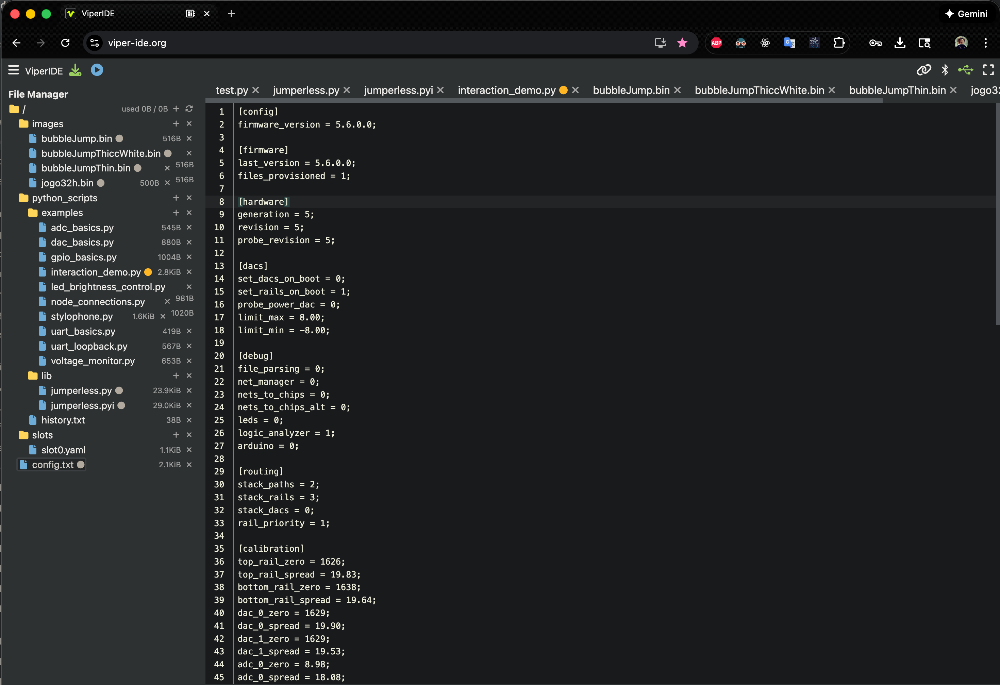

# Config File 配置文件

To change any persistent settings that apply to the Jumperless as a whole, there's a `config` file. You can read it with `~` and edit settings by copying any of those lines, pasting it back, and changing the value to whatever you want it to be.

若要更改适用于整个 Jumperless 的任何持久设置，可以使用 `config` 文件。你可以通过输入 `~` 读取它，并通过复制任何一行，粘贴回去，然后修改数值来编辑设置。

## Viewing Config.txt 查看 Config.txt

You can enter `~` to print the config.

你可以输入 `~` 来打印配置。

```j
~

copy / edit / paste any of these lines 
into the main menu to change a setting

Jumperless Config:

`[config] firmware_version = 5.6.0.0;

`[hardware] generation = 5;
`[hardware] revision = 5;
`[hardware] probe_revision = 5;

`[dacs] set_dacs_on_boot = false;
`[dacs] set_rails_on_boot = true;
`[dacs] probe_power_dac = 0;
`[dacs] limit_max = 8.00;
`[dacs] limit_min = -8.00;

`[debug] file_parsing = false;
`[debug] net_manager = false;
`[debug] nets_to_chips = false;
`[debug] nets_to_chips_alt = false;
`[debug] leds = false;
`[debug] logic_analyzer = true;
`[debug] arduino = 0;

`[routing] stack_paths = 2;
`[routing] stack_rails = 3;
`[routing] stack_dacs = 0;
`[routing] rail_priority = 1;

`[calibration] top_rail_zero = 1626;
`[calibration] top_rail_spread = 19.83;
`[calibration] bottom_rail_zero = 1638;
`[calibration] bottom_rail_spread = 19.64;
`[calibration] dac_0_zero = 1629;
`[calibration] dac_0_spread = 19.90;
`[calibration] dac_1_zero = 1629;
`[calibration] dac_1_spread = 19.53;
`[calibration] adc_0_zero = 8.98;
`[calibration] adc_0_spread = 18.08;
`[calibration] adc_1_zero = 9.01;
`[calibration] adc_1_spread = 18.15;
`[calibration] adc_2_zero = 8.98;
`[calibration] adc_2_spread = 18.06;
`[calibration] adc_3_zero = 8.96;
`[calibration] adc_3_spread = 18.05;
`[calibration] adc_4_zero = 0.00;
`[calibration] adc_4_spread = 4.92;
`[calibration] adc_7_zero = 10.52;
`[calibration] adc_7_spread = 20.66;
`[calibration] probe_max = 4040;
`[calibration] probe_min = 11;
`[calibration] probe_switch_threshold_high = 0.35;
`[calibration] probe_switch_threshold_low = 0.10;
`[calibration] probe_switch_threshold = 0.40;
`[calibration] measure_mode_output_voltage = 3.30;
`[calibration] probe_current_zero = 2.72;

`[logo_pads] top_guy = uart_tx;
`[logo_pads] bottom_guy = uart_rx;
`[logo_pads] building_pad_top = isense_pos;
`[logo_pads] building_pad_bottom = isense-;

`[display] lines_wires = wires;
`[display] menu_brightness = -10;
`[display] led_brightness = 10;
`[display] rail_brightness = 55;
`[display] special_net_brightness = 20;
`[display] net_color_mode = rainbow;
`[display] dump_leds = ;
`[display] dump_format = image;
`[display] terminal_line_buffering = 0;

`[serial_1] function = passthrough;
`[serial_1] baud_rate = 115200;
`[serial_1] print_passthrough = false;
`[serial_1] connect_on_boot = false;
`[serial_1] lock_connection = false;
`[serial_1] autoconnect_flashing = true;
`[serial_1] async_passthrough = true;

`[top_oled] enabled = true;
`[top_oled] i2c_address = 0x3C;
`[top_oled] width = 128;
`[top_oled] height = 32;
`[top_oled] connection_type = rp6_rp7;
`[top_oled] sda_pin = 6;
`[top_oled] scl_pin = 7;
`[top_oled] gpio_sda = GP_6;
`[top_oled] gpio_scl = GP_7;
`[top_oled] sda_row = -1;
`[top_oled] scl_row = -1;
`[top_oled] connect_on_boot = false;
`[top_oled] lock_connection = false;
`[top_oled] show_in_terminal = false;
`[top_oled] font = Eurostl;
`[top_oled] startup_message = images/bubbleJumpThin.bin
```

This is just a file on your filesystem called `config.txt` and just editing that file directly works too.

这也只是你的文件系统上一个名为 `config.txt` 的文件，直接编辑该文件也可以。



---

## Config Help Config 帮助

There's also a `help` you can get to by entering `~?`

你也可以通过输入 `~?` 来获取 `help`（帮助）。

```
~?

Help for command: ~


                              Read config 
                          ~ = show current config
                     ~names = show names for settings
                   ~numbers = show numbers for settings
                 ~[section] = show specific section (e.g. ~[routing])


                              Write config 
`[section] setting = value; = enter config settings (pro tip: copy/paste setting from ~ output and just change the value)


                              Reset config
                     `reset = reset to defaults (keeps calibration and hardware version)
            `reset_hardware = reset hardware settings (keeps calibration)
         `reset_calibration = reset calibration settings (keeps hardware version)
                 `reset_all = reset to defaults and clear all settings
         `force_first_start = clears everything to factory settings and runs first startup calibration


                              Help
                         ~? = show this help
```

---

# State File 状态文件

## States vs Config 状态与配置

States are now saved as YAML and we did away with the old text file format. `globalState` holds all connections, paths, and other circuit configuration in a single object that most of the code uses now.

状态现在保存为 YAML 格式，我们摒弃了旧的文本文件格式。`globalState` 在单个对象中保存所有连接、路径和其他电路配置，大部分代码现在都使用它。

**State vs Config - What's the Difference?**

状态 vs 配置 - 区别是什么？

- **State** stores things relevant to the currently loaded slot - connections, wire colors, rail voltages, GPIO settings. These change when you switch slots.

  **State** 存储与当前加载的插槽相关的内容——连接、导线颜色、电源轨电压、GPIO 设置。当你切换插槽时，这些会随之改变。

- **Config** (config.txt) contains hardware-wide settings that apply to the entire Jumperless regardless of which slot is active.

  **Config** (config.txt) 包含适用于整个 Jumperless 的硬件级设置，无论哪个插槽处于激活状态。

Rail voltages, GPIO settings, and other circuit-specific parameters now go with the state (in the YAML file) rather than config, so each slot can have its own power supply and GPIO configuration.

电源轨电压、GPIO 设置和其他特定于电路的参数现在随状态（在 YAML 文件中）一起保存，而不是在配置中，因此每个插槽都可以拥有自己的电源和 GPIO 配置。

---

## State File Structure 状态文件结构

For things specific to the current `state` of the Jumperless, there's a YAML file that contains all the connections, colors (optional), `rail` / `DAC` voltages, `GPIO` directions and pulls, stuff like that. The idea is this defines a complete setup of a particular circuit that can be switched between in different `slots`.

对于特定于 Jumperless 当前 `state`（状态）的内容，有一个 YAML 文件包含所有的连接、颜色（可选）、`rail`（电源轨）/ `DAC` 电压、`GPIO` 方向和上拉电阻等内容。其理念是定义一个特定电路的完整设置，可以在不同的 `slots`（插槽）之间切换。

The Jumperless always boots at `Slot 0`, and you can switch to other `slots` with `<` (cycle through them) or selecting one with the `click menu` with `Slots` > `Load` > `0-7` (it will show a preview of each one.) To save a copy of the currently `active slot`; `Slots` > `Save` > `0-7` will save a copy of the `active slot` to another `slot` and also make that target slot the `active`.

Jumperless 总是从 `Slot 0` 启动，你可以通过 `<`（循环切换）或在 `click menu`（点击菜单）中选择 `Slots` > `Load` > `0-7` 来切换到其他 `slots`（它会显示每个插槽的预览）。要保存当前 `active slot`（活动插槽）的副本；使用 `Slots` > `Save` > `0-7` 将 `active slot` 的副本保存到另一个 `slot`，并使该目标插槽成为 `active`（活动状态）。

```
╭────────────────────────────────────╮
│      Current YAML State (RAM)     │
╰────────────────────────────────────╯

Active Slot: 0
Dirty Flag: NO (saved)

─── YAML Output ───

version: 2
sourceOfTruth: bridges

bridges:
  - {n1: 38, n2: 44, dup: 2}
  - {n1: 21, n2: 28, dup: 2}
  - {n1: 48, n2: 55, dup: 2}
  - {n1: 4, n2: 2, dup: 2}
  - {n1: BUFFER_IN, n2: DAC0, dup: 1}

nets:
  - {num: 4, nodes: [DAC_0, BUF_IN], name: "DAC 0", anim: true}
  - {num: 6, nodes: [38, 44], color: pink}
  - {num: 7, nodes: [21, 28], color: blue}
  - {num: 8, nodes: [48, 55], color: green}
  - {num: 9, nodes: [4, 2], color: amber}

power:
  topRail: 3.30
  bottomRail: 2.50
  dac0: 3.30
  dac1: 0.00

config:
  routing: {stackPaths: 2, stackRails: 3, stackDacs: 0, railPriority: 1}
  gpio:
    direction:    [1,1,1,1,1,1,1,1,1,1]
    pulls:        [0,0,0,0,0,0,0,0,0,0]
    pwmFrequency: [1.00,1.00,1.00,1.00,1.00,1.00,1.00,1.00,1.00,1.00]
    pwmDutyCycle: [0.50,0.50,0.50,0.50,0.50,0.50,0.50,0.50,0.50,0.50]
    pwmEnabled:   [0,0,0,0,0,0,0,0,0,0]
  uart: {txFunction: 0, rxFunction: 1}
  oled: {connected: false, lockConnection: false}


─── Memory Usage ───
Connections: 5
State RAM: ~58048 bytes
```

---

## Source of Truth 真实数据源

Because the information in here is *sort of* redundant (the connections could be computed from just the `bridges` or the `nets` section on their own), there's a field called `sourceOfTruth` which is the section that actually gets parsed and then the other section is written with the computed values. (I haven't done much testing on changing this to `nets` so I'd probably just leave it on `bridges` for now.)

因为这里的信息*某种程度上*是冗余的（连接可以仅根据 `bridges` 或 `nets` 部分计算出来），所以有一个名为 `sourceOfTruth` 的字段，它是实际被解析的部分，而另一部分则写入计算出的值。（我还没怎么测试改成 `nets` 的情况，所以目前建议保持为 `bridges`。）

There's some weirdness with how colors are applied, since the `source of truth` is the bridges, and the things that actually get colored are the `nets`, it'll take the colors from the `bridges` (if specified) and try to apply them to the `nets`. But since nets always have a single color (to show that they're connected), if you have `bridges` with different colors in the same `net`, it'll just pick one (don't ask me exactly how the logic chooses, idk.)

颜色的应用有些奇怪，因为 `source of truth`（真实数据源）是 bridges（桥接），而实际着色的是 `nets`（网络），它会从 `bridges`（如果指定了）获取颜色并尝试将其应用到 `nets`。但由于 nets 通常只有一种颜色（以显示它们是连接在一起的），如果你在同一个 `net` 中有不同颜色的 `bridges`，它只会选一个（别问我具体的逻辑是怎么选的，我也不知道）。

If you specify a color to a `net` even with `sourceOfTruth: bridges` it should respect the `net` assignment over the `bridge` assignment.

如果你在 `net` 中指定了颜色，即使 `sourceOfTruth: bridges`，它也应该优先遵从 `net` 的设置而不是 `bridge` 的设置。

---

## Switching Between Saved Circuits (Slots) 在保存的电路（插槽）之间切换

The Jumperless has **8 slots** (0-7) where you can save different circuit configurations. Think of them like presets or save files.

Jumperless 有 **8 个插槽** (0-7)，你可以保存不同的电路配置。把它们想象成预设或存档文件。

**Quick slot cycling:** - Type `<` in the terminal to cycle to the next slot

**快速循环插槽：** 在终端输入 `<` 以循环到下一个插槽。

**Other slot commands:**

其他插槽命令：

- `l 5`- Load slot 5 specifically

  `l 5` - 加载插槽 5

- `Q` - Query which slot is currently active

  `Q` - 查询当前哪个插槽处于活动状态

- `s` - Show a list of all saved slots

  `s` - 显示所有已保存插槽的列表

When you make connections with the probe, they're automatically saved to whichever slot is currently active. See the [Glossary](./13_Glossary_of_Terms) for more details about slots.

当你用探针进行连接时，它们会自动保存到当前活动的插槽中。关于插槽的更多详情请参阅 [术语表](./13_Glossary_of_Terms)。

---

## Live Editing State Files 实时编辑状态文件

You can edit the YAML slot files and they will live update to the board! Whether you're editing them in the onboard `eKilo` editor or as a mounted USB MSC device on your computer, changes will be reflected immediately on your Jumperless.

你可以编辑 YAML 插槽文件，它们会实时更新到电路板上！无论你是在板载的 `eKilo` 编辑器中编辑，还是将其作为挂载的 USB MSC 设备在电脑上编辑，更改都会立即反映在你的 Jumperless 上。