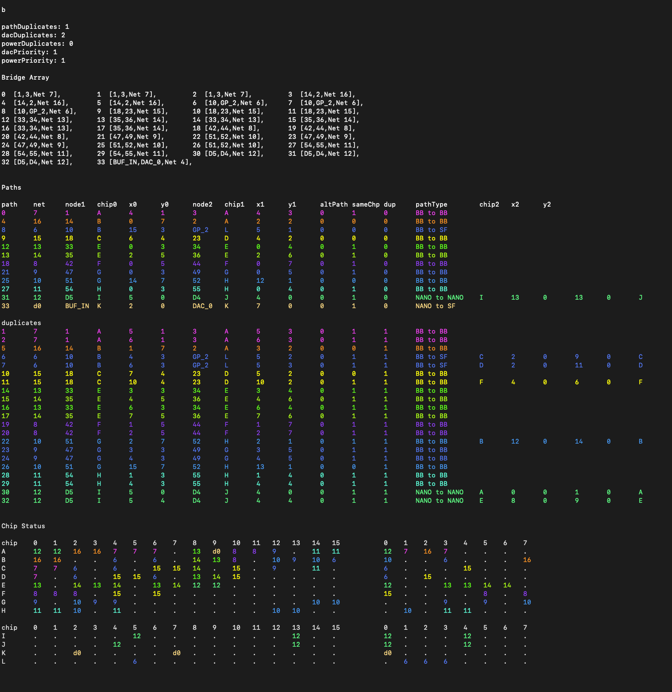
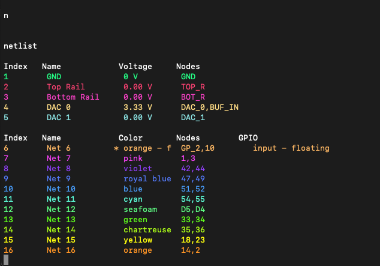

# Debug Views 调试视图

Look *Inside* your Jumperless

一探 Jumperless 的 *内部* 运作

## Crossbar Array 纵横开关阵列

There's a new way to see what the 12 analog crossbar switches are up to, just enter `c` in the menu

现在有一种新方法可以查看 12 个模拟纵横开关（analog crossbar switches）的当前状态，只需在菜单中输入 `c` 即可。

```
 Analog Crossbar Array

             chip A                            chip B                            chip C                            chip D 
     0  1  2  3  4  5  6  7            0  1  2  3  4  5  6  7            0  1  2  3  4  5  6  7            0  1  2  3  4  5  6  7            
  0 ─█───────────┼────────┼─ AI     0 ────█──┼──────────────┼─ AB0    0 ─┼──┼────────█─────█──── AC0    0 ────█────────█─────┼──── AD0  
  1 ─█───────────┼────────┼─ AJ     1 ────┼──█──────────────┼─ AB1    1 ─┼──█────────┼─────█──── AC1    1  .  │  .  .  │  .  │  .  AD1  
  2 ─┼───────────█────────┼─ AB0    2 ────┼──┼──────────────█─ BI     2  │  │  .  .  │  .  │  .  BC0    2  .  │  .  .  │  .  │  .  BD0  
  3 ─┼───────────┼────────█─ AB1    3  .  │  │  .  .  .  .  │  BJ     3  │  │  .  .  │  .  │  .  BC1    3  .  │  .  .  │  .  │  .  BD1  
  4  │  .  .  .  │  .  .  │  AC0    4  .  │  │  .  .  .  .  │  BC0    4 ─█──┼────────┼─────┼──── CI     4 ────█────────┼─────┼──── CD0  
  5  │  .  .  .  │  .  .  │  AC1    5  .  │  │  .  .  .  .  │  BC1    5 ─█──┼────────┼─────┼──── CJ     5  .  │  .  .  │  .  │  .  CD1  
  6  │  .  .  .  │  .  .  │  AD0    6  .  │  │  .  .  .  .  │  BD0    6 ─┼──┼────────█─────┼──── CD0    6  .  │  .  .  │  .  │  .  DI   
  7  │  .  .  .  │  .  .  │  AD1    7  .  │  │  .  .  .  .  │  BD1    7  │  │  .  .  │  .  │  .  CD1    7  .  │  .  .  │  .  │  .  DJ   
  8  │  .  .  .  │  .  .  │  AE0    8  .  │  │  .  .  .  .  │  BE0    8  │  │  .  .  │  .  │  .  CE0    8  .  │  .  .  │  .  │  .  DE0  
  9  │  .  .  .  │  .  .  │  AK     9  .  │  │  .  .  .  .  │  BE1    9  │  │  .  .  │  .  │  .  CL     9  .  │  .  .  │  .  │  .  DE1  
 10  │  .  .  .  │  .  .  │  AF0   10  .  │  │  .  .  .  .  │  BF0   10  │  │  .  .  │  .  │  .  CF0   10 ────┼────────┼─────█──── DF0  
 11  │  .  .  .  │  .  .  │  AF1   11  .  │  │  .  .  .  .  │  BK    11  │  │  .  .  │  .  │  .  CF1   11  .  │  .  .  │  .  │  .  DL   
 12  │  .  .  .  │  .  .  │  AG0   12  .  │  │  .  .  .  .  │  BG0   12  │  │  .  .  │  .  │  .  CG0   12  .  │  .  .  │  .  │  .  DG0  
 13  │  .  .  .  │  .  .  │  AL    13  .  │  │  .  .  .  .  │  BG1   13  │  │  .  .  │  .  │  .  CK    13  .  │  .  .  │  .  │  .  DK   
 14  │  .  .  .  │  .  .  │  AH0   14  .  │  │  .  .  .  .  │  BH0   14  │  │  .  .  │  .  │  .  CH0   14 ────┼────────█─────┼──── DH0  
 15  │  .  .  .  │  .  .  │  AH1   15  .  │  │  .  .  .  .  │  BL    15  │  │  .  .  │  .  │  .  CH1   15  .  │  .  .  │  .  │  .  DH1  
     u  1  2  3  4  5  6  7            u  8  9  10 11 12 13 14           u  15 16 17 18 19 20 21           u  22 23 24 25 26 27 28      


             chip E                            chip F                            chip G                            chip H 
     0  1  2  3  4  5  6  7            0  1  2  3  4  5  6  7            0  1  2  3  4  5  6  7            0  1  2  3  4  5  6  7            
  0 ─────────────█─────█──── AE0    0  .  .  .  │  .  │  .  .  AF0    0 ────█───────────█─────── AG0    0 ────█─────█───────────┼─ AH0  
  1  .  .  .  .  │  .  │  .  EK     1  .  .  .  │  .  │  .  .  AF1    1  .  │  .  .  .  │  .  .  GL     1  .  │  .  │  .  .  .  │  AH1  
  2  .  .  .  .  │  .  │  .  BE0    2  .  .  .  │  .  │  .  .  BF0    2  .  │  .  .  .  │  .  .  BG0    2  .  │  .  │  .  .  .  │  BH0  
  3  .  .  .  .  │  .  │  .  BE1    3  .  .  .  │  .  │  .  .  FK     3  .  │  .  .  .  │  .  .  BG1    3  .  │  .  │  .  .  .  │  HL   
  4  .  .  .  .  │  .  │  .  CE0    4  .  .  .  │  .  │  .  .  CF0    4  .  │  .  .  .  │  .  .  CG0    4  .  │  .  │  .  .  .  │  CH0  
  5  .  .  .  .  │  .  │  .  EL     5  .  .  .  │  .  │  .  .  CF1    5  .  │  .  .  .  │  .  .  GK     5  .  │  .  │  .  .  .  │  CH1  
  6  .  .  .  .  │  .  │  .  DE0    6 ──────────┼─────█─────── DF0    6  .  │  .  .  .  │  .  .  DG0    6 ────┼─────┼───────────█─ DH0  
  7  .  .  .  .  │  .  │  .  DE1    7  .  .  .  │  .  │  .  .  FL     7  .  │  .  .  .  │  .  .  DG1    7  .  │  .  │  .  .  .  │  HK   
  8  .  .  .  .  │  .  │  .  EI     8  .  .  .  │  .  │  .  .  EF0    8  .  │  .  .  .  │  .  .  EG0    8  .  │  .  │  .  .  .  │  EH0  
  9  .  .  .  .  │  .  │  .  EJ     9  .  .  .  │  .  │  .  .  EF1    9  .  │  .  .  .  │  .  .  EG1    9  .  │  .  │  .  .  .  │  EH1  
 10  .  .  .  .  │  .  │  .  EF0   10  .  .  .  │  .  │  .  .  FI    10 ────┼───────────█─────── FG0   10  .  │  .  │  .  .  .  │  FH0  
 11  .  .  .  .  │  .  │  .  EF1   11  .  .  .  │  .  │  .  .  FJ    11  .  │  .  .  .  │  .  .  FG1   11  .  │  .  │  .  .  .  │  FH1  
 12  .  .  .  .  │  .  │  .  EG0   12 ──────────█─────┼─────── FG0   12  .  │  .  .  .  │  .  .  GI    12  .  │  .  │  .  .  .  │  GH0  
 13  .  .  .  .  │  .  │  .  EG1   13  .  .  .  │  .  │  .  .  FG1   13  .  │  .  .  .  │  .  .  GJ    13  .  │  .  │  .  .  .  │  GH1  
 14  .  .  .  .  │  .  │  .  EH0   14  .  .  .  │  .  │  .  .  FH0   14  .  │  .  .  .  │  .  .  GH0   14  .  │  .  │  .  .  .  │  HI   
 15  .  .  .  .  │  .  │  .  EH1   15  .  .  .  │  .  │  .  .  FH1   15  .  │  .  .  .  │  .  .  GH1   15  .  │  .  │  .  .  .  │  HJ   
     u  31 32 33 34 35 36 37           u  38 39 40 41 42 43 44           u  45 46 47 48 49 50 51           u  52 53 54 55 56 57 58      


             chip I                            chip J                            chip K                            chip L 
     0  1  2  3  4  5  6  7            0  1  2  3  4  5  6  7            0  1  2  3  4  5  6  7            0  1  2  3  4  5  6  7            
  0 ─┼──┼──┼──█──┼────────── nA0    0  │  │  │  .  .  .  .  .  nD0    0  │  .  .  .  .  .  .  .  29     0  .  .  .  .  .  .  .  .  30   
  1  │  │  │  │  │  .  .  .  nD1    1 ─┼──█──┼──────────────── nA1    1  │  .  .  .  .  .  .  .  59     1  .  .  .  .  .  .  .  .  60   
  2  │  │  │  │  │  .  .  .  nA2    2 ─┼──┼──█──────────────── nD2    2 ─█────────────────────── BFi    2  .  .  .  .  .  .  .  .  BFo  
  3  │  │  │  │  │  .  .  .  nD3    3  │  │  │  .  .  .  .  .  nA3    3  │  .  .  .  .  .  .  .  ARF    3  .  .  .  .  .  .  .  .  5V   
  4 ─█──┼──┼──┼──┼────────── nA4    4  │  │  │  .  .  .  .  .  nD4    4  │  .  .  .  .  .  .  .  TRl    4  .  .  .  .  .  .  .  .  GP1  
  5 ─┼──┼──█──┼──┼────────── nD5    5 ─█──┼──┼──────────────── nA5    5  │  .  .  .  .  .  .  .  BRl    5  .  .  .  .  .  .  .  .  GP2  
  6 ─┼──█──┼──┼──┼────────── nA6    6  │  │  │  .  .  .  .  .  nD6    6  │  .  .  .  .  .  .  .  Da1    6  .  .  .  .  .  .  .  .  GP3  
  7 ─┼──┼──┼──┼──█────────── nD7    7  │  │  │  .  .  .  .  .  nA7    7 ─█────────────────────── Da0    7  .  .  .  .  .  .  .  .  GP4  
  8  │  │  │  │  │  .  .  .  nD1    8  │  │  │  .  .  .  .  .  nD8    8  │  .  .  .  .  .  .  .  Ad0    8  .  .  .  .  .  .  .  .  GP5  
  9 ─┼──┼──┼──┼──█────────── nD9    9  │  │  │  .  .  .  .  .  nD1    9  │  .  .  .  .  .  .  .  Ad1    9  .  .  .  .  .  .  .  .  GP6  
 10  │  │  │  │  │  .  .  .  nD1   10  │  │  │  .  .  .  .  .  nD1   10  │  .  .  .  .  .  .  .  Ad2   10  .  .  .  .  .  .  .  .  GP7  
 11  │  │  │  │  │  .  .  .  I+    11  │  │  │  .  .  .  .  .  I-    11  │  .  .  .  .  .  .  .  Ad3   11  .  .  .  .  .  .  .  .  GP8  
 12  │  │  │  │  │  .  .  .  IL    12  │  │  │  .  .  .  .  .  JL    12  │  .  .  .  .  .  .  .  KL    12  .  .  .  .  .  .  .  .  LI   
 13 ─┼──┼──┼──█──┼────────── IJ    13 ─┼──█──┼──────────────── IJ    13  │  .  .  .  .  .  .  .  KI    13  .  .  .  .  .  .  .  .  LJ   
 14  │  │  │  │  │  .  .  .  IK    14  │  │  │  .  .  .  .  .  JK    14  │  .  .  .  .  .  .  .  KJ    14  .  .  .  .  .  .  .  .  LK   
 15  │  │  │  │  │  .  .  .  uRX   15  │  │  │  .  .  .  .  .  uTX   15  │  .  .  .  .  .  .  .  GND   15  .  .  .  .  .  .  .  .  GND  
     AI BI CI DI EI FI GI HI           AJ BJ CJ DJ EJ FJ GJ HJ           AK BK CK DK EK FK GK HK           AL BL CL DL EL FL GL HL      
```

------

## Bridge Array 桥接阵列

Enter `b` in the menu. This is generally the most helpful one for *me* to troubleshoot what's going on if your issue has anything to do with routing or connections. It probably looks like nonsense to you but I've been in it so long it makes perfect sense to me.

在菜单中输入 `b`。如果你的问题涉及到布线（routing）或连接，这通常是对 *我* 排查故障最有帮助的一个视图。对你来说，这一堆东西可能看起来毫无意义（像乱码），但我沉浸其中太久了，对我而言它非常清晰合理。



------

## Net List 网络表

Enter `n` in the menu to show this one. If you have anything that's doing any measurement (`gpio` input or `ADC`s), it'll stay up and live update if any of them change. (And just like basically any menu not asking for input, entering anything will bring you back to the main menu.)

在菜单中输入 `n` 即可显示此视图。如果当前有任何正在进行的测量任务（例如 `gpio` 输入或 `ADC`），该视图会保持显示，并在数值发生变化时实时更新。（和基本上所有不需要输入参数的菜单一样，输入任意内容即可返回主菜单。）

