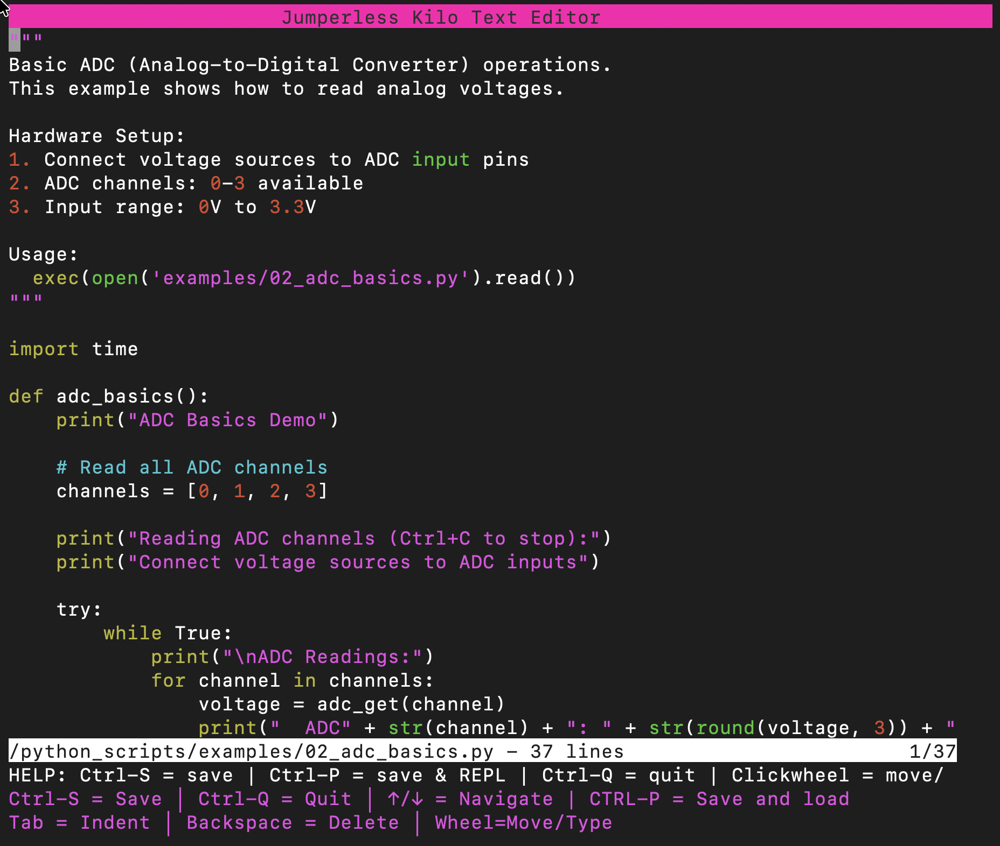
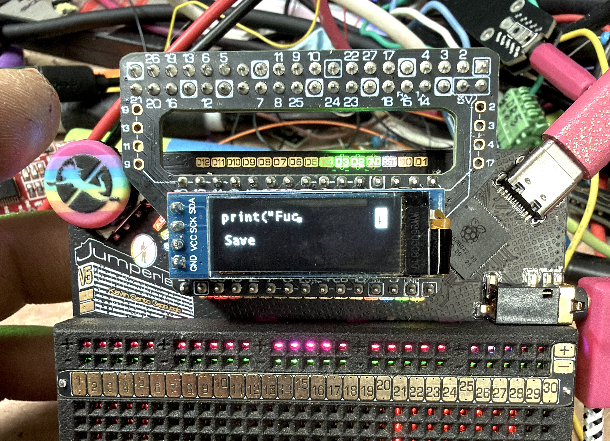
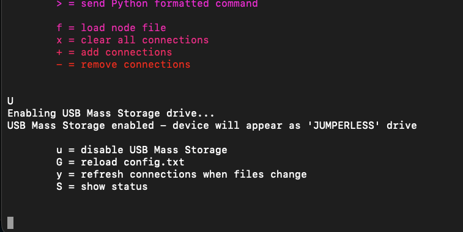
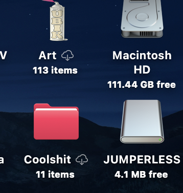
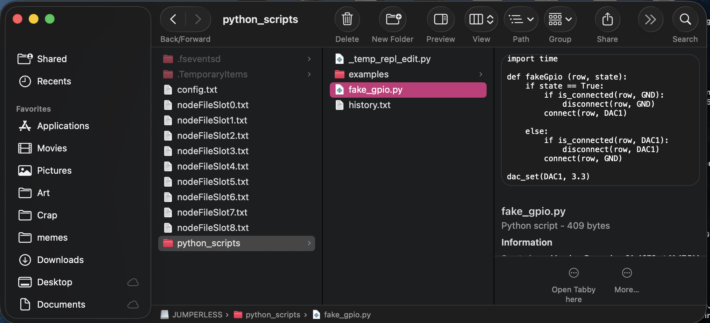

# File Manager 文件管理器

The Jumperless has a built in File Manager which you can access in the menu with `/`, or enter `U` in the menu and Jumperless will mount as a USB Mass Storage drive called `JUMPERLESS` where you can edit files on the filesystem.

Jumperless 内置了一个文件管理器，你可以在菜单中输入 `/` 访问，或者输入 `U` 将 Jumperless 挂载为名为 `JUMPERLESS` 的 USB 大容量存储驱动器，以便在文件系统上直接编辑文件。

## File System Structure 文件系统结构

```
├── config.txt
│
├── slots/
│   ├── slot0.yaml
│   ├── slot1.yaml
│   ├── slot2.yaml
│   └── ... (up to slot7.yaml)
│
└── python_scripts/
    ├── history.txt
    ├── cool_micropython_script.py
    ├── ... (your python scripts go here)
    │
    └── examples/
        ├── adc_basics.py
        ├── dac_basics.py
        ├── gpio_basics.py
        ├── led_brightness_control.py
        ├── node_connections.py
        ├── stylophone.py
        ├── uart_basics.py
        ├── uart_loopback.py
        └── voltage_monitor.py
```

Each slot's configuration is stored as a YAML file in the `/slots/` directory, and the global hardware configuration is in `/config.txt`.

每个插槽的配置都作为 YAML 文件存储在 `/slots/` 目录中，全局硬件配置位于 `/config.txt`。

---

## Navigation 导航

### Basic Movement 基本移动

| Control                                  | Action                           |
| ---------------------------------------- | -------------------------------- |
| **↑/↓ Arrow Keys** or **Rotary Encoder** | Move selection up/down           |
| **Enter** or **Click Encoder**           | Open directory or edit file      |
| **/**                                    | Go to root directory             |
| **.**                                    | Go up one directory              |
| **CTRL + q**                             | Quit File Manager or Text Editor |

| 控件                             | 动作                       |
| -------------------------------- | -------------------------- |
| **↑/↓ 箭头键** 或 **旋转编码器** | 上/下移动选择              |
| **Enter** 或 **点击编码器**      | 打开目录或编辑文件         |
| **/**                            | 转到根目录                 |
| **.**                            | 返回上一级目录             |
| **CTRL + q**                     | 退出文件管理器或文本编辑器 |

### File Manager Commands 文件管理器命令

| Key     | Action        | Description                                     |
| ------- | ------------- | ----------------------------------------------- |
| [enter] | Open          | Open file or enter directory                    |
| **h**   | Help          | Show help                                       |
| **v**   | Quick view    | View file contents                              |
| **.**   | Up dir        | Go up one directory                             |
| **n**   | New file      | Create new file (prompts for filename)          |
| **d**   | New directory | Create new directory                            |
| **x**   | Delete        | Delete file or directory (confirm with `y`/`N`) |

| 按键    | 动作     | 描述                                |
| ------- | -------- | ----------------------------------- |
| [enter] | 打开     | 打开文件或进入目录                  |
| **h**   | 帮助     | 显示帮助                            |
| **v**   | 快速查看 | 查看文件内容                        |
| **.**   | 上级目录 | 返回上一级目录                      |
| **n**   | 新建文件 | 创建新文件（提示输入文件名）        |
| **d**   | 新建目录 | 创建新目录                          |
| **x**   | 删除     | 删除文件或目录（需用 `y`/`N` 确认） |

### File Type Icons and Colors 文件类型图标和颜色

| Icon  | File Type         | Extensions              | Color   |
| ----- | ----------------- | ----------------------- | ------- |
| **⌘** | Directories       | -                       | Blue    |
| **𓆚** | Python files      | .py, .pyw, .pyi         | Green   |
| **⍺** | Text files        | .txt, .md               | White   |
| **⚙** | Config files      | .cfg, .conf, config.txt | Yellow  |
| **⟐** | JSON/YAML files   | .json, .yaml            | Cyan    |
| **☊** | Slot files        | /slots/slot*.yaml       | Magenta |
| **⎃** | Legacy slot files | nodeFileSlot*.txt       | Orange  |

| 图标  | 文件类型       | 扩展名                  | 颜色   |
| ----- | -------------- | ----------------------- | ------ |
| **⌘** | 目录           | -                       | 蓝色   |
| **𓆚** | Python 文件    | .py, .pyw, .pyi         | 绿色   |
| **⍺** | 文本文件       | .txt, .md               | 白色   |
| **⚙** | 配置文件       | .cfg, .conf, config.txt | 黄色   |
| **⟐** | JSON/YAML 文件 | .json, .yaml            | 青色   |
| **☊** | 插槽文件       | /slots/slot*.yaml       | 洋红色 |
| **⎃** | 旧版插槽文件   | nodeFileSlot*.txt       | 橙色   |

---

## Jumperless eKilo Text Editor Jumperless eKilo 文本编辑器

The File Manager also has text editor based off [**eKilo**](https://github.com/antonio-foti/ekilo)

文件管理器还包含一个基于 **[eKilo](https://github.com/antonio-foti/ekilo)** 的文本编辑器。



### Editor Controls 编辑器控件

- **Ctrl+S**: Save file

  **Ctrl+S**: 保存文件

- **Ctrl+Q**: Quit editor

  **Ctrl+Q**: 退出编辑器

- **Ctrl+P**: Save and launch MicroPython REPL

  **Ctrl+P**: 保存并启动 MicroPython REPL

- **Arrow keys**: Navigate cursor

  **箭头键**: 移动光标

- **Rotary encoder**: Move cursor horizontally

  **旋转编码器**: 水平移动光标

- **Click encoder**: Enter character selection mode (you can scroll through the letters on the OLED and click again to insert it)

  **点击编码器**: 进入字符选择模式（你可以在 OLED 上滚动选择字母，再次点击插入）

### Character Selection With the Click Wheel and OLED 使用滚轮和 OLED 选择字符

When using the rotary encoder in the editor:

在编辑器中使用旋转编码器时：

- **Click encoder**: Enter character selection mode

  **点击编码器**: 进入字符选择模式

- **Rotate encoder**: Cycle through available characters

  **旋转编码器**: 循环浏览可用字符

- **Click encoder**: Confirm character selection

  **点击编码器**: 确认字符选择

- **Wait 3 seconds**: Exit character selection mode

  **等待 3 秒**: 退出字符选择模式

Yes, you could write code with just the click wheel and the OLED if you really wanted to.

是的，如果你真想这么做，你完全可以只用滚轮和 OLED 来写代码。



---

## OLED Display Support OLED 显示支持

If you have an OLED connected, the File Manager shows:

如果你连接了 OLED，文件管理器会显示：

- **Current path** and **selected file**

  **当前路径**和**选中的文件**

- **File navigation** with scrolling support

  支持滚动的**文件导航**

- **Real-time updates** as you navigate

  导航时的**实时更新**

### MicroPython Examples MicroPython 示例

The File Manager automatically creates example Python scripts in `/python_scripts/examples/`:

文件管理器会在 `/python_scripts/examples/` 中自动创建示例 Python 脚本：

#### Basic Hardware Examples 基础硬件示例

- [**adc_basics.py**](https://github.com/Architeuthis-Flux/JumperlOS/blob/main/scripts/ex/adc_basics.py): Basic ADC (Analog-to-Digital Converter) operations.

  **[adc_basics.py](https://github.com/Architeuthis-Flux/JumperlOS/blob/main/scripts/ex/adc_basics.py)**: 基础 ADC（模数转换器）操作。

  - This example shows how to read analog voltages from all ADC channels (0-3). Connect voltage sources to ADC inputs and monitor readings in real-time.

    此示例展示了如何读取所有 ADC 通道（0-3）的模拟电压。将电压源连接到 ADC 输入并实时监控读数。

- [**dac_basics.py**](https://github.com/Architeuthis-Flux/JumperlOS/blob/main/scripts/ex/dac_basics.py): Basic DAC (Digital-to-Analog Converter) operations.

  **[dac_basics.py](https://github.com/Architeuthis-Flux/JumperlOS/blob/main/scripts/ex/dac_basics.py)**: 基础 DAC（数模转换器）操作。

  - Shows how to set DAC voltages on all channels (DAC_A, DAC_B, TOP_RAIL, BOTTOM_RAIL).

    展示如何设置所有通道（DAC_A, DAC_B, TOP_RAIL, BOTTOM_RAIL）的 DAC 电压。

  - Hardware setup: Connect voltmeter or LED to DAC output pins.

    硬件设置：将电压表或 LED 连接到 DAC 输出引脚。

- [**gpio_basics.py**](https://github.com/Architeuthis-Flux/JumperlOS/blob/main/scripts/ex/gpio_basics.py): Basic GPIO (General Purpose Input/Output) operations.

  **[gpio_basics.py](https://github.com/Architeuthis-Flux/JumperlOS/blob/main/scripts/ex/gpio_basics.py)**: 基础 GPIO（通用输入/输出）操作。

  - This example demonstrates digital I/O, direction control, and pull resistors.

    此示例演示数字 I/O、方向控制和上拉电阻。

  - Tests input mode with pull-up, pull-down, and floating configurations.

    测试上拉、下拉和浮动配置下的输入模式。

- [**node_connections.py**](https://github.com/Architeuthis-Flux/JumperlOS/blob/main/scripts/ex/node_connections.py): Node connection and routing operations.

  **[node_connections.py](https://github.com/Architeuthis-Flux/JumperlOS/blob/main/scripts/ex/node_connections.py)**: 节点连接和路由操作。

  - This example shows how to connect/disconnect nodes, check connections, and clear all connections.

    此示例展示如何连接/断开节点，检查连接，以及清除所有连接。

  - Demonstrates working with breadboard nodes, DAC outputs, and GPIO pins.

    演示如何使用面包板节点、DAC 输出和 GPIO 引脚。

- **uart_loopback.py**: UART Loopback Demo.

  **uart_loopback.py**: UART 环回演示。

  - Demonstrates UART communication by looping back data from UART_TX to UART_RX.
  
    通过将数据从 UART_TX 环回到 UART_RX 来演示 UART 通信。
  
  - Open a serial monitor on the Jumperless's second port at 115200 baud to see the looped messages.
  
    通过将数据从 UART_TX 环回到 UART_RX 来演示 UART 通信。

#### Interactive Examples 交互式示例

- [**interaction_demo.py**](https://github.com/Architeuthis-Flux/JumperlOS/blob/main/scripts/ex/interaction_demo.py): Interactive Demo - Control connections with probe, encoder, and buttons.
  
  **[interaction_demo.py](https://github.com/Architeuthis-Flux/JumperlOS/blob/main/scripts/ex/interaction_demo.py)**: 交互式演示 - 使用探针、编码器和按钮控制连接。
  
  - This example shows how to use all the interactive controls together.
  
    此示例展示了如何配合使用所有交互式控件。
  
  - No special hardware needed - use the probe to tap nodes, the encoder to adjust bridge spread, and buttons to change colors.
  
    无需特殊硬件 - 使用探针轻触节点，使用编码器调整桥接范围，使用按钮更改颜色。
  
- [**led_brightness_control.py**](https://github.com/Architeuthis-Flux/JumperlOS/blob/main/scripts/ex/led_brightness_control.py): LED Brightness Control Demo.
  
  **[led_brightness_control.py](https://github.com/Architeuthis-Flux/JumperlOS/blob/main/scripts/ex/led_brightness_control.py)**: LED 亮度控制演示。
  
  - Tap breadboard pads 1-60 to control the voltage on an LED and display the current draw.
  
    轻触面包板焊盘 1-60 可控制 LED 上的电压并显示当前电流消耗。
  
  - Hardware setup: Connect LED anode to breadboard row 15, connect LED cathode to GND.
  
    轻触面包板焊盘 1-60 可控制 LED 上的电压并显示当前电流消耗。
  
  - Displays voltage and current on OLED.
  
    在 OLED 上显示电压和电流。
  
- [**stylophone.py**](https://github.com/Architeuthis-Flux/JumperlOS/blob/main/scripts/ex/stylophone.py): Jumperless Stylophone.
  
  **[stylophone.py](https://github.com/Architeuthis-Flux/JumperlOS/blob/main/scripts/ex/stylophone.py)**: Jumperless 触笔风琴 (Stylophone)。
  
  - Musical instrument using probe and GPIO to generate audio tones.
  
    使用探针和 GPIO 生成音频的乐器。
  
  - Hardware setup: Connect speaker between rows 25 (positive) and 55 (negative).
  
    硬件设置：在第 25 行（正极）和 55 行（负极）之间连接扬声器。
  
  - Touch breadboard pads to play different frequencies, use probe buttons to adjust sustain.
  
    触摸面包板焊盘以播放不同频率，使用探针按钮调整延音。

You can trigger them to regenerate if you messed them up by deleting it with `x` (when you're in the File Manager), and then entering `m` to create new copies of any examples it doesn't see.

如果你搞乱了这些文件，可以用 `x` 删除它们（在文件管理器中），然后输入 `m` 来为系统找不到的任何示例重新创建副本。

---

## Editing Slot Files 编辑插槽文件

Slot files (located in `/slots/`) use **YAML format** and can be edited directly! They're human-readable files containing:

插槽文件（位于 `/slots/`）使用 **YAML 格式**，可以直接编辑！它们是人类可读的文件，包含：

- **bridges** - Your circuit connections

  **bridges** - 你的电路连接

- **power** - Rail and DAC voltages

  **power** - 导轨和 DAC 电压

- **colors** - Wire colors from Wokwi or custom colors

  **colors** - 来自 Wokwi 的导线颜色或自定义颜色

- **config** - Routing preferences and GPIO settings

  **config** - 路由首选项和 GPIO 设置

**Example slot file:**

插槽文件示例：

```yaml
version: 2
sourceOfTruth: bridges

bridges:
  - {n1: 1, n2: 10, dup: 2, color: red}
  - {n1: NANO_D5, n2: GPIO_1, dup: 2}
  - {n1: TOP_RAIL, n2: 5, dup: 2}

power:
  topRail: 3.30
  bottomRail: 2.50
  dac0: 3.33
  dac1: 0.00
```


**Named nodes** you can use: `NANO_D0-D13`, `NANO_A0-A7`, `GPIO_1-8`, `TOP_RAIL`, `BOTTOM_RAIL`, `GND`, `DAC0_5V`, `DAC1_5V`, and more (see [glossary](./13_Glossary_of_Terms.md))

你可以使用的**命名节点**：`NANO_D0-D13`, `NANO_A0-A7`, `GPIO_1-8`, `TOP_RAIL`, `BOTTOM_RAIL`, `GND`, `DAC0_5V`, `DAC1_5V` 等等（参见 [术语表](./13_Glossary_of_Terms.md)）。

When you edit and save a slot file, the Jumperless will automatically reload it if it's the active slot. This works whether you're using the onboard eKilo editor or have the Jumperless mouned as a USB Mass Storage drive and are editing the files on your computer in you favorite editor.

当你编辑并保存插槽文件时，如果它是当前活动的插槽，Jumperless 会自动重新加载它。无论你是使用板载 eKilo 编辑器，还是将 Jumperless 挂载为 USB 大容量存储驱动器并在电脑上使用你喜欢的编辑器编辑，这都有效。

---

## USB Mass Storage USB 大容量存储

Enter `U` in the menu and Jumperless will mount as a USB Mass Storage drive called `JUMPERLESS` where you can edit files on the filesystem.

在菜单中输入 `U`，Jumperless 将挂载为名为 `JUMPERLESS` 的 USB 大容量存储驱动器，你可以在此编辑文件系统上的文件。

Keep in mind that file operations are pretty slow, so make sure to give it time to fully save files when you drop them onto the filesystem.

请记住，文件操作相当慢，所以将文件拖入文件系统时，请确保给它足够的时间来完全保存。

When you're finished `u` (or just eject the drive) will unmount the Mass Storage device.

完成后输入 `u`（或者直接弹出驱动器）将卸载大容量存储设备。

You can also enter `Z` for a little debug menu.

你也可以输入 `Z` 打开一个小小的调试菜单。







---

## Navigation Reference 导航参考

| Key   | Action          |
| ----- | --------------- |
| ↑/↓   | Move selection  |
| Enter | Open/Edit       |
| /     | Go to root      |
| .     | Go up directory |
| h     | Show help       |

| 按键  | 动作       |
| ----- | ---------- |
| ↑/↓   | 移动选择   |
| Enter | 打开/编辑  |
| /     | 转到根目录 |
| .     | 上级目录   |
| h     | 显示帮助   |

### File Operations 文件操作

| Key  | Action        |
| ---- | ------------- |
| v    | View file     |
| e    | Edit file     |
| i    | File info     |
| n    | New file      |
| d    | New directory |
| x    | Delete        |
| r    | Refresh       |

| 按键 | 动作     |
| ---- | -------- |
| v    | 查看文件 |
| e    | 编辑文件 |
| i    | 文件信息 |
| n    | 新建文件 |
| d    | 新建目录 |
| x    | 删除     |
| r    | 刷新     |

### System 系统

| Key    | Action              |
| ------ | ------------------- |
| u      | Memory status       |
| m      | Initialize examples |
| Ctrl+Q | Quit                |

| 按键   | 动作       |
| ------ | ---------- |
| u      | 内存状态   |
| m      | 初始化示例 |
| Ctrl+Q | 退出       |