# MicroPython MicroPython

This guide covers how to write, load, and run Python scripts that control Jumperless hardware using the embedded MicroPython interpreter.

本指南介绍了如何编写、加载和运行通过嵌入式 MicroPython 解释器控制 Jumperless 硬件的 Python 脚本。

If you just want an overview of all the available calls, check out the [MicroPython API Reference](./11_MicroPython_API_Reference.md).

如果您只想概览所有可用的调用，请查看 [MicroPython API 参考手册](./11_MicroPython_API_Reference.md)。

## Now you can live code with [Viper IDE](https://viper-ide.org/)! 现在您可以使用 [Viper IDE](https://viper-ide.org/) 进行实时编程了！

Holy shit I should have done this years ago.

天哪，我几年前就该这么做了。

Seriously, this is *such* a better experience than using the onboard text editor and REPL, you should play with it right now.

说真的，这种体验比使用板载文本编辑器和 REPL 要好太多了，您现在就应该去试试。

Go to https://viper-ide.org/ and press the connect button.

前往 https://viper-ide.org/ 并点击连接按钮。

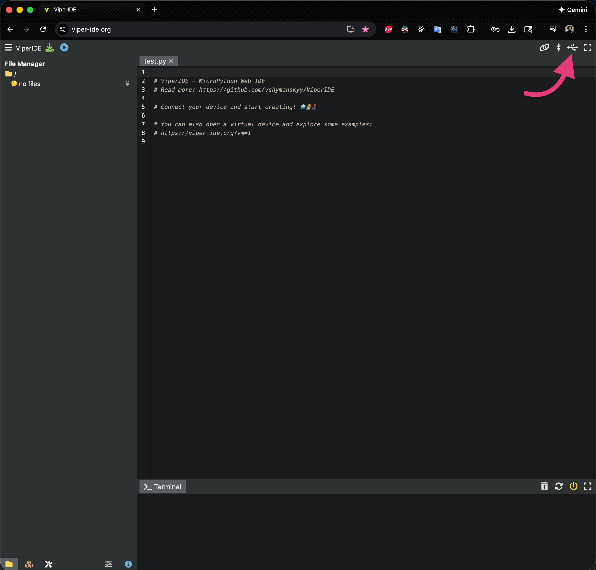

Choose the 3rd Jumperless port in that list (Windows may not put them in order, so if nothing happens, try the other ones) and click Connect.

在列表中选择第 3 个 Jumperless 端口（Windows 可能不会按顺序排列，所以如果没有反应，请尝试其他端口），然后点击 Connect（连接）。

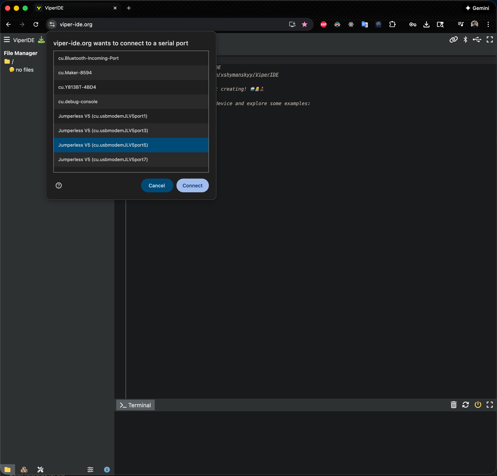

Then open some examples (this update should overwrite the examples with the new ones) and hit the Run / Stop button.

然后打开一些示例（此更新应该会用新示例覆盖旧示例），并点击 Run / Stop（运行/停止）按钮。

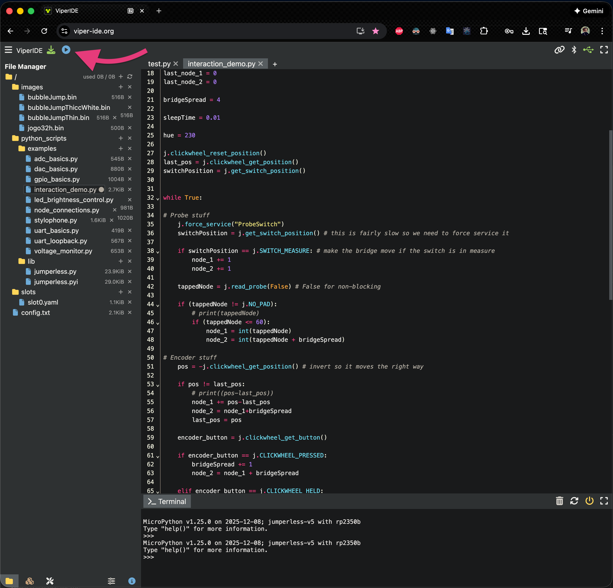

Press it again to Stop. If you make changes, hit the green Save button next to it (it takes a second and the script should be stopped.)

再次按下以停止。如果您进行了更改，请点击旁边的绿色保存按钮（这只需要一秒钟，脚本应该处于停止状态）。

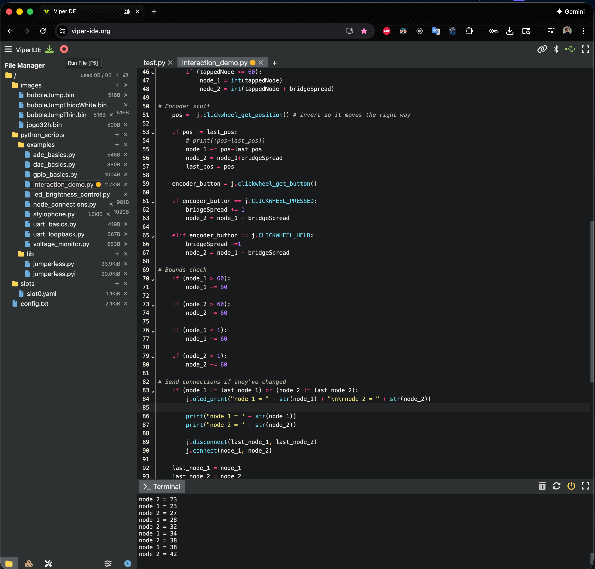

### If you write something cool, send it to me and I'll add it to the default examples (I'll put a page on this site soon where you can share them.) 如果您写了一些很酷的东西，请发给我，我会把它添加到默认示例中（我很快会在这个网站上开设一个页面，供大家分享。）

This is using [MicroPython's built-in Raw REPL](https://docs.micropython.org/en/latest/reference/repl.html#raw-mode-and-raw-paste-mode), so anything that can interact with that will work here. I've only tested with Viper IDE but I'm pretty sure just about anything else would work.

这使用的是 [MicroPython 内置的 Raw REPL](https://docs.micropython.org/en/latest/reference/repl.html#raw-mode-and-raw-paste-mode)，所以任何能与之交互的东西都可以工作。我只测试了 Viper IDE，但我很确定其他工具也能行。

There's also `jumperless.py` and `jumperless.pyi` module with stubs for all the built-in functions so syntax highlighting and autocomplete will work in your favorite code editor (sorry, autocomplete for jumperless functions doesn't work in ViperIDE.) You can grab them here:

这里还有 `jumperless.py` 和 `jumperless.pyi` 模块，包含所有内置函数的存根（stubs），因此您喜欢的代码编辑器中的语法高亮和自动补全功能将可以正常工作（抱歉，ViperIDE 中不支持 jumperless 函数的自动补全）。您可以在这里获取它们：

[jumperless.py](https://github.com/Architeuthis-Flux/JumperlOS/blob/main/scripts/jumperless.py)

[jumperless.pyi](https://github.com/Architeuthis-Flux/JumperlOS/blob/main/scripts/jumperless.pyi)

---

## Quick Start (to do it from the built-in REPL) 快速入门 (通过内置 REPL 操作)

From the main Jumperless menu, press `p` to enter the MicroPython REPL:

在 Jumperless 主菜单中，按 `p` 进入 MicroPython REPL：

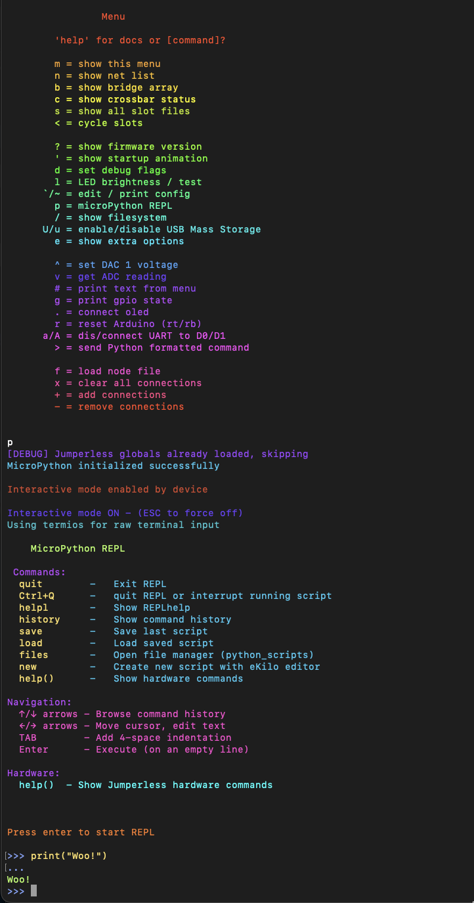

---

## REPL Navigation REPL 导航

Up / Down arrow keys on a blank prompt will scroll through history, any other key will break out of history mode and enter multiline editing. So you can use arrow keys to navigate and edit the script.

在空白提示符下按上/下方向键将滚动浏览历史记录，任何其他键将退出历史记录模式并进入多行编辑模式。因此，您可以使用方向键导航和编辑脚本。

---

## Hardware Control Functions 硬件控制函数

All Jumperless hardware functions are automatically imported into the global namespace - no prefix needed

所有 Jumperless 硬件函数都会自动导入到全局命名空间中——不需要前缀。

---

## Basic Hardware Control 基础硬件控制

```
# Connect nodes 1 and 5
connect(1, 5)

# Set GPIO pin 1 to HIGH
gpio_set(1, True)

# Read ADC channel 0
voltage = adc_get(0)
print("Voltage: " + str(voltage) + "V")

# Set DAC channel 0 to 3.3V
dac_set(0, 3.3)
```

---

## Node Connections 节点连接

```
# Connect two nodes
connect(1, 5)                    # Connect using numbers
connect("d13", "tOp_rAiL")       # Connect using node names (case insensitive when in quotes)
connect(TOP_RAIL, BOTTOM_RAIL)   # Connect using DEFINEs (all caps) Note: This will actually just be ignored by the Jumperless due to Do Not Intersect rules

# Disconnect bridges
disconnect(1, 5)

# Disconnect everything connected to a node
disconnect(5, -1)

# Check if nodes are connected
if is_connected(1, 5):
    print("Nodes 1 and 5 are connected")

# Clear all connections
nodes_clear()
```


---

## DAC (Output Voltage) DAC (输出电压)

```
# Set DAC voltage (-8.0V to 8.0V)
dac_set(0, 2.5)    # Set DAC channel 0 to 2.5V
dac_set(1, 1.65)   # Set DAC channel 1 to 1.65V

# Read current DAC voltage
voltage = dac_get(0)
print("DAC 0: " + str(voltage) + "V")

# Available channels:
# 0 = DAC0, 1 = DAC1, 2 = TOP_RAIL, 3 = BOTTOM_RAIL
# Can also use node names: DAC0, DAC1, TOP_RAIL, BOTTOM_RAIL
```

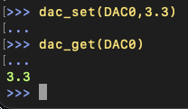

---

## ADC (Measure Voltage) ADC (测量电压)

```
# Read analog voltage (0-8V range for channels 0-3, 0-5V for channel 4)
voltage = adc_get(0)    # Read ADC channel 0
voltage = adc_get(1)    # Read ADC channel 1

# Available channels: 0, 1, 2, 3, 4
```

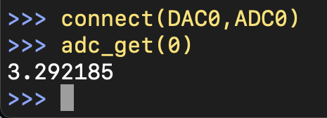

---

## GPIO (General Purpose I/O) GPIO (通用输入/输出)

```
# Set GPIO direction
gpio_set_dir(1, True)   # Set GPIO 1 as OUTPUT
gpio_set_dir(2, False)  # Set GPIO 2 as INPUT

# Set GPIO state
gpio_set(1, True)       # Set GPIO 1 HIGH
gpio_set(1, False)      # Set GPIO 1 LOW

# Read GPIO state - returns GPIOState object (prints as "HIGH", "LOW", or "FLOATING")
state = gpio_get(2)
print(state)            # Prints "HIGH", "LOW", or "FLOATING"
if state:               # GPIOState is truthy when HIGH, falsy when LOW/FLOATING
    print("It's HIGH!")

# Configure pull resistors
gpio_set_pull(3, 1)     # Enable pull-up
gpio_set_pull(3, -1)    # Enable pull-down
gpio_set_pull(3, 0)     # No pull resistor

# Read GPIO configuration - returns custom types that print nicely
direction = gpio_get_dir(1)    # Prints "INPUT" or "OUTPUT"
pull = gpio_get_pull(2)        # Prints "PULLUP", "PULLDOWN", or "NONE"

# Available GPIO pins: 1-8 (GPIO 1-8), 9 (UART Tx), 10 (UART Rx)
```

---

## PWM (Pulse Width Modulation) PWM (脉冲宽度调制)

```
# Hardware PWM: High frequency (10Hz to 62.5MHz)
pwm(1, 1000, 0.5)       # 1kHz, 50% duty cycle on GPIO_1
pwm(2, 50000, 0.25)     # 50kHz, 25% duty cycle on GPIO_2

# Slow PWM: Low frequency (0.001Hz to 10Hz)
pwm(3, 0.1, 0.75)       # 0.1Hz (10 second period), 75% duty cycle
pwm(4, 0.001, 0.5)      # 0.001Hz (1000 second period), 50% duty cycle

# Change PWM parameters
pwm_set_frequency(1, 2000)     # Change to 2kHz
pwm_set_duty_cycle(1, 0.25)    # Change to 25% duty cycle

# Stop PWM
pwm_stop(1)             # Stop PWM on GPIO_1

# Available GPIO pins: 1-8 (GPIO 1-8 only)
# Automatic mode selection: Hardware PWM for 10Hz+, Slow PWM for <10Hz
```

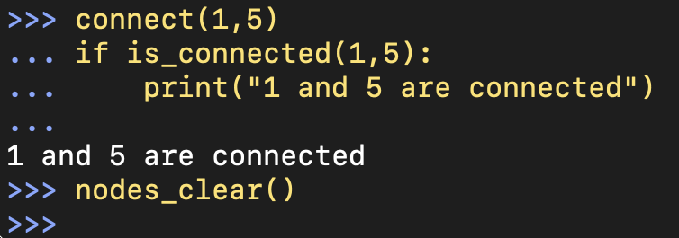

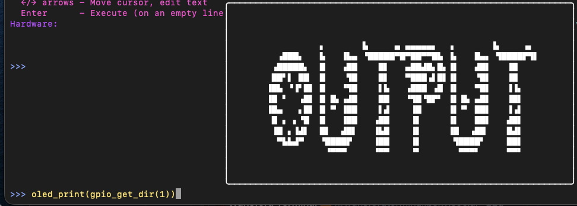

---

## WaveGen (Waveform Generator) WaveGen (波形发生器)

```
# Basic sine wave generation
wavegen_set_output(DAC1)      # Output on DAC1
wavegen_set_wave(SINE)        # Sine wave
wavegen_set_freq(100)         # 100 Hz
wavegen_set_amplitude(3.3)    # 3.3V peak-to-peak
wavegen_set_offset(1.65)      # Center at 1.65V (0 to 3.3V range)
wavegen_start()               # Start generating

# Available waveforms: SINE, TRIANGLE, SAWTOOTH (or RAMP), SQUARE

# Change parameters while running
wavegen_set_wave(TRIANGLE)
wavegen_set_freq(50)

# Check status
if wavegen_is_running():
    freq = wavegen_get_freq()
    print("Running at " + str(freq) + " Hz")

# Stop generation
wavegen_stop()

# Sweep configuration (for scripts that use it)
wavegen_set_sweep(20, 2000, 5)  # Sweep from 20Hz to 2000Hz over 5 seconds
```

---

## Current Sensing (INA219) 电流感应 (INA219)

```
# Read current sensor data
current = ina_get_current(0)          # Current in A
current = ina_get_current(0) * 1000   # Current in mA
voltage = ina_get_voltage(0)          # Shunt voltage in V
bus_voltage = ina_get_bus_voltage(0)  # Bus voltage in V
power = ina_get_power(0)              # Power in W

# Available sensors: 0, 1    # INA 1 is hardwired to the output of DAC 0 because it's meant for measuring resistance
```

---

## OLED Display OLED 显示屏

```
# Initialize OLED
oled_connect()                 # Connect to OLED
oled_print("Hello World!")     # Display text

# Clear display
oled_clear()

# Disconnect
oled_disconnect()
```

---

## Probe Functions 探针函数

```
# Read probe pad (blocking)
pad = probe_read_blocking()       # Returns ProbePad object only when a pad is touched

# Read probe pad (non-blocking)
pad = probe_read_nonblocking()    # Returns ProbePad object (which can be NO_PAD)

# Button functions (probe button)
button = probe_button()           # Read probe button state (blocking)
button = get_button()             # Alias
button = button_read()            # Another alias
button = read_button()            # Another alias
button = check_button()           # Non-blocking check
button = button_check()           # Alias

# Button with parameters
button = probe_button(True)       # Blocking
button = probe_button(False)      # Non-blocking
```

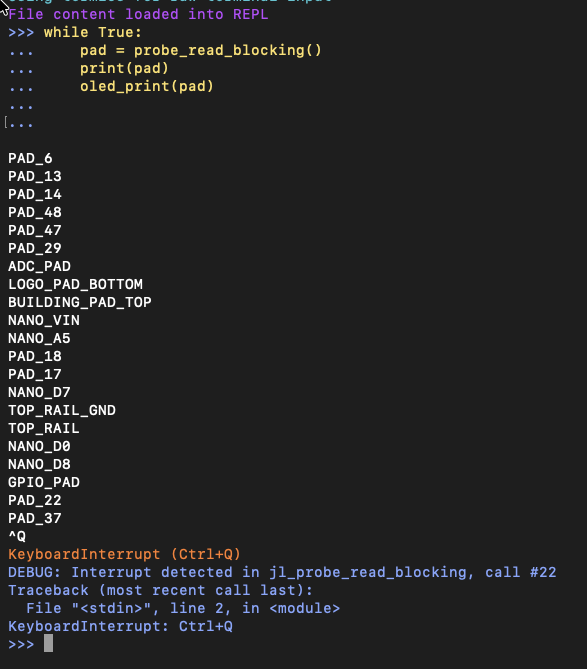

---

## System Functions 系统函数

```
# Reset Arduino
arduino_reset()

# Run built-in apps
run_app("I2C Scan")        # Run I2C scanner
run_app("Bounce Startup")  # Loop the startup animation

# Advanced system control
pause_core2(True)          # Pause core2 processing
pause_core2(False)         # Resume core2 processing
send_raw("A", 1, 2, 1)     # Send raw data to core2 (chip A, pos 1,2, set)

# Connection context - controls whether changes persist after exiting Python
context_toggle()           # Toggle between 'global' and 'python' modes
print(context_get())       # Shows current mode: "global" or "python"

# Show help
help()                # Display all available functions
nodes_help()          # Show all available node names and aliases
```

The [help()](./11_MicroPython_API_Reference.md#The entire output of help() help() 的完整输出) and [nodes_help()](./11_MicroPython_API_Reference.md#The entire output of nodes_help() nodes_help() 的完整输出) functions will list all the available commands (except for the new ones I forget to update)

[help()](./11_MicroPython_API_Reference.md#The entire output of help() help() 的完整输出) 和 [nodes_help()](./11_MicroPython_API_Reference.md#The entire output of nodes_help() nodes_help() 的完整输出) 函数将列出所有可用命令（除了我忘记更新的新命令）。

---

## Slot Management 插槽管理

```
# Save current connections to current slot
nodes_save()

# Save to a specific slot (0-7)
nodes_save(3)

# Switch to a different slot
old = switch_slot(2)
print("Switched from slot " + str(old) + " to slot 2")

# Check for unsaved changes
if nodes_has_changes():
    print("You have unsaved changes!")
    nodes_save()  # Save them

# Discard changes and restore last saved state
nodes_discard()
```

---

## Net Information 网络信息

```
# Get info about nets (groups of connected nodes)
num_nets = get_num_nets()
print("Active nets: " + str(num_nets))

# Get and set net names
name = get_net_name(6)
set_net_name(7, "VCC")
set_net_name(6, "Signal_In")

# Get and set net colors
color_name = get_net_color_name(6)
print("Net 6 is " + color_name)

# Set colors by name
set_net_color(6, "red")
set_net_color(7, "cyan")
set_net_color(8, "pink")

# Set colors by hex
set_net_color(6, "#FF00FF")  # Magenta
set_net_color(7, "0x00FF00")  # Green

# Get full net info as a dictionary
info = get_net_info(6)
print("Name: " + info['name'])
print("Color: " + info['color_name'])
print("Nodes: " + info['nodes'])

# List all bridges
num_bridges = get_num_bridges()
for i in range(num_bridges):
    bridge = get_bridge(i)
    print("Bridge " + str(i) + ": " + str(bridge))
```

---

## Basic Script Structure 基础脚本结构

```
"""
My Jumperless Script
Description of what this script does
"""

print("Starting my script...")

# Connect some nodes
connect(1, 5)
connect(2, 6)

# Set up GPIO
gpio_set_dir(1, True)  # Output
gpio_set_dir(2, False) # Input

# Main loop
for i in range(10):
    gpio_set(1, True)
    time.sleep(0.5)
    gpio_set(1, False)
    time.sleep(0.5)

    # Read input (gpio_get returns truthy for HIGH, falsy for LOW)
    if gpio_get(2):
        print("Button pressed!")

# Cleanup
nodes_clear()
print("Script complete!")
```

---

## Loading and Running Scripts 加载和运行脚本

### Method 1: File Manager 方法 1：文件管理器

From the REPL, type `files` to open the file manager:

在 REPL 中，输入 `files` 打开文件管理器：

```
>>> files
```

Navigate to your script and press Enter to load it for editing, then press `Ctrl+P` to load it into the REPL for execution.

导航到您的脚本并按 Enter 键加载进行编辑，然后按 `Ctrl+P` 将其加载到 REPL 中执行。

**Note:** The standard Python `exec(open(...).read())` method is not supported in the Jumperless MicroPython environment. Always use the file manager and `Ctrl+P` to run scripts.

**注意：** Jumperless MicroPython 环境不支持标准的 Python `exec(open(...).read())` 方法。请始终使用文件管理器和 `Ctrl+P` 来运行脚本。

### Method 2: REPL Commands 方法 2：REPL 命令

From the MicroPython REPL, you can use the following commands to manage scripts:

在 MicroPython REPL 中，您可以使用以下命令管理脚本：

```
# Load script into editor for modification
load my_script.py

# Save current session as script
save my_new_script.py
```

### Method 3: Direct Execution 方法 3：直接执行

From the main Jumperless menu, you can execute single commands:

在 Jumperless 主菜单中，您可以执行单个命令：

```
> gpio_set(1, True)
> adc_get(0)
> connect(1, 5)
```

---

## REPL (Interactive Mode) REPL (交互模式)

### Starting REPL 启动 REPL

From main menu: Press `p`

从主菜单：按 `p`

### REPL Commands REPL 命令

```
CTRL + q           - Exit REPL
history            - Show command history and saved scripts
save [name]        - Save last executed script
load <name>        - Load script by name or number
files              - Open file manager
new                - Create new script with eKilo editor
helpl              - Show REPL help
help()             - Show hardware commands
```

```
CTRL + q           - 退出 REPL
history            - 显示命令历史和已保存的脚本
save [name]        - 保存上次执行的脚本
load <name>        - 按名称或编号加载脚本
files              - 打开文件管理器
new                - 使用 eKilo 编辑器创建新脚本
helpl              - 显示 REPL 帮助
help()             - 显示硬件命令
```

### Navigation 导航

```
↑/↓ arrows         - Browse command history
←/→ arrows         - Move cursor, edit text
TAB                - Add 4-space indentation
Enter              - Execute (empty line in multiline to finish)
Ctrl+Q             - Force quit REPL or interrupt running script
```

```
↑/↓ 箭头           - 浏览命令历史
←/→ 箭头           - 移动光标，编辑文本
TAB                - 添加 4 空格缩进
Enter              - 执行（在多行模式下为空行时结束）
Ctrl+Q             - 强制退出 REPL 或中断运行中的脚本
```

### Multiline Auto-Indent Mode 多行自动缩进模式

The REPL automatically detects when you need multiple lines after a `:`

REPL 会自动检测何时在 `:` 后需要多行：

```
>>> def blink_led():
...     for i in range(5):
...         gpio_set(1, True)
...         time.sleep(0.5)
...         gpio_set(1, False)
...         time.sleep(0.5)
... 
>>> blink_led()
```

If you want to use *real* multiline mode, use the Kilo file editor.

如果您想使用**真正的**多行模式，请使用 Kilo 文件编辑器。

### Command History 命令历史

- Use ↑/↓ arrows to browse previous commands

  使用 ↑/↓ 箭头浏览之前的命令

- Commands are automatically saved

  命令会自动保存

- Type `history` to see all saved scripts

  输入 `history` 查看所有保存的脚本

---

## Connection Context Switching 连接上下文切换

The MicroPython REPL now supports **connection contexts** that determine how connections persist:

MicroPython REPL 现在支持 **连接上下文 (connection contexts)**，用于决定连接如何持久化：

- **`global` context**: Changes persist to global state - connections remain after exiting Python

  **`global` 上下文**：更改持久化到全局状态——退出 Python 后连接保留。

- **`python` context**: Connections are restored to how they were when exiting REPL (saved to `slots/slotPython.yaml`)

  **`python` 上下文**：连接恢复到进入 REPL 时的状态（保存到 `slots/slotPython.yaml`）。

**To toggle contexts:** Type `context` in the REPL

**切换上下文：** 在 REPL 中输入 `context`

**How it works:**

**工作原理：**

- In `global` mode: Any connections you make become permanent, just like using the normal command interface

  在 `global` 模式下：您所做的任何连接都会变成永久性的，就像使用普通命令界面一样。

- In `python` mode: The connection state when you entered the REPL is saved, and restored when you exit

  在 `python` 模式下：进入 REPL 时的连接状态会被保存，并在退出时恢复。

- The current context is displayed in the REPL prompt

  当前上下文会显示在 REPL 提示符中。

---

## Built-in Examples 内置示例

The system includes several example scripts. To run an example:

系统包含多个示例脚本。要运行示例：

1. Type `files` in the REPL.

   在 REPL 中输入 `files`。

2. Navigate to the `examples/` directory.

   导航到 `examples/` 目录。

3. Select the desired script and press Enter to edit/view it.

   选择所需的脚本并按 Enter 进行编辑/查看。

4. Press `Ctrl+P` to load it into the REPL for execution.

   按 `Ctrl+P` 将其加载到 REPL 中执行。

Example scripts include:

示例脚本包括：

- 01_dac_basics.py (DAC basics - voltage control)

  01_dac_basics.py (DAC 基础 - 电压控制)

- 02_adc_basics.py (ADC basics - voltage reading)

  02_adc_basics.py (ADC 基础 - 电压读取)

- 03_gpio_basics.py (GPIO basics - digital I/O)

  03_gpio_basics.py (GPIO 基础 - 数字 I/O)

- 04_node_connections.py (Node connections)

  04_node_connections.py (节点连接)

**REPL not responding:**

**REPL 无响应：**

- Press Ctrl+Q to force quit

  按 Ctrl+Q 强制退出

- Unplug / replug your Jumperless (don't worry, almost everything is persistent)

  拔出/重新插入 Jumperless（别担心，几乎所有内容都是持久化的）

---

## Formatted Output and Custom Types 格式化输出和自定义类型

The Jumperless module returns custom types that print nicely but also work in conditionals:

Jumperless 模块返回自定义类型，这些类型不仅打印出来美观，还可以用于条件判断：

```
# GPIO functions return custom types that print as readable strings
state = gpio_get(1)           # Prints "HIGH", "LOW", or "FLOATING"
direction = gpio_get_dir(1)   # Prints "INPUT" or "OUTPUT"
pull = gpio_get_pull(1)       # Prints "PULLUP", "PULLDOWN", or "NONE"

# These types are also truthy/falsy for use in conditionals:
if gpio_get(1):               # True if HIGH, False if LOW or FLOATING
    print("Pin is HIGH")
if gpio_get_dir(1):           # True if OUTPUT, False if INPUT
    print("Pin is output")

# Connection status works the same way
connected = is_connected(1, 5) # Prints "CONNECTED" or "DISCONNECTED"
if connected:                  # True if connected, False if not
    print("Nodes are connected")

# Voltage and current readings are floats
voltage = adc_get(0)          # Returns float (e.g., 3.300)
current = ina_get_current(0)  # Returns float in A (e.g., 0.0123)
power = ina_get_power(0)      # Returns float in W (e.g., 0.4567)

# All functions work with both numbers and string aliases
gpio_set_dir("GPIO_1", True)  # Same as gpio_set_dir(1, True)
connect("TOP_RAIL", "GPIO_1") # Same as connect(101, 131)
```

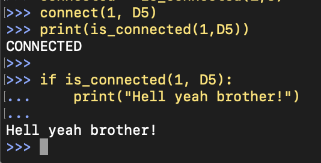