# Odds and Ends 杂项

## What's New in JumperlOS JumperlOS 的新功能

JumperlOS is now a proper operating system with a priority-based task scheduler! This is a huge refactor from the original firmware:

JumperlOS 现在是一个拥有基于优先级的任务调度器的真正操作系统了！这是对原始固件的一次巨大重构：

- **Viper IDE and Micropython raw REPL** - Live code on the Jumperless' file system in your browser

  **Viper IDE 和 Micropython 原始 REPL** - 直接在浏览器中对 Jumperless 文件系统上的代码进行实时编程。

- **Priority-based task scheduler** - Each component has a `service()` routine that checks whether it should do anything, replacing the old busy-wait loop

  **基于优先级的任务调度器** - 每个组件都有一个 `service()` 例程来检查是否需要执行操作，取代了旧的忙等待（busy-wait）循环。

- **Live updating** - Edits to the YAML state files will live update with new connections (whether you're editing them in the onboard editor or as a mounted USB MSC device on your computer)

  **实时更新** - 编辑 YAML 状态文件时，新的连接会实时更新（无论你是使用板载编辑器，还是将其作为 USB MSC 设备挂载到电脑上进行编辑）。

- **Better fonts** - New fonts available: `Berkeley`, `Iosevka`, `Pragmat[ism]`

  **更好的字体** - 新增字体：`Berkeley`、`Iosevka`、`Pragmat[ism]`。

- **YAML connection files** - More permissive of malformed syntax

  **YAML 连接文件** - 对格式错误的语法更加包容。

- **Unified syntax highlighting** - Works consistently in `eKilo`, `python`, and normal input after `>`

  **统一的语法高亮** - 在 `eKilo`、`python` 以及 `>` 之后的常规输入中保持一致。

- **Encoder-based connections** - Use the clickwheel to scroll through and select nodes without touching the probe

  **基于编码器的连接** - 使用拨轮（clickwheel）滚动并选择节点，无需触摸探头。

- **Current sensing marching ants** - Animated visual feedback showing current flow direction between I+ and I- connections

  **电流感应“蚂蚁线”动画** - 显示 I+ 和 I- 连接之间电流流动方向的动态视觉反馈。

- **Python context switching** - Toggle between `global` and `python` connection contexts in the MicroPython REPL

  **Python 上下文切换** - 在 MicroPython REPL 中切换 `global`（全局）和 `python` 连接上下文。

The JumperlOS firmware repo is at https://github.com/Architeuthis-Flux/JumperlOS

JumperlOS 固件仓库地址：https://github.com/Architeuthis-Flux/JumperlOS

------

## Safety Info 安全信息

Here's an image of the little card that should have been inside your box

这里是原本应该放在盒子里的那张小卡片的图片：

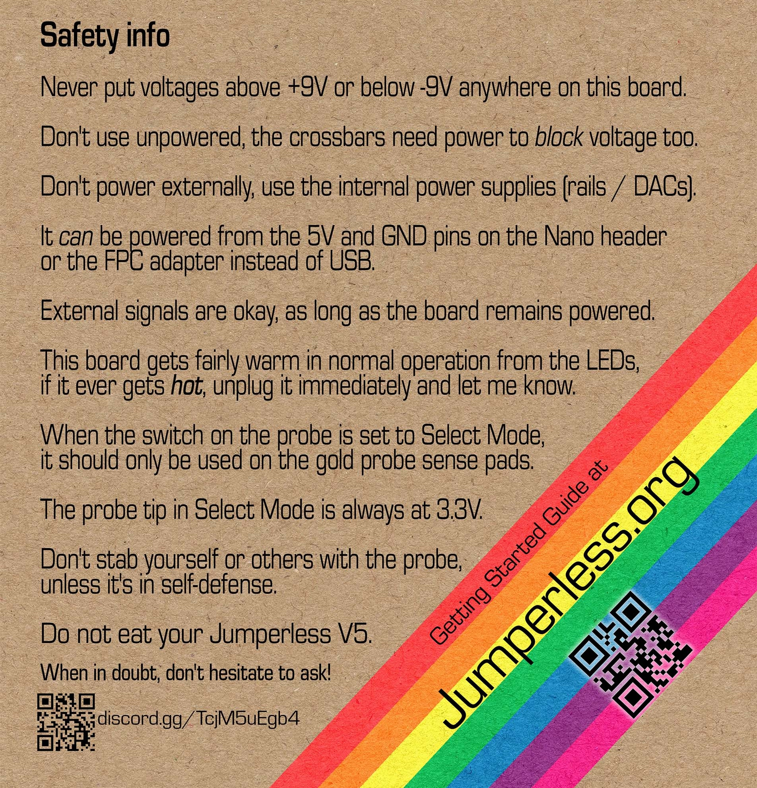

- Never put voltages above +9V or below -9V anywhere on this board.

  **绝对不要**在本板的任何地方施加高于 **+9V** 或低于 **-9V** 的电压。

- Don't use unpowered, the crossbars need power to block voltage too.

  **不要在未通电状态下使用**，交叉开关（crossbars）需要电源才能阻断电压。

- Don't power externally, use the internal power supplies (rails / DACs).

  **不要外部供电**，请使用内部电源（电源轨 / DACs）。

- It can be powered from the 5V and GND pins on the Nano header or the FPC adapter instead of USB.

  可以通过 Nano 排针或 FPC 转接板上的 5V 和 GND 引脚供电，而不使用 USB。

- External signals are okay, as long as the board remains powered.

  **外部信号是可以的**，只要主板保持通电状态即可。

- This board gets fairly warm in normal operation from the LEDs, if it ever gets hot, unplug it immediately and let me know.

  在正常工作时，由于 LED 的原因，主板会**变得相当温热**。如果它变得**很烫**，请立即拔掉电源并告诉我。

- When the switch on the probe is set to Select Mode, it should only be used on the gold probe sense pads.

  当探头上的开关设置为 **选择模式 (Select Mode)** 时，它**只能**用于金色的探头感应焊盘。

- The probe tip in Select Mode is always at 3.3V.

  选择模式下的探头尖端始终处于 **3.3V**。

- Don't stab yourself or others with the probe, unless it's in self-defense.

  **不要用探头刺伤自己或他人**，除非是为了自卫。

- Do not eat your Jumperless V5.

  **请勿吞食**您的 Jumperless V5。

- When in doubt, don't hesitate to [ask!](https://discord.gg/TcjM5uEgb4)

  如有疑问，请毫不犹豫地[提问！](https://discord.gg/TcjM5uEgb4)

There are a lot of exceptions to these if you know what you're doing. It's pretty hard to permanently damage this board.

如果你知道自己在做什么，这些规则有很多例外。想永久损坏这块板子其实挺难的。

Some things (usually external power with the Jumperless off) can cause lockup on the [analog CMOS switches](https://tinyurl.com/24xrspea), but the current limiting resistors on their power supply pins generally keep them from drawing so much current that they permanently break. In situations where one chip is getting crazy hot, the first thing to try is to unplug the Jumperless, let it cool down, and try it again (obviously, change whatever you think was causing it). Most of the time they go back to normal after some rest.

有些情况（通常是在 Jumperless 关机时接入外部电源）会导致 [模拟 CMOS 开关](https://tinyurl.com/24xrspea) 锁定（lockup），但其电源引脚上的限流电阻通常能防止它们因电流过大而永久损坏。如果出现某个芯片发热严重的情况，首先尝试拔掉 Jumperless，让它冷却下来，然后再试一次（显然，你需要改变导致该问题的操作）。大多数情况下，休息一会儿后它们就会恢复正常。

Don't let any of this scare you, I'd rather you just pretend it's indestructable and use it with reckless abandon. So if you manage to break anything, just let me know and I'll send out a fresh one and a return label, no questions asked*.

别让这些吓到你，我更希望你把它当成坚不可摧的东西，肆无忌惮地使用它。所以如果你真的弄坏了什么，只需告诉我，我会发给你一个新的并附上退货标签，不问任何问题。

*Actually, a ton of questions asked, so we can figure out how it happened and maybe prevent it from happening to someone else. But the point is I don't care if it's clearly your fault and not some manufacturing defect, I will make sure you have a working Jumperless.

*实际上，我会问很多问题，这样我们就能弄清楚它是怎么发生的，也许能防止这种事发生在别人身上。但重点是，即使这明显是你的错而不是制造缺陷，我也不在乎，我会确保你拥有一个能正常工作的 Jumperless。


It's even printed on the box

这些甚至都印在了盒子上。

------

## Bandwidth 带宽

Michael has done some [awesome work characterizing the bandwidth of the Jumperless](https://codeberg.org/multiplex/jumperless-wigglyvolts).

Michael 做了一些[很棒的工作来表征 Jumperless 的带宽](https://codeberg.org/multiplex/jumperless-wigglyvolts)。

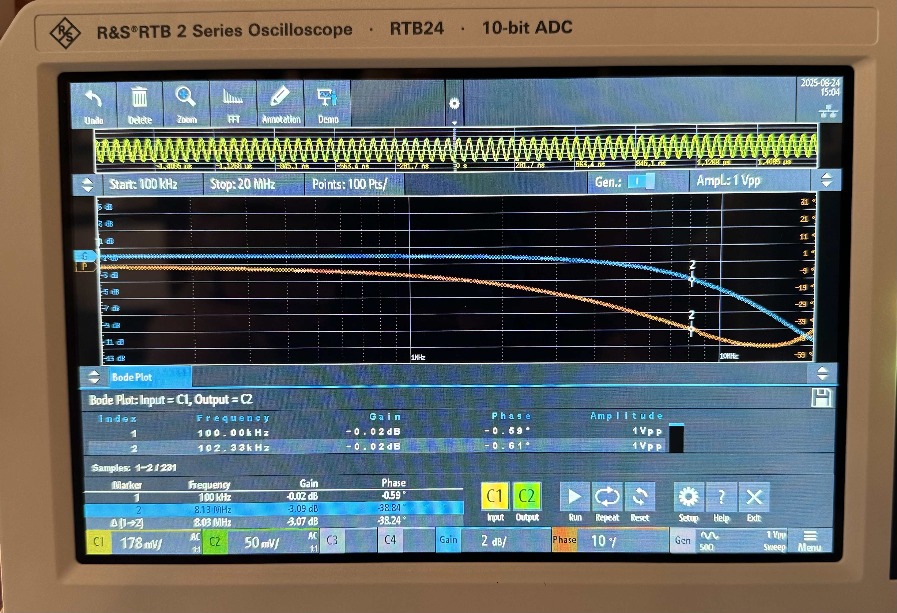

The TL;DR is just the physical breadboard puts the 3dB rolloff t ~13MHz, and a signal passing through the crossbar matrix brings it down to around ~8MHz.

简而言之，仅仅是物理面包板就会使 3dB 滚降点出现在约 ~13MHz 处，而信号通过交叉开关矩阵会将其降至约 ~8MHz。

It makes sense these are pretty high, these CH446Qs were originally made for switching video signals so bandwidth was pretty important when they were designing them. Keep in mind this isn't a hard limit, it's just where the signal gets attenuated by the (arbitrarilyish) defined 3dB, so your signal's amplitude is reduced by √2.

这也是合理的，这些数值相当高了，因为这些 CH446Q 芯片最初是为切换视频信号而制造的，所以在设计时带宽非常重要。请记住，这不是一个硬性限制，这只是信号衰减达到（差不多随意）定义的 3dB 的地方，此时你的信号幅度减少了 √2。

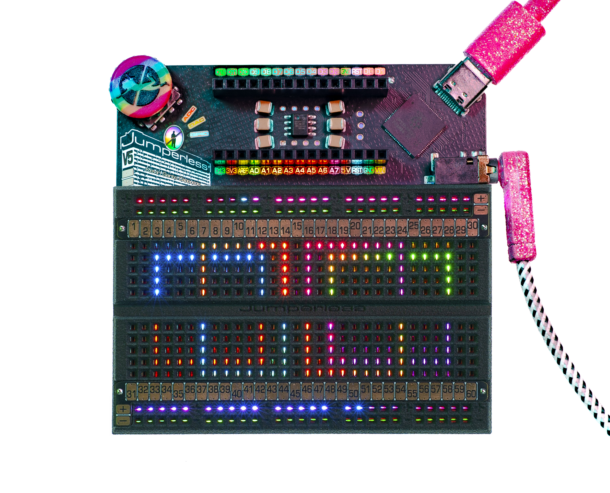

---

## Animations 动画

The Jumperless uses LED animations to show the state of different components on the breadboard.

Jumperless 使用 LED 动画来显示面包板上不同组件的状态。

### Rail Animations 电源轨动画

If it's a rail, those are animated and should be a continuous slow pulsing toward the top or bottom depending on the rail.

如果是电源轨，会有动画显示，表现为向顶部或底部的连续缓慢脉冲，具体取决于哪条导轨。

### ADC Animations ADC 动画

`ADCs` are green at 0V, and go through the spectrum to red at +5V, and get whiter hot pink toward +8V. Negative voltages are kinda blue/icy and do that same thing with the "cold" colors towards -8V.

`ADCs` 在 0V 时为绿色，随电压升高变为红色（+5V），在接近 +8V 时变为偏白的亮粉色。负电压则偏蓝/冰冷色调，并在接近 -8V 时以“冷”色调呈现相同的变化。

### GPIO Animations GPIO 动画

### Input Mode 输入模式

`GPIO` as inputs are animated with a white pulsing (this might be broken in that FW release, I'm fixing that right now actually, and will just be purple/white) when floating, red for high, green for low.

作为输入的 `GPIO` 在悬空时会有白色脉冲动画（这个功能在那个固件版本中可能坏了，实际上我正在修复它，之后可能会只是紫色/白色），高电平为红色，低电平为绿色。

### Output Mode 输出模式

`GPIO` outputs will be either green or red depending on their state.

`GPIO` 输出将根据其状态显示为绿色或红色。

------

## What's that `BUFFER_IN - DAC_0` bridge that's always there? 那个一直存在的 `BUFFER_IN - DAC_0` 桥接是什么？

That gets added to power the `probe LEDs`, it's kinda weird, but to multiplex 3.3V, GND, LED data, 2 buttons, and a +-9V tolerant analog line over the 4 wires on a TRRS cable, the line powering those LEDs is shared.

那是用来给 `探头 LED` 供电的。这有点奇怪，但为了在一根 TRRS 线缆的 4 根线上复用 3.3V、GND、LED 数据、2 个按钮以及一条耐压 +-9V 的模拟线路，给 LED 供电的线路是共享的。

The `connect`/`measure` switch is a Dual Pole Dual Throw (DPDT) switch. The probe tip needs to be at a steady 3.3V to be read by the `probe sense pads` which is a big resistive divider sensed by a single `ADC`.

`connect`（连接）/`measure`（测量）开关是一个双刀双掷（DPDT）开关。探头尖端需要保持稳定的 3.3V 才能被 `探头感应焊盘` 读取，这些焊盘是由单个 `ADC` 感测的大型电阻分压器。

When you have it in `select` mode, the probe tip is getting 3.3V from a `GPIO` on the RP2350B driven `high`, and the LEDs get their power from the analog line, which is `ROUTABLE_BUFFER_IN` connected to `DAC 0` set to 3.3V.

当你将其处于 `select`（选择）模式时，探头尖端从 RP2350B 的一个被拉`高`的 `GPIO` 获取 3.3V 电压，而 LED 的电源则来自模拟线路，即连接到 `DAC 0`（设置为 3.3V）的 `ROUTABLE_BUFFER_IN`。

When you switch to `measure` mode, those roles get swapped, the LEDs are powered by that `GPIO`, and the probe tip is now `ROUTABLE_BUFFER_IN`. In the current firmware, that just stays at 3.3V so you can *kinda* sense pads in either mode (you may notice the sensing is a lot wonkier, that's because the `DAC` isn't perfectly calibrated to output *exactly* 3.3V.) But in the future, there will be some other stuff you can do in that mode treating it as an analog line (and of course, I'll forget to update this, if it's after like June 2025, double check this is still true.)

当你切换到 `measure`（测量）模式时，这些角色互换：LED 由该 `GPIO` 供电，探头尖端现在连接到 `ROUTABLE_BUFFER_IN`。在当前的固件中，它依然保持在 3.3V，所以你可以*勉强*在任一模式下感应焊盘（你可能会注意到感应变得不稳定，这是因为 `DAC` 并未完美校准到输出*精确的* 3.3V）。但在未来，你将能够在该模式下将其视为模拟线路来做一些其他事情（当然，如果我在 2025 年 6 月之后还没更新这段话，那我肯定忘了，请再次确认这一点是否仍然属实）。

A side effect of needing a crossbar connection to light the probe is that the LEDs in `Select` Mode act as a test of whether the Jumperless is properly making connections.

需要通过交叉开关连接来点亮探头的副作用是，`Select` 模式下的 LED 可以作为测试 Jumperless 是否正确建立连接的一种方式。

### Why am I using one of the precious two DACs and not another GPIO? 为什么我要占用两个宝贵 DAC 中的一个，而不是用另一个 GPIO？

The answer is switch position sensing. You may notice there's no obvious way for the Jumperless to know where the switch is set, so I had to get creative on this one. `DAC 0`'s output is hardwired to go through a `current sense` shunt resistor, so when `DAC 0` is powering the `probe LEDs`, they'll be drawing some current I can measure with one of the `INA219`s, and therefore I can be reasonably confident that the switch is in the `select` position.

答案是开关位置检测。你可能注意到 Jumperless 没有显而易见的方法来知道开关设定在哪里，所以我必须在这个问题上发挥创意。`DAC 0` 的输出被硬连线经过一个 `电流感应` 分流电阻，所以当 `DAC 0` 为 `探头 LED` 供电时，它们会消耗一些电流，我可以用其中一个 `INA219` 测量到这个电流，因此我可以比较确信开关处于 `select` 位置。

If you need both `DAC`s, you can just get rid of this connection and the `probe LEDs` won't light up, but other than aesthetics, it really has no effect on functionality. Or you connect `ROUTABLE_BUFFER_IN` to a `GPIO` and set it `high` and just lose the ability to sense where the switch is.

如果你需要两个 `DAC`，你可以直接断开这个连接，`探头 LED` 就不会亮起，但除了美观之外，这对功能真的没有影响。或者你可以将 `ROUTABLE_BUFFER_IN` 连接到一个 `GPIO` 并将其设为 `high`，只是会失去检测开关位置的能力。

------

## AI Generated Wiki AI 生成的维基

If you want to read a wiki generated by AI and ask it questions about how this thing works and how to use it, [**DeepWiki**](https://deepwiki.com/Architeuthis-Flux/JumperlessV5/1-overview) was surprisingly accurate (enough.)

如果你想阅读由 AI 生成的维基，并向它询问有关这个东西如何工作以及如何使用它的问题，**[DeepWiki](https://deepwiki.com/Architeuthis-Flux/JumperlessV5/1-overview)** 令人惊讶地准确（这就够了）。

The docs on this site are more about how to *use* your Jumperless, this is more geared toward helping understand the circuitry and code.

本站的文档更多是关于如何*使用*你的 Jumperless，而那个维基更倾向于帮助理解电路和代码。

------

## Onboard Help 板载帮助

Use `help` or `[command]?` for onboard documentation

使用 `help` 或 `[command]?` 获取板载文档。

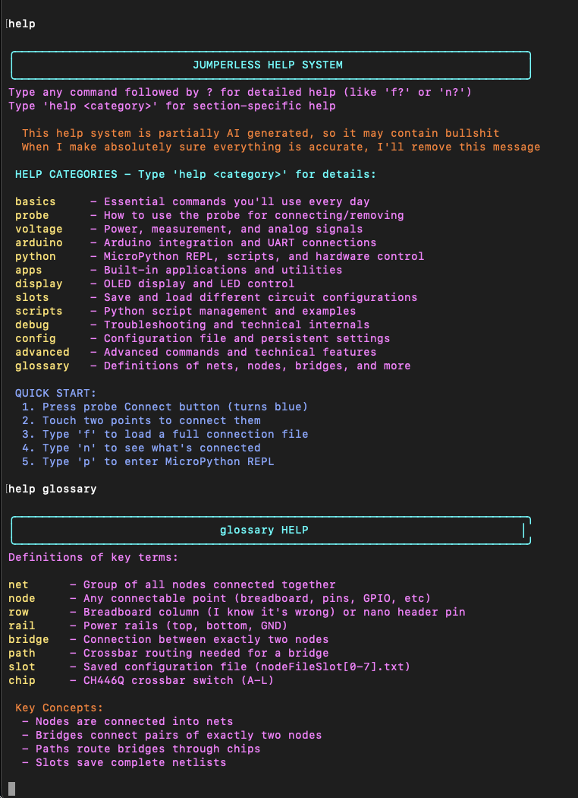

------

## [GitHub Releases](https://github.com/Architeuthis-Flux/JumperlessV5/releases) [GitHub 发布页 (Releases)](https://github.com/Architeuthis-Flux/JumperlessV5/releases)

If you want more info about each feature when I was particularly excited about it, I usually write about the new features in the [Release notes on Github](https://github.com/Architeuthis-Flux/JumperlessV5/releases).

如果你想了解每个功能的更多信息（在我对它特别兴奋的时候），我通常会在 [Github 的发布说明](https://github.com/Architeuthis-Flux/JumperlessV5/releases) 中撰写有关新功能的内容。

------

## Schematic 原理图

Here's the schematic that's printed on the inner flap of the box:

这是印在盒子内侧折页上的原理图：

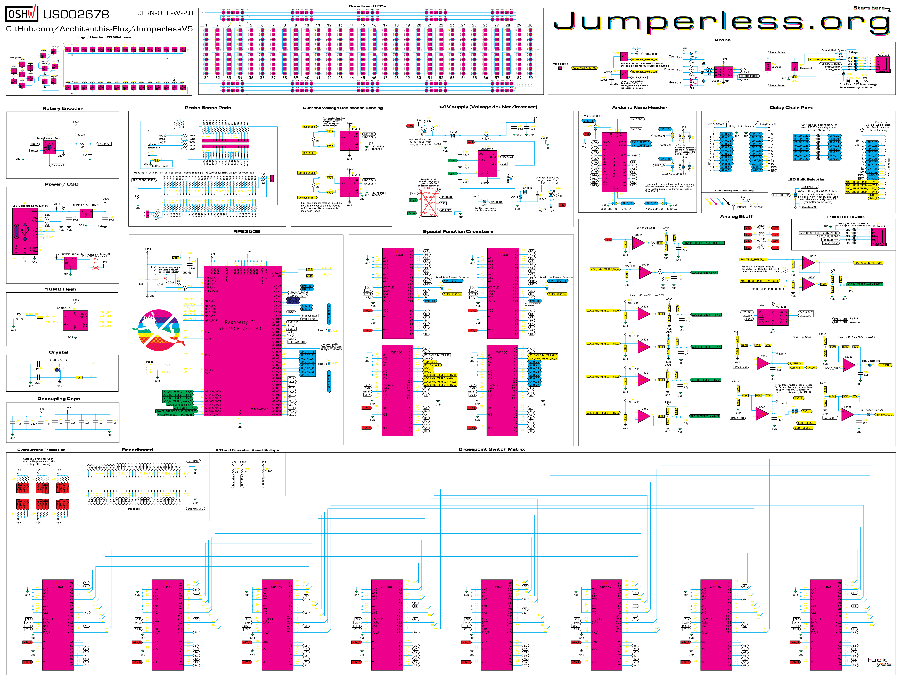

If you want look at the schematic and PCB together and don't feel like downloading the whole thing and opening it in KiCad, [you can open it in the browser with KiCanvas here](https://kicanvas.org/?github=https://github.com/Architeuthis-Flux/JumperlessV5/blob/main/Jumperless23V50/MainBoard/JumperlessV5r6/JumperlessV5r6.kicad_pro).

如果你想对照 PCB 查看原理图，但不想下载整个文件并在 KiCad 中打开，[你可以在这里使用 KiCanvas 在浏览器中打开它](https://kicanvas.org/?github=https://github.com/Architeuthis-Flux/JumperlessV5/blob/main/Jumperless23V50/MainBoard/JumperlessV5r6/JumperlessV5r6.kicad_pro)。

---

## Writing Native apps 编写原生 App

Writing Apps

编写 App

### Here's a the example app that should show the calls for most of the things you might want to do 这是一个示例 App，展示了你可能想做的除大多数事情的调用方法

You can do literally anything the Jumperless can in an app, so if there's a specific thing, lmk and I'll write an example. Until I make this into a proper operating system, what you're doing when you write an App is just writing a function in the main firmware. There's really no guard rails, and the API is just any function in the firmware.

实际上你可以在 App 中做 Jumperless 能做的任何事情，所以如果有特定的需求，请告诉我，我会写一个示例。在我把它做成一个真正的操作系统之前，当你编写 App 时，其实就是在主固件中编写一个函数。真的没有什么护栏（guard rails），API 就是固件中的任何函数。

---

## First get it PlatformIO set up to flash code 首先设置好 PlatformIO 以刷写代码

So fork the firmware here: https://github.com/Architeuthis-Flux/JumperlOS

Fork 这个固件仓库：https://github.com/Architeuthis-Flux/JumperlOS

I'm using PlatformIO in VSCode. And it *should* just work to open the RP23V50firmware folder in that (you'll probably need to comment out `upload_port = /dev/cu.usbmodemJLV5port1` in `Platformio.ini` so it'll just automatically find it)

我在 VSCode 中使用 PlatformIO。直接打开 `RP23V50firmware` 文件夹*应该*就能工作（你可能需要注释掉 `Platformio.ini` 中的 `upload_port = /dev/cu.usbmodemJLV5port1`，这样它就能自动找到设备了）。

You should probably try to just load the firmware just to make sure everything works.

你应该先尝试加载固件，以确一切正常工作。

---

## To write an App 编写一个 App

Before you go writing your app, follow these steps to make it so it's listed in the App library and you can run it from the menus.

在你开始编写 App 之前，请遵循以下步骤，使其列在 App 库中，并能从菜单中运行它。

- Go to [`menuTree.h`](https://github.com/Architeuthis-Flux/JumperlessV5/blob/main/RP23V50firmware/src/menuTree.h) and add the name of your app under `Apps\n\` (shown as `-Custom App\n\` here, it needs to fit in 7x2 chars to show on the breadboard) 

  转到 [`menuTree.h`](https://github.com/Architeuthis-Flux/JumperlessV5/blob/main/RP23V50firmware/src/menuTree.h) 并在 `Apps\n\` 下添加你的 App 名称（此处显示为 `-Custom App\n\`，它需要适应 7x2 的字符空间以在面包板上显示）。

  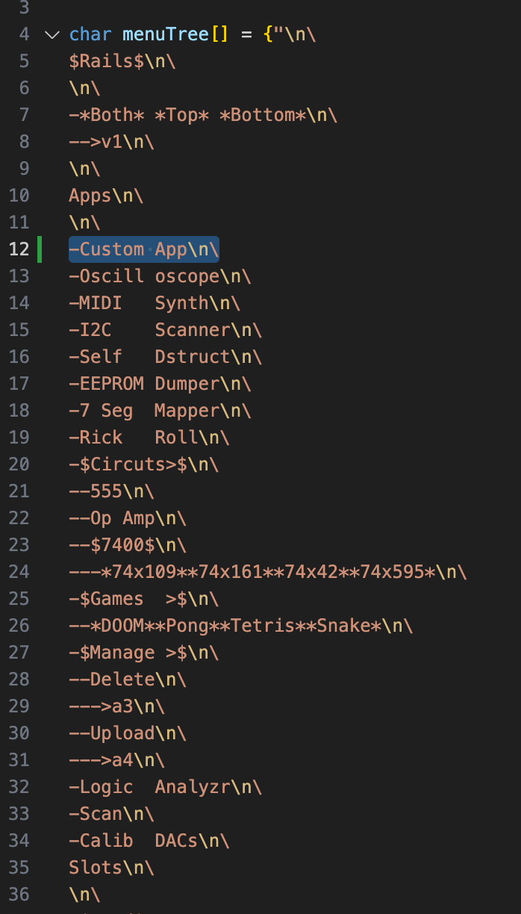

- Go to `Apps.h` and declare your function where you'll write your app

  转到 `Apps.h` 并在你要编写 App 的地方声明你的函数。

  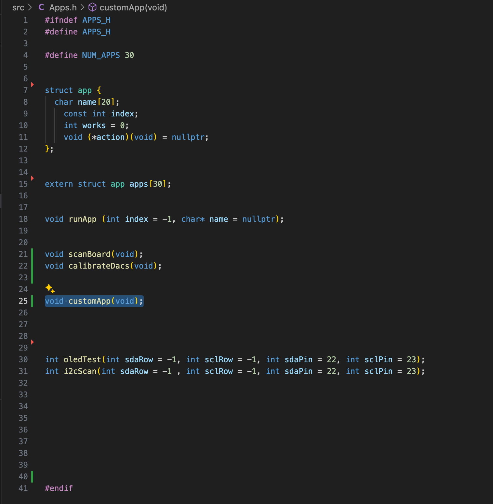

- Go to `Apps.cpp` and add a struct in the `struct app apps[30]` for your app `{"Name", index, ??idk, name of the function (unused)}` 

  转到 `Apps.cpp` 并在 `struct app apps[30]` 中为你的 App 添加一个结构体 `{"Name", index, ??idk, name of the function (unused)}`。

  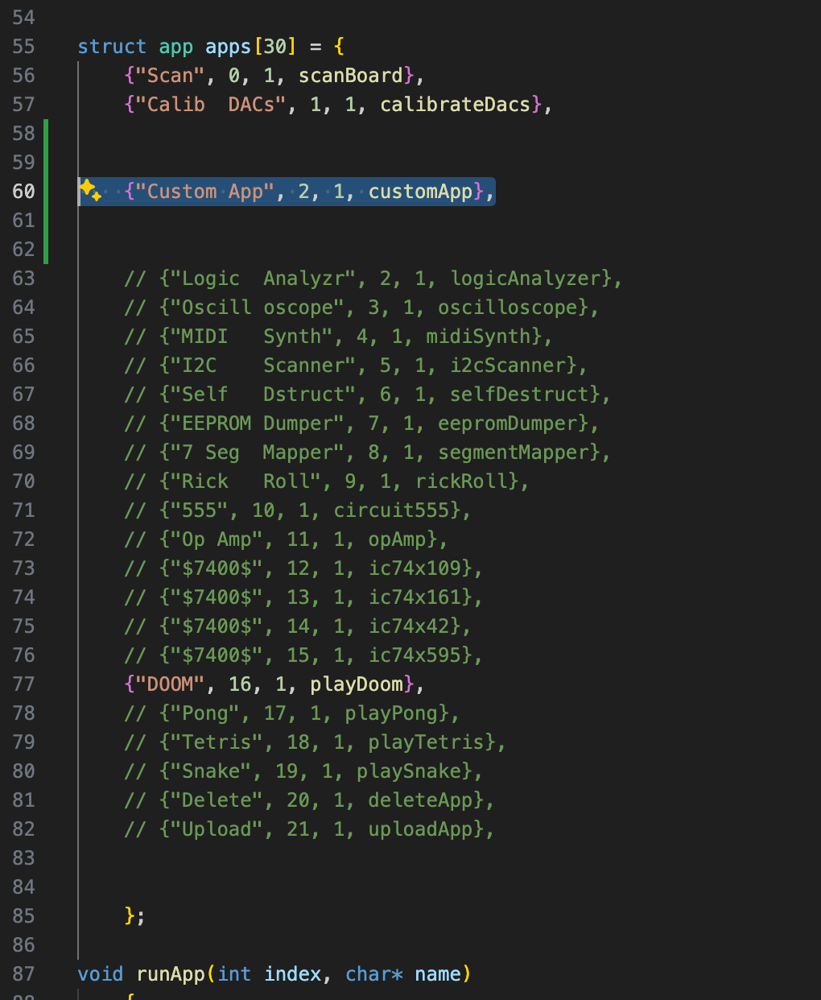

- Go to `Apps.cpp > runApp()` and add a `case` for your app's index (this is so you can also find it by index rather than exact matching the name `"Custom App"` 

  转到 `Apps.cpp > runApp()` 并为你的 App 索引添加一个 `case`（这样你也可以通过索引找到它，而不仅仅是精确匹配名称 `"Custom App"`）。

  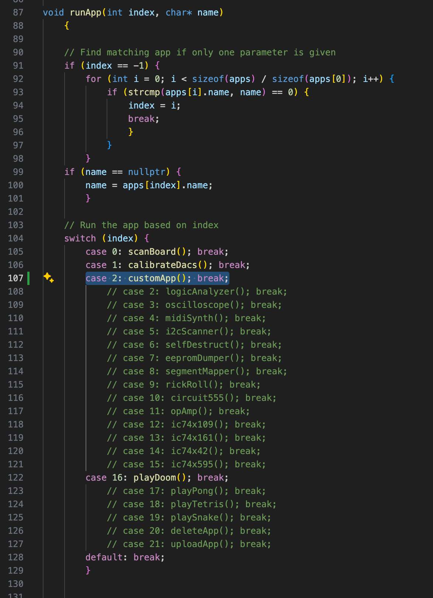

- Make a function that's the entirety of your app, I just pushed a demo function called `customApp(void)` with some (non exhaustive) examples of things you can do from an app. 

  编写一个包含你 App 全部内容的函数，我刚刚推送了一个名为 `customApp(void)` 的演示函数，其中包含一些（非详尽的）示例，展示了你可以在 App 中做的事情。

  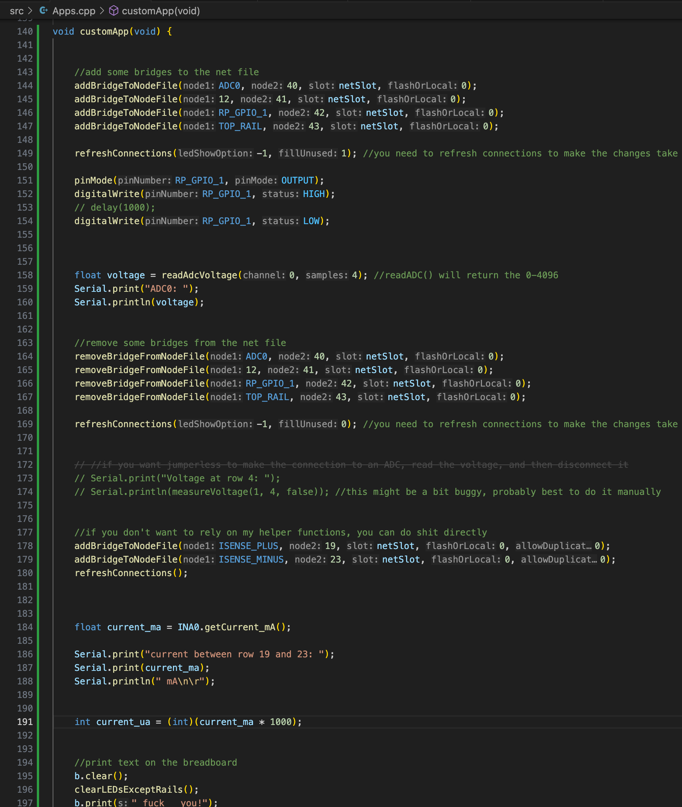

- Run your app with the clickwheel, `Apps > Custom App`.

  使用拨轮运行你的 App：`Apps > Custom App`。

The quick way run `"Custom App"` is to just enter `2` in the main menu, or just use the clickwheel and go Apps > Custom App.

运行 `"Custom App"` 的快速方法是直接在主菜单中输入 `2`，或者使用拨轮进入 Apps > Custom App。

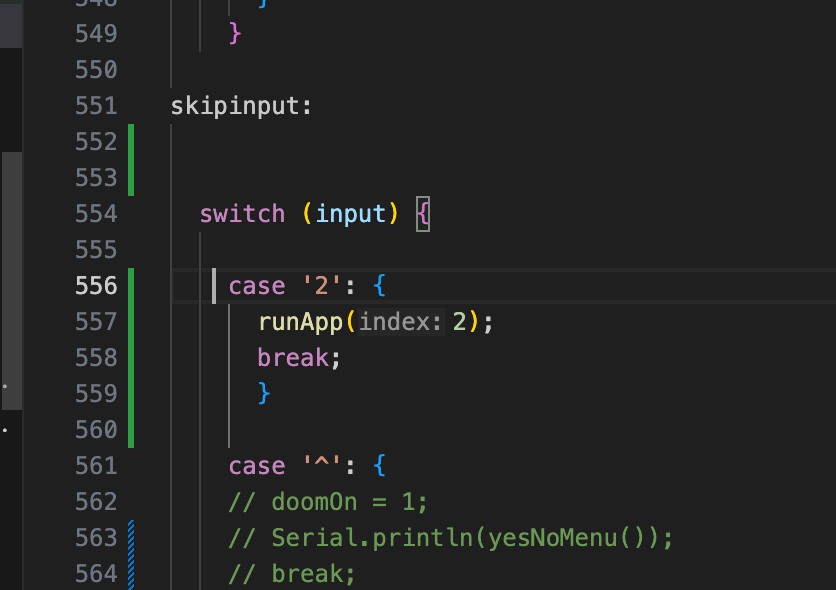

If you want to add your own shortcut, find an unused menu character and add a

```c++
case'3':
{
runApp(3); //the app index you set above
break;
}
```

in the big main menu `switch` statement in `main.cpp`.

如果你想添加自己的快捷方式，请找到一个未使用的菜单字符，并在 `main.cpp` 的大型主菜单 `switch` 语句中添加。

---

## To actually write the app 实际编写 App

[The code](https://github.com/Architeuthis-Flux/JumperlessV5/blob/6fd4fcba572c4b524435ec36c8901adcedbf52c6/RP23V50firmware/src/Apps.cpp#L141) for `Custom App` is an example of the calls available with comments telling you what's going on. There are tons more, but what's shown there are the higher-level helper functions that should roughly do what they say they're doing.

`Custom App` 的[代码](https://github.com/Architeuthis-Flux/JumperlessV5/blob/6fd4fcba572c4b524435ec36c8901adcedbf52c6/RP23V50firmware/src/Apps.cpp#L141)是一个包含可用调用的示例，附带注释解释了正在发生什么。还有更多可用的调用，但那里展示的是更高级别的辅助函数，其功能大致与其名称描述一致。