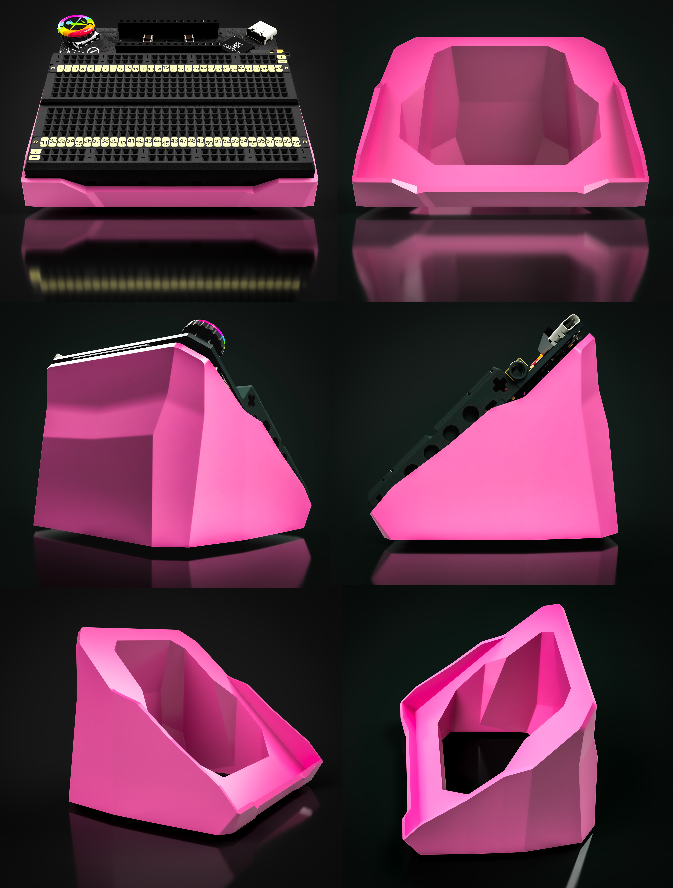

# 3D Printable Stand 3D 可打印支架

[Here are the 3D models](https://www.printables.com/model/1249365-jumperless-stand) for you to print your own stand for your Jumperless. It's extremely handy to have it propped up like this to read text on the breadboard.

[点击此处获取 3D 模型](https://www.printables.com/model/1249365-jumperless-stand)，您可以为您手中的 Jumperless 打印一个专属支架。将它像这样支撑起来非常实用，能让您更轻松地阅读面包板上的文字。

## Printing Tips 打印技巧

Yes, the model is at a weird angle, just drop it down in the slicer, if you want it to hold at a shallower angle, just drop the model through the bed a bit when you slice.

没错，模型的初始角度看起来有点奇怪，只需在切片软件中将其放平即可。如果您希望它的支撑角度更平缓（更低）一些，只需在切片时将模型往热床下方稍微沉下去一点即可。

## Rubber Feet 橡胶脚垫

These [stick-on rubber feet](https://www.amazon.com/AmazonBasics-300-Piece-Adhesive-Rubber-Bumpers/dp/B087MG3G76) also make it a lot more solid on your desk (and having the different sizes lets you shim the angle by putting different ones on the front and back.)

使用这些[粘贴式橡胶脚垫](https://www.amazon.com/AmazonBasics-300-Piece-Adhesive-Rubber-Bumpers/dp/B087MG3G76)可以让支架在桌面上更加稳固（而且利用不同尺寸的脚垫，你可以通过在前后端粘贴不同大小的脚垫来**微调倾斜角度**）。